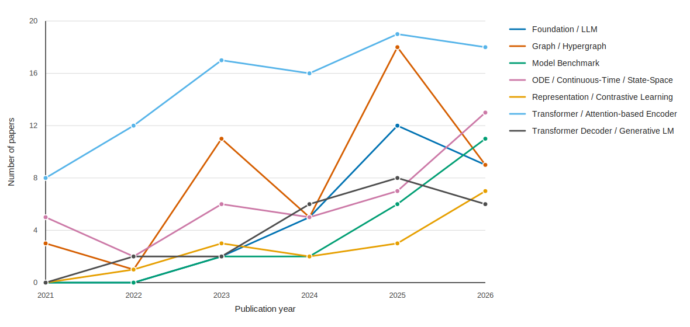

# Awesome Patient Trajectory Modeling

A curated bibliography of patient trajectory modeling (PTM), covering longitudinal EHR models, clinical event-stream foundation models, trajectory simulation, temporal representation learning, and benchmark or analysis studies.

## Contents

- [Method](#method)
  - [Foundation / LLM](#foundation-llm)
  - [Agentic System](#agentic-system)
  - [Transformer / Attention-based Encoder](#transformer-attention-based-encoder)
  - [Encoder-Decoder / Seq2Seq](#encoder-decoder-seq2seq)
  - [Transformer Decoder / Generative LM](#transformer-decoder-generative-lm)
  - [Graph / Hypergraph](#graph-hypergraph)
  - [ODE / Continuous-Time / State-Space](#ode-continuous-time-state-space)
  - [Reinforcement Learning](#reinforcement-learning)
  - [Representation / Contrastive Learning](#representation-contrastive-learning)
  - [Other Architecture](#other-architecture)
  - [Diffusion / Generative Models](#diffusion-generative-models)
  - [RNN-based Model](#rnn-based-model)
- [Benchmark and Analysis](#benchmark-and-analysis)
  - [Scaling / Pretraining Analysis](#scaling-pretraining-analysis)
  - [Model Benchmark](#model-benchmark)
- [Contributing](#contributing)

## Method

### Foundation / LLM

<strong>A multimodal and temporal foundation model for virtual patient representations at healthcare system scale</strong> (2026-04, arXiv). <a href="https://arxiv.org/abs/2604.18570">arXiv</a>

Apollo is a multimodal temporal foundation model trained on 25 billion longitudinal records from 7.2 million patients spanning 28 medical modalities and 12 specialties, building a unified virtual patient representation space over 100 thousand medical concepts. It is evaluated on 322 prognosis and retrieval tasks covering new-disease onset, disease progression, treatment response, adverse events, and hospital operations, plus semantic similarity search. The work establishes a foundation model spanning entire patient care journeys.

<strong>EviCare: Enhancing Diagnosis Prediction with Deep Model-Guided Evidence for In-Context Reasoning</strong> (2026-04, arXiv). <a href="https://arxiv.org/abs/2604.10455">arXiv</a>

EviCare proposes an in-context reasoning framework that fuses deep-model candidate selection, evidential prioritization, and relational evidence construction into adaptive prompts to guide LLM-based diagnosis prediction on EHRs. The framework specifically targets the overlooked novel-diagnosis prediction problem. Experiments on MIMIC-III and MIMIC-IV show large gains over LLM-only and deep-model-only baselines.

<strong>FeatEHR-LLM: Leveraging Large Language Models for Feature Engineering in Electronic Health Records</strong> (2026-04, arXiv). <a href="https://arxiv.org/abs/2604.22534">arXiv</a>

The paper presents FeatEHR-LLM, a framework that uses LLMs to generate clinically meaningful tabular features from irregularly sampled EHR time series. The LLM operates only on schemas and task descriptions and uses tool-augmented generation with specialized routines for irregular temporal data. An iterative validation-in-the-loop pipeline supports univariate and multivariate features and improves AUROC across ICU prediction tasks.

<strong>MedGemma 1.5 Technical Report</strong> (2026-04, arXiv). <a href="https://arxiv.org/abs/2604.05081">arXiv</a>

MedGemma 1.5 4B is a multimodal medical foundation model that adds high-dimensional CT/MRI volumes, whole-slide pathology, anatomical bounding-box localization, and multi-timepoint chest X-ray analysis to a single architecture. Architectural innovations include long-context 3D volume slicing and whole-slide pathology sampling. It improves over MedGemma 1 on imaging classification, longitudinal X-ray analysis, MedQA, and EHRQA benchmarks.

<strong>RePrompT: Recurrent Prompt Tuning for Integrating Structured EHR Encoders with Large Language Models</strong> (2026-04, arXiv). <a href="https://arxiv.org/abs/2604.17725">arXiv</a>

The paper introduces RePrompT, a time-aware framework that integrates structured EHR encoders into frozen LLMs via recurrent prompt tuning. Latent states from prior visits are recurrently injected to preserve longitudinal structure, and trainable prompt tokens carry population-level information from a cohort-trained EHR encoder. RePrompT outperforms EHR- and LLM-based baselines on multiple MIMIC prediction tasks.

<strong>DeepCORO-CLIP: A Multi-View Foundation Model for Comprehensive Coronary Angiography Video-Text Analysis and External Validation</strong> (2026-03, arXiv). <a href="https://arxiv.org/abs/2603.17675">arXiv</a>

The paper presents DeepCORO-CLIP, a multi-view foundation model trained with video-text contrastive learning on over 200k angiography videos. It uses attention-based pooling to integrate multiple projections for study-level diagnostic, prognostic, and disease-progression tasks. Embeddings capture serial-exam disease progression and transfer to one-year MACE prediction.

<strong>EveryQuery: Zero-Shot Clinical Prediction via Task-Conditioned Pretraining over Electronic Health Records</strong> (2026-03, arXiv). <a href="https://arxiv.org/abs/2603.07900">arXiv</a>

EveryQuery is an EHR foundation model that replaces autoregressive trajectory simulation with task-conditioned pretraining: a structured query and patient history are mapped to outcome likelihood in a single forward pass. The model is pretrained over randomly sampled task-context combinations, enabling zero-shot prediction across the query space without fine-tuning or sampling. On MIMIC-IV it beats an autoregressive baseline on 82 percent of 39 sampled tasks with particularly large gains on rare clinical events.

<strong>GEN-KnowRD: Reframing AI for Rare Disease Recognition</strong> (2026-03, medRxiv). <a href="https://www.medrxiv.org/content/10.64898/2026.03.02.26347469v1">medRxiv</a>

GEN-KnowRD repositions large language models from diagnostic reasoning to the knowledge layer by generating schema-guided rare disease profiles and constructing the PheMAP-RD knowledge base. The framework integrates this knowledge into lightweight inference pipelines over longitudinal EHRs and substantially improves disease ranking compared to HPO-centered and end-to-end LLM baselines, including for early discrimination of idiopathic pulmonary fibrosis.

<strong>One Loss to Rule Them All: Marked Time-to-Event for Structured EHR Foundation Models</strong> (2026-02, arXiv). <a href="https://arxiv.org/abs/2602.00541">arXiv</a>

The authors propose a novel marked time-to-event pretraining objective (ORA) that jointly models event timing and associated numeric measurements for structured EHR data. Compared with conventional next-token prediction, ORA yields more generalisable representations and consistently improves performance across a range of downstream tasks-including classification, regression, and survival analysis-on multiple EHR datasets and model architectures.

<strong>PaReGTA: An LLM-based EHR Data Encoding Approach to Capture Temporal Information</strong> (2026-02, arXiv). <a href="https://arxiv.org/abs/2602.19661">arXiv</a>

The paper proposes PaReGTA, an LLM-based EHR encoding pipeline that converts longitudinal events into templated visit text with temporal cues, contrastively fine-tunes a sentence embedder, and aggregates visit embeddings via hybrid temporal pooling. On 39,088 All of Us migraine patients, PaReGTA outperforms sparse baselines and introduces a Representation Shift Score for interpretability.

<strong>EHR-RAG: Bridging Long-Horizon Structured Electronic Health Records and Large Language Models via Enhanced Retrieval-Augmented Generation</strong> (2026-01, arXiv). <a href="https://arxiv.org/abs/2601.21340">arXiv</a>

The paper proposes EHR-RAG, a retrieval-augmented framework for long-horizon structured EHRs that introduces event- and time-aware hybrid retrieval, adaptive iterative retrieval, and dual-path factual/counterfactual reasoning. Across four longitudinal clinical prediction tasks, EHR-RAG outperforms the strongest LLM baselines with a 10.76% average Macro-F1 improvement.

<strong>Forecasting Alzheimer's Disease Progression with Deep Multimodal Learning: Integration of 3D MRI and Tabular Clinical Records via a Large Vision-Language Model</strong> (2026-01, medRxiv). <a href="https://www.medrxiv.org/content/10.64898/2026.01.06.26343479v1">medRxiv</a>

The paper introduces AD-LLaVA-3D, a large vision-language model adapted from LLaVA-NeXT-Video that treats 3D MRI volumes as temporal sequences and fuses them with longitudinal tabular clinical records to forecast Alzheimer's disease progression scores such as CDR-SB and MMSE. Trained on ADNI and externally validated on OASIS, it outperforms tabular ML, 3D-CNN, and Med-Flamingo baselines on future cognitive score prediction.

<strong>Learning Longitudinal Health Representations from EHR and Wearable Data</strong> (2026-01, arXiv). <a href="https://arxiv.org/abs/2601.12227">arXiv</a>

The paper proposes a multimodal foundation model that jointly represents electronic health records and wearable data as a continuous-time latent process via modality-specific encoders and a shared temporal backbone pretrained with self-supervised and cross-modal objectives. The model outperforms EHR-only and wearable-only baselines on forecasting and risk modeling tasks, particularly at long horizons and under missing data.

<strong>NEST: Nested Event Stream Transformer for Sequences of Multisets</strong> (2026-01, arXiv). <a href="https://arxiv.org/abs/2602.00520">arXiv</a>

The paper presents NEST, a foundation model for event streams structured as sequences of multisets, which preserves the visit-level hierarchy of EHR events and introduces Masked Set Modeling for set-level representation learning. NEST improves pretraining efficiency and downstream performance on real-world clinical encounter data.

<strong>UniPACT: A Multimodal Framework for Prognostic Question Answering on Raw ECG and Structured EHR</strong> (2026-01, arXiv). <a href="https://arxiv.org/abs/2601.17916">arXiv</a>

The paper introduces UniPACT, a unified multimodal framework that converts numerical EHR data into semantically rich text and fuses it with raw ECG waveform representations for LLM-driven prognostic question answering. On the MDS-ED benchmark, UniPACT reaches a state-of-the-art mean AUROC of 89.37% across diagnosis, deterioration, ICU admission, and mortality tasks while remaining robust to missing modalities.

<strong>Coefficient of Variation Masking: A Volatility-Aware Strategy for EHR Foundation Models</strong> (2025-12, arXiv). <a href="https://arxiv.org/abs/2512.05216">arXiv</a>

The authors propose CV-Masking, a volatility-aware masking strategy that assigns higher mask probabilities to highly variable laboratory biomarkers, thereby training a masked autoencoder to learn more informative EHR representations. Compared with uniform random or variance-based masking, CV-Masking improves reconstruction accuracy, boosts downstream predictive performance, and accelerates model convergence, demonstrating its effectiveness for volatility-sensitive foundation model pretraining.

<strong>PULSE-ICU: A Pretrained Unified Long-Sequence Encoder for Multi-task Prediction in Intensive Care Units</strong> (2025-11, arXiv). <a href="https://arxiv.org/abs/2511.22199">arXiv</a>

PULSE-ICU introduces a self-supervised, foundation-style transformer encoder that fuses heterogeneous ICU event attributes into unified embeddings and employs a Longformer backbone to efficiently model long patient trajectories. Fine-tuning on 18 distinct ICU prediction tasks demonstrates strong generalization, and external validation on multiple ICU datasets confirms robustness to domain shifts and minimal fine-tuning requirements.

<strong>CEHR-XGPT: A Scalable Multi-Task Foundation Model for Electronic Health Records</strong> (2025-09, arXiv). <a href="https://arxiv.org/abs/2509.03643">arXiv</a>

CEHR-XGPT is a GPT-style foundation model that introduces a time-token framework to encode patient timelines, enabling unified feature representation, zero-shot risk prediction, and synthetic data generation. The model demonstrates strong performance across these tasks and generalizes to external EHR datasets through vocabulary expansion and fine-tuning, facilitating rapid development of predictive models and cohort discovery without task-specific retraining.

<strong>Towards Self-Supervised Foundation Models for Critical Care Time Series</strong> (2025-09, arXiv). <a href="https://arxiv.org/abs/2509.19885">arXiv</a>

The paper trains a self-supervised Bi-Axial Transformer foundation model on aggregated clinical time-series data. Fine-tuning on a distinct mortality prediction dataset shows superior performance over fully supervised baselines, especially for small cohorts (<5,000 patients).

<strong>Generative Foundation Model for Structured and Unstructured Electronic Health Records</strong> (2025-08, arXiv). <a href="https://arxiv.org/abs/2508.16054">arXiv</a>

The paper introduces Generative Deep Patient (GDP), a multimodal foundation model that combines a CNN-Transformer encoder for structured EHR timelines with a LLaMA-based decoder for natural-language output. GDP is pretrained with generative goals (clinical narrative generation, masked feature, and next-time-step prediction) and fine-tuned for multitask clinical prediction, achieving state-of-the-art AUROC scores for heart failure, type 2 diabetes, and 30-day readmission on MIMIC-IV.

<strong>SurvivEHR: a competing risks, time-to-event foundation model for multiple long-term conditions from primary care electronic health records</strong> (2025-08, medRxiv). <a href="https://doi.org/10.1101/2025.08.04.25332916">medRxiv</a>

SurvivEHR is a generative transformer foundation model pretrained on 7.6 billion coded events from 23 million UK primary-care patients, using a competing-risks time-to-event objective to forecast diagnoses, investigations, medications, and mortality. The model delivers strong risk stratification, captures clinically meaningful multi-condition trajectories, outperforms benchmark survival models, and transfers effectively to fine-tuned prognostic tasks-particularly in low-resource settings-offering a privacy-preserving foundation for primary-care risk modeling in multimorbidity.

<strong>A Foundation Model for Intensive Care Unlocking Generalization across Tasks and Domains at Scale</strong> (2025-07, medRxiv). <a href="https://doi.org/10.1101/2025.07.25.25331635">medRxiv</a>

ICareFM is an intensive-care foundation model trained on a harmonized dataset of 650,000 patient stays and over one billion measurements drawn from hospitals in the US, Europe, and China. It uses a self-supervised time-to-event objective to learn robust patient representations from noisy, irregular multivariate ICU time series, and it generalizes to unseen hospitals and zero-shot tasks, consistently outperforming conventional machine-learning models and recent foundation-model baselines while producing interpretable forecasts.

<strong>Quantifying surprise in clinical care: Detecting highly informative events in electronic health records with foundation models</strong> (2025-07, Pacific Symposium on Biocomputing. Pacific Symposium on Biocomputing). <a href="https://pubmed.ncbi.nlm.nih.gov/41758141/">PubMed</a>

The study uses a foundation model to quantify surprise across the entire context of a patient's hospitalization, flagging highly informative tokens and events that deviate from typical patterns. It demonstrates that events identified as informative improve downstream outcome predictions and that less informative events can be safely omitted, while the informativeness metric also aids in interpreting prognostic model predictions.

<strong>From EHRs to Patient Pathways: Scalable Modeling of Longitudinal Health Trajectories with LLMs</strong> (2025-06, arXiv). <a href="https://arxiv.org/abs/2506.04831">arXiv</a>

The authors introduce EHR2Path, a large-language-model-based framework that converts heterogeneous EHR data into a structured representation and generates future patient pathways. By embedding long-term temporal context into topic-specific summary tokens, the model achieves higher accuracy in next-time-step prediction and realistic longitudinal simulation of vitals, labs, and length of stay compared to baseline approaches.

<strong>Intercept Cancer: Cancer Pre-Screening with Large Scale Healthcare Foundation Models</strong> (2025-06, arXiv). <a href="https://arxiv.org/abs/2506.00209">arXiv</a>

CATCH-FM introduces a large-scale foundation model pretrained on millions of EHR code sequences and fine-tuned for cancer risk prediction. The model achieves superior performance-50% sensitivity at 99% specificity-outperforming feature-based tree models and both generic and medical LLMs by up to 20% AUPRC, demonstrating strong robustness across diverse patient populations.

<strong>Trajectory-Ordered Objectives for Self-Supervised Representation Learning of Temporal Healthcare Data Using Transformers: Model Development and Evaluation Study</strong> (2025-06, JMIR Medical Informatics). <a href="https://pubmed.ncbi.nlm.nih.gov/40465350/">PubMed</a>

The study introduces TOO-BERT, a transformer encoder that augments masked language modeling with a trajectory-order objective to capture temporal dependencies in EHR sequences. Compared with baseline models, TOO-BERT achieves superior predictive accuracy for heart failure, Alzheimer's disease, and prolonged length of stay on two large EHR datasets, even with limited fine-tuning data.

<strong>Foundation models for electronic health records: representation dynamics and transferability</strong> (2025-04, arXiv). <a href="https://arxiv.org/abs/2504.10422">arXiv</a>

This study investigates the transferability of a foundation model pretrained on MIMIC-IV to a local institutional EHR. By visualizing representation-space trajectories and evaluating supervised fine-tuned classifiers on both source and target data, the authors assess how well the model captures patient dynamics and predicts future clinical outcomes, providing insights into effective adaptation across healthcare systems.

<strong>EMIT - Event-Based Masked Auto Encoding for Irregular Time Series</strong> (2024-12, Industrial Conference on Data Mining). <a href="https://arxiv.org/abs/2409.16554">arXiv</a>

The paper introduces EMIT, a self-supervised pretraining framework that performs event-based masking and latent-space reconstruction tailored for irregular clinical time series. By selecting mask points based on local rate-of-change, EMIT preserves temporal dynamics while enabling robust representation learning.

<strong>Zero shot health trajectory prediction using transformer</strong> (2024-09, npj Digital Medicine). <a href="https://pubmed.ncbi.nlm.nih.gov/39300208/">PubMed</a>

ETHOS introduces a transformer-based foundation model trained on tokenized patient health timelines to generate future health trajectories without any labeled data or fine-tuning. By leveraging zero-shot learning, the model simulates potential treatment pathways and patient-specific progression, aiming to support care optimization and reduce bias in clinical decision-making.

<strong>EHRMamba: Towards Generalizable and Scalable Foundation Models for Electronic Health Records</strong> (2024-05, arXiv). <a href="https://arxiv.org/abs/2405.14567">arXiv</a>

EHRMamba is a foundation model built on the efficient Mamba architecture that can process far longer clinical sequences with linear computational cost. By using Multitask Prompted Finetuning, the model learns multiple prediction and forecasting tasks in a single fine-tuning stage, improving deployment efficiency and cross-task generalization.

<strong>Predicting Risk of Alzheimer's Diseases and Related Dementias with AI Foundation Model on Electronic Health Records</strong> (2024-04, medRxiv). <a href="https://pubmed.ncbi.nlm.nih.gov/38712223/">PubMed</a>

The authors pretrain an EHR foundation model on 1.2 million patient records and then fine-tune a transformer-based predictor, TRADE, to estimate 1- and 5-year risk of AD, ADRD, and mild cognitive impairment from past visit sequences. TRADE achieves an AUROC of 0.772 for 1-year and 0.735 for 5-year risk, surpassing existing EHR-based models and enabling scalable, inclusive dementia risk stratification.

<strong>Medical Profile Model: Scientific and Practical Applications in Healthcare</strong> (2024-01, IEEE journal of biomedical and health informatics). <a href="https://pubmed.ncbi.nlm.nih.gov/37782592/">PubMed</a>

The study introduces a transformer-based unsupervised learning approach that converts longitudinal disease histories and demographics into patient embeddings, termed the Medical Profile Model. These embeddings yield state-of-the-art performance on diagnosis prediction and are further employed in a Harbinger Disease Discovery framework and an insurance-scoring task, illustrating the model's broad applicability across clinical and operational domains.

<strong>EHR foundation models improve robustness in the presence of temporal distribution shift</strong> (2023-03, Scientific Reports). <a href="https://pubmed.ncbi.nlm.nih.gov/36882576/">PubMed</a>

This study pretrains large-scale EHR foundation models-both transformer-based and GRU-based-using self-supervised learning on extensive patient records. The resulting patient representations are fed into simple logistic regression classifiers to predict multiple inpatient outcomes, yielding superior in-distribution and out-of-distribution performance compared to baseline count-based models, especially over temporal shifts.

<strong>MOTOR: A Time-to-Event Foundation Model For Structured Medical Records</strong> (2023-01, International Conference on Learning Representations). <a href="https://arxiv.org/abs/2301.03150">arXiv</a>

The paper presents MOTOR, a self-supervised foundation model that learns representations from vast sequences of electronic health records and claims data for time-to-event prediction. Pretrained on 55 million patient records, MOTOR transfers well to 19 downstream tasks across three datasets, improving C-statistics by ~4.6 % and label efficiency by up to 95 %.

### Agentic System

<strong>CARE: Privacy-Compliant Agentic Reasoning with Evidence Discordance</strong> (2026-04, arXiv). <a href="https://arxiv.org/abs/2604.01113">arXiv</a>

CARE is a multi-stage privacy-compliant agentic reasoning framework where a remote LLM produces structured categories and transitions without seeing sensitive data, while a local LLM uses them to acquire evidence and make decisions for short-horizon ICU organ-dysfunction worsening prediction. The authors also release MIMIC-DOS, a dataset focused on cases of sign-symptom discordance. CARE outperforms single-pass LLM and agentic baselines on conflicting clinical evidence.

<strong>Cohort-Aware Agents for Individualized Lung Cancer Risk Prediction Using a Retrieval-Augmented Model Selection Framework</strong> (2026-04, SPIE Medical Imaging). <a href="https://pubmed.ncbi.nlm.nih.gov/41987941/">PubMed</a>

The paper proposes a cohort-aware agent that performs FAISS-based retrieval across nine real-world lung cancer cohorts and then prompts a large language model to select the most appropriate risk model, including temporally-aware models such as TD-VIT and DLSTM, for each patient. The two-stage retrieval-and-reasoning pipeline enables personalized, cohort-driven model selection for lung cancer screening risk prediction.

<strong>Detecting Clinical Discrepancies in Health Coaching Agents: A Dual-Stream Memory and Reconciliation Architecture</strong> (2026-04, arXiv). <a href="https://arxiv.org/abs/2604.27045">arXiv</a>

The paper introduces a Dual-Stream Memory Architecture for longitudinal LLM health-coaching agents that separates patient narrative memory from structured FHIR clinical records. A dedicated Reconciliation Engine evaluates extracted memories against the FHIR profile and classifies discrepancies by type, severity, and affected resources. The architecture detects clinical discrepancies with high safety-critical recall across longitudinal sessions.

<strong>TrajOnco: a multi-agent framework for temporal reasoning over longitudinal EHR for multi-cancer early detection</strong> (2026-04, arXiv). <a href="https://arxiv.org/abs/2604.10386">arXiv</a>

The paper presents TrajOnco, a training-free multi-agent LLM framework that performs temporal reasoning over longitudinal EHRs for multi-cancer early detection. A chain-of-agents architecture with long-term memory produces patient-level summaries, evidence-linked rationales, and risk scores in zero-shot. The multi-agent design enables strong temporal reasoning even with smaller-capacity LLM backbones.

<strong>Uncertainty-Guided Latent Diagnostic Trajectory Learning for Sequential Clinical Diagnosis</strong> (2026-04, arXiv). <a href="https://arxiv.org/abs/2604.05116">arXiv</a>

LDTL formulates sequential clinical diagnosis as latent trajectory learning with a planning LLM agent and a diagnostic LLM agent. It introduces a posterior distribution over latent evidence-acquisition paths that favors informative trajectories and trains the planning agent to align with this posterior, encouraging uncertainty-reducing actions. Experiments on MIMIC-CDM show gains in diagnostic accuracy with fewer tests.

<strong>Autonomous Agent-Orchestrated Digital Twins (AADT): Leveraging the OpenClaw Framework for State Synchronization in Rare Genetic Disorders</strong> (2026-03, arXiv). <a href="https://arxiv.org/abs/2603.27104">arXiv</a>

AADT is an autonomous agent-orchestrated digital twin framework in which OpenClaw's heartbeat mechanism and modular Agent Skills continuously monitor patient-reported phenotypes and external variant databases, then trigger workflows for ingestion, normalization, and state updates. Two rare-disease case studies demonstrate variant reinterpretation and longitudinal phenotype tracking, showing how agent orchestration keeps patient state synchronized with evolving genomic knowledge.

<strong>LLMs can construct powerful representations and streamline sample-efficient supervised learning</strong> (2026-03, arXiv). <a href="https://arxiv.org/abs/2603.11679">arXiv</a>

The paper proposes an agentic representation pipeline in which an LLM analyzes a diverse sample of text-serialized records to synthesize a global rubric that programmatically extracts and organizes evidence, complemented by task-conditioned local rubrics. Across 15 EHRSHOT clinical tasks the rubric-based representations outperform count-feature models, naive serialization LLM baselines, and a clinical foundation model pretrained on far more data, while remaining auditable and convertible to tabular features.

<strong>Synthetic or Authentic? Building Mental Patient Simulators from Longitudinal Evidence</strong> (2026-03, arXiv). <a href="https://arxiv.org/abs/2603.22704">arXiv</a>

The paper proposes DEPROFILE, a data-grounded patient simulation framework that integrates demographic attributes, standardized symptoms, counseling dialogues, and longitudinal life-event histories into unified patient profiles. It introduces a Chain-of-Change agent that transforms noisy longitudinal records into structured, temporally grounded memory representations for LLM-based mental patient simulators. The approach improves dialogue realism, behavioral diversity, and event richness over prior simulators.

<strong>MED-COPILOT: A Medical Assistant Powered by GraphRAG and Similar Patient Case Retrieval</strong> (2026-02, arXiv). <a href="https://arxiv.org/abs/2603.00460">arXiv</a>

MED-COPILOT is an interactive clinical decision-support system that combines guideline-grounded GraphRAG retrieval with hybrid semantic-keyword retrieval over a 36,000-case database of MIMIC-IV and Synthea patient trajectories. The system improves generation fidelity and clinical reasoning accuracy on note completion and medical question answering compared to parametric LLM and standard RAG baselines.

<strong>SynthAgent: A Multi-Agent LLM Framework for Realistic Patient Simulation -- A Case Study in Obesity with Mental Health Comorbidities</strong> (2026-02, arXiv). <a href="https://arxiv.org/abs/2602.08254">arXiv</a>

The paper presents SynthAgent, a multi-agent LLM framework that simulates obesity patients with mental health comorbidities by integrating claims data, surveys, and literature into personality-enriched virtual patients whose agent interactions model disease progression and treatment response. Evaluation on over 100 generated patients shows GPT-5 and Claude 4.5 Sonnet as the highest-fidelity engines.

<strong>TRACE: Temporal Reasoning via Agentic Context Evolution for Streaming Electronic Health Records</strong> (2026-02, arXiv). <a href="https://arxiv.org/abs/2602.12833">arXiv</a>

The paper introduces TRACE, an agentic framework that enables temporal clinical reasoning over streaming EHRs with frozen LLMs by maintaining a dual-memory of Global and Individual Protocols coordinated by Router, Reasoner, Auditor, and Steward agents. On MIMIC-IV event streams, TRACE improves next-event prediction accuracy, protocol adherence, and clinical safety over long-context and RAG baselines.

<strong>AgentEHR: Advancing Autonomous Clinical Decision-Making via Retrospective Summarization</strong> (2026-01, arXiv). <a href="https://arxiv.org/abs/2601.13918">arXiv</a>

The paper presents AgentEHR, a benchmark and RetroSum framework for autonomous LLM agents performing long-range diagnostic and treatment-planning tasks over raw EHR databases. RetroSum combines a retrospective summarization mechanism that re-evaluates interaction history with an evolving experience memory bank, achieving up to 29.16% gains and 92.3% fewer interaction errors over baselines.

<strong>EHRNavigator: A Multi-Agent System for Patient-Level Clinical Question Answering over Heterogeneous Electronic Health Records</strong> (2026-01, arXiv). <a href="https://arxiv.org/abs/2601.10020">arXiv</a>

The paper presents EHRNavigator, a multi-agent framework that performs patient-level clinical question answering over heterogeneous, multimodal EHR data with temporal reasoning demands. Evaluated on both public benchmarks and institutional data under realistic hospital conditions, the system reaches 86% accuracy on real-world cases with clinician-validated chart review.

<strong>Traj-CoA: Patient Trajectory Modeling via Chain-of-Agents for Lung Cancer Risk Prediction</strong> (2025-10, arXiv). <a href="https://arxiv.org/abs/2510.10454">arXiv</a>

Traj-CoA employs a chain-of-agents system that processes long, noisy EHR data in manageable chunks, distilling critical events into a shared memory module (EHRMem). A final manager agent synthesizes the workers' summaries with the extracted timeline to predict one-year lung cancer risk in a zero-shot setting, outperforming baselines and demonstrating clinically aligned temporal reasoning.

<strong>Organ-Agents: Virtual Human Physiology Simulator via LLMs</strong> (2025-08, arXiv). <a href="https://arxiv.org/abs/2508.14357">arXiv</a>

Organ-Agents introduces a multi-agent LLM framework in which each agent simulates a specific physiological system (cardiovascular, renal, immune, etc.) through supervised fine-tuning on system-specific time-series and reinforcement-guided coordination. Trained on 7,134 sepsis patients and 7,895 controls (9 systems, 125 variables), it achieves per-system MSEs below 0.16, transfers to 22,689 external ICU patients with stable simulation, faithfully reproduces multi-system sepsis events, and supports counterfactual treatment simulation with classifiers trained on synthetic data losing less than 0.04 AUROC.

### Transformer / Attention-based Encoder

<strong>Early Detection of Rare Disease Using Hierarchical Set-to-Sequence Modeling of Structured Electronic Health Records</strong> (2026-05, medRxiv). <a href="https://www.medrxiv.org/content/10.64898/2026.05.04.26352393v1">medRxiv</a>

The paper proposes HSS, a hierarchical set-to-sequence framework that uses Multi-Query Attention to encode heterogeneous events within each visit as unordered sets and a transformer encoder conditioned on visit age and inter-visit gaps to model irregular disease progression. Across five prediction horizons (7-365 days before diagnosis) on a 40k-patient rare disease cohort, HSS consistently outperforms logistic regression, XGBoost, and transformer baselines, with the largest gain at the 365-day horizon.

<strong>A Clinical Point Cloud Paradigm for In-Hospital Mortality Prediction from Multi-Level Incomplete Multimodal EHRs</strong> (2026-04, arXiv). <a href="https://arxiv.org/abs/2604.04614">arXiv</a>

HealthPoint reframes multi-level incomplete multimodal EHRs as a clinical point cloud in a continuous 4D space of content, time, modality, and case. A Low-Rank Relational Attention mechanism captures high-order dependencies across these axes, combined with a hierarchical interaction and sampling strategy and event-level self-supervision. The approach reaches state-of-the-art in-hospital mortality prediction with strong robustness to varying levels of incompleteness.

<strong>A Hybrid Machine Learning Framework for Early Prediction of Chronic Kidney Disease Progression Using Longitudinal Claims Data: An XGBoost-LSTM Ensemble with Temporal Attention</strong> (2026-04, medRxiv). <a href="https://www.medrxiv.org/content/10.64898/2026.04.03.26349862v1">medRxiv</a>

The paper proposes XGBoost-LSTM-Attention (XLA), a hybrid framework that combines gradient-boosted feature selection with LSTM networks and a temporal attention mechanism for early prediction of CKD progression from longitudinal claims data. Evaluated on NHANES cross-sectional data and a longitudinal calibrated cohort, XLA shows substantial gains over cross-sectional baselines when trajectory features such as eGFR slope and adherence trends are available.

<strong>CognitiveTwin: Robust Multi-Modal Digital Twins for Predicting Cognitive Decline in Alzheimer's Disease</strong> (2026-04, arXiv). <a href="https://arxiv.org/abs/2604.22428">arXiv</a>

CognitiveTwin is a digital twin framework that fuses longitudinal cognitive scores, MRI, PET, CSF biomarkers, and genetics with a Transformer-based multimodal encoder and a Deep Markov Model for temporal dynamics. It predicts patient-specific Alzheimer's cognitive trajectories. Evaluation on TADPOLE/ADNI demonstrates fairness across demographics and robustness under missing-not-at-random conditions.

<strong>Counterfactual prediction of treatment effects on irregular clinical data using Time-Aware G-Transformers</strong> (2026-04, medRxiv). <a href="https://www.medrxiv.org/content/10.64898/2026.04.01.26349920v1">medRxiv</a>

The paper introduces the Time-Aware G-Transformer, which integrates causal G-computation with time-aware attention to predict counterfactual treatment outcomes on irregularly sampled longitudinal clinical data. Evaluated on synthetic tumor growth data and 90,753 cancer patient trajectories, the model achieves superior long-horizon prediction accuracy and uncertainty calibration compared to state-of-the-art baselines.

<strong>MATA-Former &amp; SIICU: Semantic Aware Temporal Alignment for High-Fidelity ICU Risk Prediction</strong> (2026-04, arXiv). <a href="https://arxiv.org/abs/2604.01727">arXiv</a>

MATA-Former is a Medical-semantics Aware Time-ALiBi Transformer that dynamically parameterizes attention with event semantics to prioritize pathological dependencies over chronological proximity, paired with Plateau-Gaussian Soft Labeling that turns binary classification into continuous multi-horizon trajectory regression. The authors also introduce SIICU, an expert-annotated 506k-event ICU dataset. The framework outperforms baselines on SIICU and MIMIC-IV.

<strong>PROMISE-AD: Progression-aware Multi-horizon Survival Estimation for Alzheimer's Disease Progression and Dynamic Tracking</strong> (2026-04, arXiv). <a href="https://arxiv.org/abs/2604.28055">arXiv</a>

PROMISE-AD introduces a temporal Transformer survival framework that tokenizes irregular EHR visits with missingness masks, slopes, and visit timing to predict multi-horizon Alzheimer's progression. It combines a progression-ranking objective with discrete-time mixture hazards, horizon-specific focal risk loss, hazard smoothness, and isotonic calibration. The architecture jointly produces a progression score and calibrated 1-5 year conversion risks while avoiding diagnostic leakage.

<strong>TELF: An End-to-End Temporal Encoder with Late Fusion for Interpretable Disease Risk Prediction from Longitudinal Real-World Data</strong> (2026-04, medRxiv). <a href="https://www.medrxiv.org/content/10.64898/2026.04.04.26350180v1">medRxiv</a>

The paper introduces TELF, a lightweight end-to-end encoder-only transformer that processes medical codes from longitudinal claims data with on-the-fly code embeddings and late fusion of static demographics. Evaluated across pancreatic cancer, type 2 diabetes, and heart failure cohorts, TELF outperforms XGBoost, LightGBM, and logistic regression baselines while its isolated temporal attention enables interpretable patient-journey motif mining preceding disease onset.

<strong>TEMPO: Transformers for Temporal Disease Progression from Cross-Sectional Data</strong> (2026-04, arXiv). <a href="https://arxiv.org/abs/2604.23368">arXiv</a>

TEMPO proposes a dual Transformer architecture for event-based disease progression modeling from cross-sectional data. One module treats biomarkers as tokens to infer event sequencing while the other treats patients as tokens to infer disease stages, learning both ordinal and continuous event sequences through simulation-based supervised learning. The approach replaces rigid generative assumptions of classical event-based models with a learned simulation-trained inference algorithm.

<strong>DT-BEHRT: Disease Trajectory-aware Transformer for Interpretable Patient Representation Learning</strong> (2026-03, arXiv). <a href="https://arxiv.org/abs/2603.10180">arXiv</a>

DT-BEHRT is a graph-enhanced sequential Transformer that disentangles disease trajectories by modeling diagnosis-centric interactions within organ systems and capturing asynchronous progression patterns. Its pretraining combines trajectory-level code masking with ontology-informed ancestor prediction to align representations across modules. Across multiple EHR benchmarks the model improves predictive accuracy and yields interpretable patient representations consistent with disease-centered clinical reasoning.

<strong>MUSE-Net: Missingness-aware mUlti-branching Self-attention Encoder for Irregular Longitudinal Electronic Health Records</strong> (2026-03, IEEE Transactions on Automation Science and Engineering). <a href="https://arxiv.org/abs/2407.00840">arXiv</a>

MUSE-Net is a missingness-aware, multi-branch self-attention encoder that combines Gaussian-process imputation, imbalance-aware branching, and a time-aware attention mechanism to handle irregular, incomplete longitudinal EHR data. The model improves disease-prediction performance on both synthetic and real-world datasets, while its attention heads offer interpretable insights into which clinical time points drive predictions.

<strong>TA-RNN-Medical-Hybrid: A Time-Aware and Interpretable Framework for Mortality Risk Prediction</strong> (2026-03, arXiv). <a href="https://arxiv.org/abs/2603.08278">arXiv</a>

TA-RNN-Medical-Hybrid extends time-aware recurrent modeling with explicit continuous-time embeddings that operate independently of visit indexing, SNOMED-grounded disease representations, and a hierarchical dual-level attention mechanism over visits and concepts. On MIMIC-III the model improves AUC and recall-oriented metrics over time-aware and sequential baselines while decomposing mortality risk across time and clinical concepts.

<strong>Time-aware attention-based deep representation learning for multi-source longitudinal data with structured missingness in electronic medical records</strong> (2026-03, Information Fusion). <a href="https://www.semanticscholar.org/paper/9131b8e2be72e7bebfd753115730dac459d4b9e3">Semantic Scholar</a>

The paper introduces a time-aware attention-based deep representation learning framework for multi-source longitudinal EMR data with structured missingness. A mask-guided self-attention module models within-source missing patterns over time, a time-aware cross-source attention module chronologically aligns and fuses sequences from different sources, and a contrastive loss combined with mask-reconstruction auxiliary tasks brings embeddings from different sources closer together. On MIMIC-IV and eICU-CRD it outperforms state-of-the-art methods for in-hospital mortality and length-of-stay prediction.

<strong>Capture Timing-Attention of Events in Clinical Time Series</strong> (2026-02, arXiv). <a href="https://arxiv.org/abs/2602.10385">arXiv</a>

The paper introduces LITT, a transformer architecture that aligns patient-specific event sequences on a virtual relative timeline, enabling event-timing-focused attention and treating timing as a computable dimension. LITT is validated on EHR data from 3,276 breast cancer patients for cardiotoxicity-induced heart disease onset prediction and outperforms state-of-the-art survival baselines on public datasets.

<strong>Structure-Aware Set Transformers: Temporal and Variable-Type Attention Biases for Asynchronous Clinical Time Series</strong> (2026-02, arXiv). <a href="https://arxiv.org/abs/2603.06605">arXiv</a>

The paper proposes STAR-Set, a Structure-Aware Set Transformer for asynchronous clinical time series that augments point-set tokenization with parameter-efficient soft attention biases for temporal locality and variable-type affinity. On three ICU prediction tasks, STAR-Set outperforms grid- and set-based baselines while yielding interpretable temporal and variable-interaction summaries.

<strong>Early Prediction of Type 2 Diabetes Using Multimodal data and Tabular Transformers</strong> (2026-01, arXiv). <a href="https://arxiv.org/abs/2601.12981">arXiv</a>

The paper introduces a tabular-transformer (TabTrans) architecture that processes longitudinal EHR and DXA bone-imaging records to predict early type 2 diabetes onset in a Qatar BioBank cohort of 1,382 subjects. The model captures long-range dependencies in disease progression and reaches ROC AUC >= 79.7%, outperforming conventional ML and generative LLM baselines.

<strong>Large language models improve transferability of electronic health record-based predictions across countries and coding systems.</strong> (2026-01, npj Digital Medicine). <a href="https://pubmed.ncbi.nlm.nih.gov/41571946/">PubMed</a>

GRASP combines embeddings from a large language model with a transformer-based prediction model to address variation in medical practices and coding standards across healthcare systems. Applied to onset prediction for 21 diseases and all-cause mortality in over one million individuals, GRASP-trained on the UK Biobank and evaluated on FinnGen and Mount Sinai-achieves an average DeltaC-index 88% and 47% higher than language-unaware baselines and shows higher correlations with polygenic risk scores for 62% of diseases, even on unharmonized data.

<strong>Temporal Fusion Nexus: A task-agnostic multi-modal embedding model for clinical narratives and irregular time series in post-kidney transplant care</strong> (2026-01, arXiv). <a href="https://arxiv.org/abs/2601.08503">arXiv</a>

Temporal Fusion Nexus (TFN) is a multimodal embedding framework that fuses irregular clinical time series with unstructured narratives to generate task-agnostic representations for post-kidney transplant outcome prediction. It outperforms existing state-of-the-art models on graft loss, rejection, and mortality, achieving AUC gains of 2-10 % through multimodal integration.

<strong>CSAI: Conditional Self-Attention Imputation for Healthcare Time-series.</strong> (2025-12, IEEE journal of biomedical and health informatics). <a href="https://pubmed.ncbi.nlm.nih.gov/41442289/">PubMed</a>

The study introduces CSAI, a recurrent neural network that integrates attention-based hidden-state initialization, domain-informed temporal decay, and a non-uniform masking strategy to perform conditional self-attention imputation on multivariate EHR time-series. CSAI outperforms existing imputation methods on four benchmark EHR datasets, improving both data restoration and downstream clinical prediction accuracy, and is implemented within the PyPOTS toolbox.

<strong>TraCeR: Transformer-Based Competing Risk Analysis with Longitudinal Covariates</strong> (2025-12, arXiv). <a href="https://arxiv.org/abs/2512.18129">arXiv</a>

TraCeR introduces a transformer-based framework that estimates hazard functions directly from sequences of longitudinal covariates, capturing complex temporal interactions without restrictive assumptions. The model naturally handles censored data and competing events, and its performance-both discrimination and calibration-is shown to surpass state-of-the-art methods on several real-world datasets.

<strong>BiPETE: A Bi-Positional Embedding Transformer Encoder for Risk Assessment of Alcohol and Substance Use Disorder with Electronic Health Records</strong> (2025-11, arXiv). <a href="https://arxiv.org/abs/2511.04998">arXiv</a>

The authors introduce BiPETE, a transformer encoder that combines rotary and sinusoidal positional embeddings to capture irregular visit timing and order. Trained on EHR data from depressive disorder and PTSD cohorts, BiPETE achieves significant improvements in AUPRC for ASUD risk prediction.

<strong>HPformer: Low-Parameter Transformer With Temporal Dependency Hierarchical Propagation for Health Informatics</strong> (2025-11, IEEE Transactions on Pattern Analysis and Machine Intelligence). <a href="https://pubmed.ncbi.nlm.nih.gov/40729723/">PubMed</a>

HPformer introduces a low-parameter transformer architecture that divides sequences into logarithmically many chunks, hierarchically propagates temporal dependencies, and shares key/value matrices across layers to reduce self-attention complexity from O(L²) to O(L log L). Extensive evaluations on publicly available health-informatics benchmarks and the LRA benchmark demonstrate that HPformer achieves competitive predictive performance with markedly lower memory usage and computational cost compared to standard...

<strong>A Hybrid Approach for Irregular-Time Series Prediction Using Electronic Health Records: An Intensive Care Unit Mortality Case Study</strong> (2025-10, ACM Transactions on Computing for Healthcare). <a href="https://www.semanticscholar.org/paper/58cd1dc7c95a9d367b822b5e533728b5e25e6bff">Semantic Scholar</a>

The paper introduces STraTS-mTAND, a hybrid algorithm that fuses an interpolation-based approach (mTAND) with a non-interpolation irregular-time series model (STraTS) to improve mortality prediction in intensive care units. By combining the strengths of both techniques, the method achieves higher PR-AUC and ROC-AUC than existing baselines on PhysioNet 2012 and MIMIC-III, particularly under conditions of sparse, irregular data and limited training samples.

<strong>HyMaTE: A Hybrid Mamba and Transformer Model for EHR Representation Learning</strong> (2025-10, ACM International Conference on Bioinformatics, Computational Biology and Biomedicine). <a href="https://arxiv.org/abs/2509.24118">arXiv</a>

HyMaTE combines the linear-time state-space architecture Mamba with transformer attention to efficiently model long, sparse EHR sequences. Through experiments on several clinical datasets, it demonstrates improved predictive performance and offers interpretable self-attention maps that highlight key temporal and feature-level signals driving predictions.

<strong>Multimodal BEHRT: transformers for multimodal electronic health records to predict breast cancer prognosis</strong> (2025-10, medRxiv). <a href="https://pubmed.ncbi.nlm.nih.gov/41179659/">PubMed</a>

The study introduces M-BEHRT, a multimodal BERT-style encoder that learns patient trajectories from both structured and unstructured EHR data. On a held-out cohort, M-BEHRT outperforms the Nottingham Prognostic Index and a random forest in predicting 3-year disease-free survival, achieving an AUC-ROC of 0.77.

<strong>Serialized EHR make for good text representations</strong> (2025-10, arXiv). <a href="https://arxiv.org/abs/2510.13843">arXiv</a>

SerialBEHRT extends SciBERT with additional pretraining on serialized EHR event sequences to encode temporal and contextual relationships among clinical events. Applied to antibiotic-susceptibility prediction, it consistently outperforms state-of-the-art EHR representation strategies, underscoring the value of temporal serialization in foundation-model pretraining for healthcare.

<strong>ASCENDgpt: A Phenotype-Aware Transformer Model for Cardiovascular Risk Prediction from Electronic Health Records</strong> (2025-09, arXiv). <a href="https://arxiv.org/abs/2509.04485">arXiv</a>

ASCENDgpt is a transformer encoder pre-trained with masked language modeling on phenotype-aware tokenized EHR sequences. The model achieves strong discrimination (average C-index 0.816) across multiple cardiovascular outcomes while reducing the vocabulary size by 77.9%, enabling efficient and interpretable risk prediction.

<strong>Causal Transformer for Learning Embeddings from Structured Medical History Records and Multi-Source Data Integration for Complex Disease Risk Prediction.</strong> (2025-09, Interdisciplinary Sciences Computational Life Sciences). <a href="https://pubmed.ncbi.nlm.nih.gov/40963070/">PubMed</a>

MIDRP is a multi-source disease-risk prediction framework that integrates genetic variants, lifestyle factors, physical attributes, and medical history records using a causal Transformer architecture to extract nuanced patterns from longitudinal histories. Evaluated on UK Biobank data against LDPred2, random forest, MLP, logistic regression, AdaBoost, DiseaseCapsule, EIR, and Med-BERT, MIDRP attains AUROCs of 0.783, 0.841, and 0.784 for coronary artery disease, type 2 diabetes, and breast cancer, respectively.

<strong>Transformer patient embedding using electronic health records enables patient stratification and progression analysis</strong> (2025-08, npj Digital Medicine). <a href="https://pubmed.ncbi.nlm.nih.gov/40813607/">PubMed</a>

The authors develop an unsupervised transformer encoder that learns patient-level embeddings from high-dimensional EHR codes. When used for downstream tasks, these embeddings achieve strong performance in predicting future disease within one year and in bulk phenotyping, demonstrating their utility for patient stratification.

<strong>Predicting and interpreting healthcare trajectories from irregularly collected sequential patient data using AMITA</strong> (2025-07, Information Sciences). <a href="https://www.semanticscholar.org/paper/2c86f1f6a1342efdeab22d6b3d6fbf531c6e6617">Semantic Scholar</a>

(Abstract unavailable) The paper proposes AMITA, a framework for predicting and interpreting healthcare trajectories from irregularly collected sequential patient data, designed to deliver both accurate forecasts and clinical interpretability under non-uniform sampling.

<strong>Time-Aware Attention for Enhanced Electronic Health Records Modeling</strong> (2025-07, arXiv). <a href="https://arxiv.org/abs/2507.14847">arXiv</a>

TALE-EHR introduces a Transformer-based architecture with a novel time-aware attention mechanism that explicitly incorporates continuous temporal gaps to better capture irregular EHR event timing. Complementing this temporal modeling, the model leverages embeddings generated by a pre-trained Large Language Model from standardized code descriptions, enriching semantic understanding of clinical concepts.

<strong>MIPO: Mutual Integration of Patient Journey and Medical Ontology for Healthcare Representation Learning</strong> (2025-06, IEEE International Joint Conference on Neural Network). <a href="https://arxiv.org/abs/2107.09288">arXiv</a>

This study proposes MIPO, a transformer-based framework that jointly learns from patient journey data and medical ontologies via a sequential diagnosis prediction task and an ontology-aware disease-typing task. By integrating a graph-embedding module to capture visit sequence context, the model achieves superior predictive performance in both ample and limited data regimes, while its diagnosis embeddings provide interpretable disease relationships useful for clinical decision support.

<strong>Longitudinal Masked Representation Learning for Pulmonary Nodule Diagnosis from Language Embedded EHRs</strong> (2025-05, medRxiv). <a href="https://pubmed.ncbi.nlm.nih.gov/40385386/">PubMed</a>

This study introduces masked representation learning (MRL) for pulmonary nodule diagnosis by pretraining a bidirectional transformer on longitudinal, multimodal EHR event streams. Leveraging time-conditioned MRL and language-embedded embeddings, the fine-tuned model achieves superior diagnostic accuracy (0.781 AUC) over a purely supervised baseline, demonstrating the benefit of self-supervised learning for clinical EHR classification tasks.

<strong>TRACE: Intra-visit Clinical Event Nowcasting via Effective Patient Trajectory Encoding</strong> (2025-05, The Web Conference). <a href="https://arxiv.org/abs/2503.23072">arXiv</a>

TRACE introduces a transformer-based encoder for intra-visit laboratory measurement nowcasting, leveraging a novel timestamp embedding that models decay and periodicity, and a smoothed mask for denoising. It effectively captures long patient trajectories and outperforms prior methods on two large EHR datasets, demonstrating its potential to improve clinical decision support.

<strong>ChronoFormer: Time-Aware Transformer Architectures for Structured Clinical Event Modeling</strong> (2025-04, arXiv). <a href="https://arxiv.org/abs/2504.07373">arXiv</a>

ChronoFormer introduces a time-aware transformer that embeds temporal signals, employs hierarchical attention, and applies domain-specific masking to model longitudinal patient data. The architecture achieves superior performance on three clinical prediction benchmarks-mortality, readmission, and long-term comorbidity onset-while interpretable attention visualizations reveal its ability to capture clinically meaningful long-range temporal dependencies.

<strong>Temporal Entailment Pretraining for Clinical Language Models over EHR Data</strong> (2025-04, arXiv). <a href="https://arxiv.org/abs/2504.18128">arXiv</a>

The authors introduce a temporal entailment pretraining objective that frames EHR data as ordered sentence pairs and trains a transformer encoder to classify whether a later state is entailed, contradictory, or neutral relative to an earlier state. This pretraining endows the model with latent clinical reasoning over time, yielding state-of-the-art results on temporal clinical QA, early warning prediction, and disease progression modeling.

<strong>Improving Representation Learning of Complex Critical Care Data with ICU-BERT</strong> (2025-02, arXiv). <a href="https://arxiv.org/abs/2502.19593">arXiv</a>

ICU-BERT is a transformer encoder pre-trained on MIMIC-IV with a multi-task, multi-token strategy that incorporates dense embeddings from a biomedical LLM, enabling robust representation learning of heterogeneous ICU data. After fine-tuning, the model achieves or surpasses state-of-the-art performance on five clinical prediction tasks across several ICU datasets, illustrating the utility of foundational models for diverse ICU decision-support applications.

<strong>Multivariate Time-Series Representation Learning for Continuous Medical Diagnosis</strong> (2024-12, IEEE International Conference on Bioinformatics and Biomedicine). <a href="https://www.semanticscholar.org/paper/6c1fcbfc15442c387a3af9f1ee18dbd2f9af6aa5">Semantic Scholar</a>

The paper introduces a novel representation-learning framework that first encodes feature names and values over time to tackle sparsity, then applies a transformer-based encoder augmented with gated units, followed by a Time Update Block that blends LSTM and attention mechanisms for continuous diagnosis. Extensive experiments on real-world medical datasets demonstrate that this approach outperforms existing methods for continuous, real-time disease monitoring in critically ill patients.

<strong>Federated learning of medical concepts embedding using BEHRT</strong> (2024-10, JAMIA Open). <a href="https://pubmed.ncbi.nlm.nih.gov/39445033/">PubMed</a>

The study proposes a federated learning framework that trains a BEHRT-based medical concept embedding model using masked language modeling and downstream next-visit prediction tasks. Evaluated on MIMIC-IV, the federated model achieves performance close to a centrally trained counterpart while outperforming locally trained models, demonstrating the feasibility of privacy-preserving multi-hospital learning for next-visit diagnostics.

<strong>TransLSTD: Augmenting hierarchical disease risk prediction model with time and context awareness via disease clustering</strong> (2024-09, Information Systems). <a href="https://www.semanticscholar.org/paper/cd74c0f036d6aaf0068f2f8ddf640d882b8be993">Semantic Scholar</a>

(Abstract unavailable) The paper proposes TransLSTD, a transformer-based hierarchical disease risk prediction model that augments standard architectures with time and context awareness through disease clustering, enabling richer modeling of patient trajectories.

<strong>Self-attention with temporal prior: can we learn more from the arrow of time?</strong> (2024-08, Frontiers in Artificial Intelligence). <a href="https://pubmed.ncbi.nlm.nih.gov/39165902/">PubMed</a>

The authors introduce a learnable, adaptive kernel applied to self-attention matrices to embed a temporal prior, encouraging models to emphasize short-term temporal relationships that are often under-represented in high-dimensional attention mechanisms. Evaluation on several EHR classification tasks shows that this modification consistently outperforms state-of-the-art attention baselines, demonstrating that a simple temporal bias can enhance clinical predictive performance.

<strong>TEE4EHR: Transformer Event Encoder for Better Representation Learning in Electronic Health Records</strong> (2024-08, Artificial intelligence in medicine). <a href="https://pubmed.ncbi.nlm.nih.gov/38908257/">PubMed</a>

TEE4EHR is a transformer event encoder trained with a point-process loss that jointly models the timing and content of laboratory tests in EHRs, addressing irregular and non-random missingness in event sequences. Self-supervised pretraining with an attention-based deep network yields state-of-the-art negative log-likelihood and next-event prediction, and the frozen encoder transferred to downstream outcome prediction outperforms competing methods for irregularly sampled time series, with attention weights aggregated to reveal event interactions.

<strong>Learning to Select the Best Forecasting Tasks for Clinical Outcome Prediction</strong> (2024-07, arXiv). <a href="https://arxiv.org/abs/2407.19359">arXiv</a>

The authors introduce a meta-learning framework that self-supervised learns a forecasting rule to produce patient state representations optimized for downstream risk prediction tasks. Evaluated on MIMIC-III, the attention-based representations markedly improve low-resource risk prediction performance over direct supervised learning and generic forecasting pretraining.

<strong>Mining Multimorbidity Trajectories and Co-Medication Effects from Patient Data to Predict Post-Hip Fracture Outcomes</strong> (2024-06, ACM Transactions on Management Information Systems). <a href="https://www.semanticscholar.org/paper/551617b48afe9934dd7a9552e4e900a8b11174b8">Semantic Scholar</a>

This study proposes an attention-based deep learning framework that jointly models patients' multimorbidity trajectories and nested medication interactions to predict post-hip-fracture outcomes. By employing cross-attention to capture disease progression and a nested self-attention module to learn medication synergistic effects, the method outperforms six benchmark models on precision, recall, F-measure, and AUROC.

<strong>TA-RNN: an attention-based time-aware recurrent neural network architecture for electronic health records</strong> (2024-06, Bioinformatics). <a href="https://pubmed.ncbi.nlm.nih.gov/38940180/">PubMed</a>

The authors introduce TA-RNN and TA-RNN-AE, RNN-based architectures that incorporate time embeddings of irregular visit intervals and a dual-level attention mechanism, enabling interpretable prediction of clinical outcomes. They demonstrate superior performance over state-of-the-art models for Alzheimer's disease prediction on ADNI/NACC and for mortality prediction on MIMIC-III, and show that the learned attention weights highlight the most influential visits and features.

<strong>Assessing the significance of longitudinal data in Alzheimer's Disease forecasting</strong> (2024-05, AIiH). <a href="https://arxiv.org/abs/2405.17352">arXiv</a>

The authors propose LongForMAD, a transformer-encoder model that integrates multi-visit, multimodal data to forecast Alzheimer's disease progression. By demonstrating that longer historical sequences improve predictive accuracy over single-visit models, the study highlights the value of longitudinal data for early detection and monitoring of AD.

<strong>Scalable Numerical Embeddings for Multivariate Time Series: Enhancing Healthcare Data Representation Learning</strong> (2024-05, arXiv). <a href="https://arxiv.org/abs/2405.16557">arXiv</a>

The paper introduces SCANE, a scalable numerical embedding technique that treats each feature value as an independent token, eliminating the need for imputation and generating robust representations for sparsely observed data. Coupled with a Transformer Encoder, the resulting SUMMIT model achieves state-of-the-art predictive performance across three high-missingness EHR datasets for multivariate time-series tasks.

<strong>Targeted-BEHRT: Deep Learning for Observational Causal Inference on Longitudinal Electronic Health Records</strong> (2024-04, IEEE Transactions on Neural Networks and Learning Systems). <a href="https://pubmed.ncbi.nlm.nih.gov/35737602/">PubMed</a>

** Targeted-BEHRT is a transformer-based model that integrates deep EHR representations with doubly-robust causal estimation to derive treatment effects. In semi-synthetic experiments with varying confounding and limited data, it yields more accurate relative risk estimates than statistical and other deep-learning baselines, producing class-wise antihypertensive effects on cancer risk consistent with randomized trial findings.

<strong>TransformerLSR: Attentive Joint Model of Longitudinal Data, Survival, and Recurrent Events with Concurrent Latent Structure</strong> (2024-04, Artificial intelligence in medicine). <a href="https://pubmed.ncbi.nlm.nih.gov/39705769/">PubMed</a>

TransformerLSR introduces a transformer-based framework that jointly models longitudinal measurements, recurrent events, and terminal survival outcomes by treating recurrent and death events as competing processes dependent on past data. It incorporates deep temporal point processes and latent trajectory representations to capture complex dependencies among multiple longitudinal variables.

<strong>A new efficient ALignment-driven Neural Network for Mortality Prediction from Irregular Multivariate Time Series data</strong> (2024-03, Expert systems with applications). <a href="https://www.semanticscholar.org/paper/ee320e6e1b9919d92f9cffbcc681f944360ce865">Semantic Scholar</a>

(Abstract unavailable) The paper proposes an efficient alignment-driven neural network for mortality prediction from irregular multivariate clinical time-series data, designed to align observations across heterogeneous variables and timestamps for downstream ICU risk modeling.

<strong>Temporal Cross-Attention for Dynamic Embedding and Tokenization of Multimodal Electronic Health Records</strong> (2024-03, arXiv). <a href="https://arxiv.org/abs/2403.04012">arXiv</a>

The paper proposes a dynamic embedding and tokenization framework that encodes temporal and sequential information using temporal cross-attention, tailored for multimodal clinical time series. When integrated into a multitask transformer classifier with sliding-window attention, the approach outperforms baselines on predicting the occurrence of nine postoperative complications in a large real-world cohort.

<strong>Temporal self-attention for risk prediction from electronic health records using non-stationary kernel approximation</strong> (2024-03, Artificial intelligence in medicine). <a href="https://pubmed.ncbi.nlm.nih.gov/38462292/">PubMed</a>

The paper proposes a self-attention mechanism enhanced with non-stationary kernel approximation to model both contextual relationships and temporal gaps between EHR visits, capturing the non-stationarity of disease progression. Evaluated on a general EHR cohort of 11,451 patients and a pregnancy-specific cohort of 65,474 patients for next-diagnosis prediction, non-stationary kernels (quadratic, cubic, bi-quadratic) significantly outperform baselines such as RETAIN and LSTM as well as stationary-kernel variants on NDCG@10 and Hit@10.

<strong>LATTE: Label-efficient incident phenotyping from longitudinal electronic health records</strong> (2024-01, Patterns). <a href="https://pubmed.ncbi.nlm.nih.gov/38264714/">PubMed</a>

LATTE is a label-efficient incident phenotyping algorithm that annotates the timing of clinical events from longitudinal EHRs by combining pre-trained semantic embeddings, visit-attention learning, and silver-standard label construction for semi-supervised training. Evaluated on the onset of type 2 diabetes, heart failure, and multiple sclerosis relapses, LATTE substantially outperforms benchmark methods, offers interpretable feature importance, and supports downstream analyses such as identifying heart-failure risk factors among rheumatoid arthritis patients.

<strong>CARE-30: A Causally Driven Multi-Modal Model for Enhanced 30-Day ICU Readmission Predictions</strong> (2023-12, IEEE International Conference on Bioinformatics and Biomedicine). <a href="https://www.semanticscholar.org/paper/88b7bb19fe79a36e7a8014fa052b4715cf6bbba7">Semantic Scholar</a>

CARE-30 introduces a causal-inference guided multimodal transformer that integrates clinical text, vitals, and categorical information to predict unplanned 30-day ICU readmissions. The model constructs a directed acyclic graph to elucidate cause-effect relationships and applies the front-door criterion for bias mitigation, yielding higher accuracy and F1 scores than competing baselines.

<strong>Integrated Local and Global Information for Health Risk Prediction Model</strong> (2023-12, IEEE International Conference on Bioinformatics and Biomedicine). <a href="https://www.semanticscholar.org/paper/8ad568af79a05ec682e38079c26e02c53001747e">Semantic Scholar</a>

The authors propose a hierarchical self-attentive model that captures both local (visit-level) and global (patient-level) relationships in EHR data by incorporating disease category information and duration matrices. The model jointly learns disease embeddings and explores spatio-temporal visit patterns through self-attention and time-interval features, achieving state-of-the-art performance on two real datasets.

<strong>MPRE: Multi-perspective Patient Representation Extractor for Disease Prediction</strong> (2023-12, Industrial Conference on Data Mining). <a href="https://arxiv.org/abs/2401.00756">arXiv</a>

MPRE introduces a frequency-transformation module to extract trend and variation from dynamic EHR signals, constructs a 2-D temporal tensor, and applies a dilated-convolution network augmented with a first-order difference attention mechanism to capture correlations between trend and variation. The resulting patient representations improve disease prediction, achieving higher AUROC and AUPRC than state-of-the-art baselines on two real-world public datasets.

<strong>SHAPE: A Sample-Adaptive Hierarchical Prediction Network for Medication Recommendation</strong> (2023-12, IEEE journal of biomedical and health informatics). <a href="https://pubmed.ncbi.nlm.nih.gov/37768789/">PubMed</a>

The paper introduces SHAPE, a hierarchical neural network that encodes intra-visit medical events as compact set representations and then aggregates these into patient-level representations across variable visit lengths. By employing a soft curriculum learning strategy to adaptively weight samples based on visit length, SHAPE better captures heterogeneous longitudinal patterns and surpasses existing baselines on a benchmark EHR medication-prediction dataset.

<strong>LIFE: A Deep Learning Framework for Laboratory Data Imputation in Electronic Health Records</strong> (2023-11, medRxiv). <a href="https://doi.org/10.1101/2023.10.31.23297843">medRxiv</a>

LIFE introduces a multi-head attention framework for imputing missing laboratory test values across the entire patient trajectory, eliminating the need for test-specific models. Trained on a large oncology EHR cohort, it outperforms state-of-the-art baselines on 23 of 25 labs and improves downstream adverse event detection in most cases.

<strong>MuST: Multimodal Spatiotemporal Graph-Transformer for Hospital Readmission Prediction</strong> (2023-11, arXiv). <a href="https://arxiv.org/abs/2311.07608">arXiv</a>

This paper introduces MuST, a Multimodal Spatiotemporal Graph-Transformer that jointly models EHR data and chest radiographs using graph convolution networks and temporal transformers, and fuses these spatiotemporal features with embeddings from clinical notes obtained via a domain-specific transformer. MuST captures spatial and temporal dependencies across modalities and achieves superior readmission prediction accuracy on the MIMIC-IV dataset compared to unimodal and existing state-of-the-art methods.

<strong>On the Importance of Step-wise Embeddings for Heterogeneous Clinical Time-Series</strong> (2023-11, ML4H@NeurIPS). <a href="https://arxiv.org/abs/2311.08902">arXiv</a>

This study adapts recent transformer-based tabular learning techniques to ICU time-series data, introducing step-wise embeddings that group heterogeneous features by clinical domain. Experiments on MIMIC-III and HiRID show that these embeddings outperform traditional tree-based methods across several ICU outcome prediction tasks.

<strong>Contrastive Learning of Temporal Distinctiveness for Survival Analysis in Electronic Health Records</strong> (2023-10, International Conference on Information and Knowledge Management). <a href="https://arxiv.org/abs/2308.13104">arXiv</a>

The paper introduces OTCSurv, a contrastive learning framework that jointly learns discriminative embeddings and temporal distinctiveness for survival analysis. It combines an ontological encoder with a sequential self-attention module, applies a temporal contrastive loss with hardness-aware negative sampling, and integrates the contrastive objective with a conventional time-to-event loss to predict AKI risk and timing.

<strong>Ontology-aware Prescription Recommendation in Treatment Pathways Using Multi-evidence Healthcare Data</strong> (2023-10, ACM Transactions on Information Systems). <a href="https://www.semanticscholar.org/paper/c778881aa0418d1a3000d6d96c8bea15274cb2f7">Semantic Scholar</a>

OntoPath proposes an ontology-aware hierarchical-attention framework that incorporates longitudinal diagnosis histories, disease/drug ontologies, and side-information to personalize next-drug recommendation for chronic disease management. The model, pretrained to enhance discriminative representations, outperforms state-of-the-art baselines on a large depression cohort and offers interpretable recommendations through hierarchical attention visualization.

<strong>Point-process-based Representation Learning for Electronic Health Records</strong> (2023-10, 2023 IEEE EMBS International Conference on Biomedical and Health Informatics (BHI)). <a href="https://www.semanticscholar.org/paper/3eb8873d676fdc0bd5455d9bc9e29bd76c17d2cd">Semantic Scholar</a>

The paper introduces a transformer-based event encoder trained with a point-process loss to encode irregularly sampled laboratory test patterns. Joint self-supervised learning with a state encoder improves negative log-likelihood and future event prediction, and the frozen encoder yields superior mortality and sepsis shock prediction relative to existing irregular-time-series models.

<strong>VecoCare: Visit Sequences-Clinical Notes Joint Learning for Diagnosis Prediction in Healthcare Data</strong> (2023-08, International Joint Conference on Artificial Intelligence). <a href="https://www.semanticscholar.org/paper/ed3eddf7934189158252b0946efd05d6ff953605">Semantic Scholar</a>

VecoCare introduces a joint learning framework that aligns structured visit histories and clinical notes by using Gromov-Wasserstein distance-based contrastive pre-training and an adaptive masked-language-model objective. After pre-training, a dual-channel retrieval mechanism aggregates evidence from both similar and dissimilar patients, enabling more accurate diagnosis prediction.

<strong>Warpformer: A Multi-scale Modeling Approach for Irregular Clinical Time Series</strong> (2023-08, Knowledge Discovery and Data Mining). <a href="https://arxiv.org/abs/2306.09368">arXiv</a>

Warpformer introduces a multi-scale framework that simultaneously addresses intra-series irregularity and inter-series discrepancy in irregular clinical time-series. It encodes irregular observations, applies a warping module to unify signal scales, and employs custom attention layers across stacked modules to generate fine-grained and coarse-grained representations for downstream clinical prediction tasks.

<strong>A self-supervised learning-based approach to clustering multivariate time-series data with missing values (SLAC-Time): An application to TBI phenotyping</strong> (2023-07, Journal of Biomedical Informatics). <a href="https://pubmed.ncbi.nlm.nih.gov/37225066/">PubMed</a>

SLAC-Time is a Transformer-based self-supervised clustering method that uses time-series forecasting as a proxy task to learn robust representations of multivariate clinical time series with missing values, alternating between K-means clustering and pseudo-label updates. Applied to TRACK-TBI patients, it outperforms baseline K-means on standard cluster-quality indices and identifies three traumatic-brain-injury phenotypes that differ in clinically relevant variables and outcomes such as GOSE, ICU length of stay, and mortality.

<strong>ExBEHRT: Extended Transformer for Electronic Health Records to Predict Disease Subtypes &amp; Progressions</strong> (2023-07, TML4H). <a href="https://arxiv.org/abs/2303.12364">arXiv</a>

ExBEHRT extends the BEHRT transformer by integrating a rich, multimodal EHR feature set and a novel method to harmonize timing and frequency across modalities. The enhanced model outperforms baseline approaches on disease subtype/classification and progression prediction tasks, and its internal representations reveal implicit disease groupings via clustering.

<strong>DuETT: Dual Event Time Transformer for Electronic Health Records</strong> (2023-04, Machine Learning in Health Care). <a href="https://arxiv.org/abs/2304.13017">arXiv</a>

DuETT extends a Transformer encoder to attend over both time and event-type dimensions in EHR data, reducing self-attention complexity by converting irregular sparse series into regular fixed-length sequences. Trained with self-supervised prediction tasks, DuETT achieves superior performance over state-of-the-art models on multiple downstream clinical outcome prediction benchmarks from MIMIC-IV and PhysioNet-2012.

<strong>Hi-BEHRT: Hierarchical Transformer-Based Model for Accurate Prediction of Clinical Events Using Multimodal Longitudinal Electronic Health Records</strong> (2023-02, IEEE journal of biomedical and health informatics). <a href="https://pubmed.ncbi.nlm.nih.gov/36427286/">PubMed</a>

Hi-BEHRT is a hierarchical transformer that substantially enlarges the receptive field to capture decades-long patient histories, achieving 1-5% AUROC and 1-8% AUPRC gains over prior deep models on 5-year heart failure, diabetes, CKD, and stroke risk prediction. It also proposes an end-to-end contrastive pre-training scheme that improves transferability when only small labeled datasets are available.

<strong>TransEHR: Self-Supervised Transformer for Clinical Time Series Data</strong> (2023-01, ML4H@NeurIPS). <a href="https://www.semanticscholar.org/paper/9df5106dedcd13b3707ef144345f2d848cd56b08">Semantic Scholar</a>

TransEHR is a self-supervised Transformer model designed to encode multi-sourced, asynchronous sequential EHR data with sparse event sequences alongside multivariate time series. Three pretext tasks are used to pre-train the model on large amounts of unlabeled structured EHR, after which fine-tuning on limited labeled data yields state-of-the-art performance on benchmark clinical tasks including in-hospital mortality classification, phenotyping, and length-of-stay prediction across three real-world health datasets.

<strong>DL-BERT: a time-aware double-level BERT-style model with pre-training for disease prediction</strong> (2022-12, 2022 IEEE International Conference on Big Data (Big Data)). <a href="https://www.semanticscholar.org/paper/af004b38da295d49834a2e565098901191c9ce0c">Semantic Scholar</a>

The paper introduces DL-BERT, a two-level BERT-style architecture that separately models intra-visit code interactions and inter-visit temporal irregularities in EHR data. Through code-level and visit-level Transformer modules, coupled with two pre-training tasks to capture code relationships and temporal context, the model achieves improved disease prediction performance over prior baselines.

<strong>Self-Supervised Transformer for Sparse and Irregularly Sampled Multivariate Clinical Time-Series</strong> (2022-12, ACM Transactions on Knowledge Discovery from Data). <a href="https://arxiv.org/abs/2107.14293">arXiv</a>

The paper introduces STraTS, a self-supervised transformer that models irregular, sparse ICU time-series as continuous observation triplets and embeds time and values directly. By leveraging an auxiliary forecasting task, the model learns robust representations that outperform state-of-the-art approaches for mortality prediction when labeled data are scarce, and an interpretable variant highlights the most informative measurements.

<strong>Multi-dimensional patient acuity estimation with longitudinal EHR tokenization and flexible transformer networks</strong> (2022-11, Frontiers in Digital Health). <a href="https://pubmed.ncbi.nlm.nih.gov/36440460/">PubMed</a>

The authors introduce a dynamic tokenization scheme for heterogeneous EHR data and a transformer-based classifier that jointly embeds temporal patient measurements. Applied to multi-task ICU acuity estimation, the model predicts six mortality and readmission outcomes and outperforms baseline traditional machine learning models, demonstrating the promise of transformer approaches for clinical prediction.

<strong>AdaDiag: Adversarial Domain Adaptation of Diagnostic Prediction with Clinical Event Sequences</strong> (2022-10, Journal of Biomedical Informatics). <a href="https://pubmed.ncbi.nlm.nih.gov/35987449/">PubMed</a>

AdaDiag applies unsupervised adversarial domain adaptation on top of a BERT-style Transformer pretrained with masked language modeling on clinical event sequences to mitigate cross-institutional dataset shift in EHR-based prediction. Evaluated on next-visit heart-failure onset prediction across two distinct clinical event sequence sources, AdaDiag empirically improves prediction performance in both transfer directions relative to non-adversarial baselines.

<strong>Deep Knowledge Reasoning guided Disease Prediction</strong> (2022-10, IEEE International Conference on Systems, Man and Cybernetics). <a href="https://www.semanticscholar.org/paper/59135b2ea7d80e1132600550ff2ed0e8d9ea3d35">Semantic Scholar</a>

The paper proposes a knowledge-guided transformer framework that performs multi-hop reasoning over an external medical knowledge graph using reinforcement learning to identify explicit disease progression paths. These paths are fused with EHR data and fed into a self-attention transformer to predict future diseases, yielding superior accuracy on MIMIC-III while providing interpretable multi-hop evidence for each prediction.

<strong>Improving Medical Predictions by Irregular Multimodal Electronic Health Records Modeling</strong> (2022-10, International Conference on Machine Learning). <a href="https://arxiv.org/abs/2210.12156">arXiv</a>

This study proposes an end-to-end attention-based framework that explicitly models irregular sampling within each modality and across modalities by using gating with imputation embeddings, a time-attention mechanism for notes, and an interleaved attention fusion across temporal steps. The model achieves consistent improvements over state-of-the-art baselines on two ICU outcome prediction tasks, demonstrating the value of incorporating irregularity directly into multimodal representations.

<strong>Mortality Prediction with Bidirectional Coupled and Gumbel Subset Network on Irregularly Multivariate Time Series</strong> (2022-10, International Conference on the Software Process). <a href="https://www.semanticscholar.org/paper/5b30a2a686d4a80c47ee2dcc2d8ba58c8f28ce9e">Semantic Scholar</a>

The paper introduces BiCGSN, an end-to-end model that fuses recurrent network-based intra-time series coupling with a Gumbel-selected multi-head attention mechanism to capture inter-time series relationships. This bidirectional coupling framework first imputes missing values and then predicts patient mortality, achieving AUC scores of 0.869 on PhysioNet2012 and 0.911 on the COVID-19 dataset, outperforming established baselines.

<strong>Multi-View Integrative Attention-Based Deep Representation Learning for Irregular Clinical Time-Series Data</strong> (2022-08, IEEE journal of biomedical and health informatics). <a href="https://pubmed.ncbi.nlm.nih.gov/35511839/">PubMed</a>

This work introduces a multi-integration attention module (MIAM) that jointly models observed values, missing indicators, and time intervals via self-attention for irregular clinical time-series. An attention-based decoder is used during training for missing-value imputation, yielding an imputation-free representation at inference.

<strong>Deep learning for the dynamic prediction of multivariate longitudinal and survival data</strong> (2022-07, Statistics in Medicine). <a href="https://pubmed.ncbi.nlm.nih.gov/35347750/">PubMed</a>

The study surveys modern machine-learning approaches for jointly modeling multivariate longitudinal and survival data, then proposes a novel transformer-based joint model (TransformerJM) that captures temporal patterns and updates risk estimates in real time. Evaluated on both simulated scenarios and a real Alzheimer's cohort, TransformerJM delivers superior predictive performance compared with functional-data-analysis or CNN baselines.

<strong>A multi-task Gaussian process self-attention neural network for real-time prediction of the need for mechanical ventilators in COVID-19 patients</strong> (2022-06, Journal of Biomedical Informatics). <a href="https://pubmed.ncbi.nlm.nih.gov/35489596/">PubMed</a>

The study introduces an end-to-end neural network combining a Multi-task Gaussian Process to model irregularly sampled vital signs with a self-attention layer for real-time prediction of mechanical-ventilation need in hospitalized COVID-19 patients. Evaluated on 9,532 nationwide inpatient records, the model shows improved AUROC and AUPRC over conventional machine-learning and deep-learning baselines-especially shortly after admission-and demonstrates robust, consistent risk-score predictions.

<strong>Multi-modal Contrastive Learning for Healthcare Data Analytics</strong> (2022-06, IEEE International Conference on Healthcare Informatics). <a href="https://www.semanticscholar.org/paper/378112f58884efbfca9477c86c89abce6b30b192">Semantic Scholar</a>

The paper introduces a multimodal contrastive learning framework that embeds diagnosis codes in hyperbolic space and uses a hyperbolic transformer to capture sequential admission information. It incorporates clinical features through a multi-modal contrastive loss and proposes a supervised contrastive loss for multi-label settings, demonstrating enhanced performance on diagnosis and mortality prediction across two public EHR datasets.

<strong>CATNet: Cross-event Attention-based Time-aware Network for Medical Event Prediction</strong> (2022-04, Artificial intelligence in medicine). <a href="https://pubmed.ncbi.nlm.nih.gov/36462902/">PubMed</a>

The authors propose CATNet, an attention-based time-aware neural network that jointly models heterogeneous medical events and their irregular timestamps, explicitly learning cross-event interactions to predict future medications, diagnoses, labs, procedures, and outcomes. Experiments on MIMIC-III and eICU demonstrate that CATNet outperforms state-of-the-art baselines on several event prediction tasks, and the code is publicly released.

<strong>Multi-View Imputation and Cross-Attention Network Based on Incomplete Longitudinal and Multi-Modal Data for Alzheimer's Disease Prediction</strong> (2022-01, arXiv). <a href="https://arxiv.org/abs/2206.08019">arXiv</a>

MCNet integrates multi-view imputation and cross-attention in a unified framework for predicting conversion from mild cognitive impairment to Alzheimer's disease at the baseline visit, using longitudinal multimodal data only during training. A multi-view imputation module with adversarial learning addresses diverse missing-data scenarios, and two cross-attention blocks exploit longitudinal-multimodal associations, with multi-task learning over imputation, longitudinal classification, and conversion prediction. On two independent testing sets and single-modal baseline data, MCNet outperforms competitive methods while remaining interpretable.

<strong>Interpretable time-aware and co-occurrence-aware network for medical prediction</strong> (2021-12, BMC Medical Informatics and Decision Making). <a href="https://pubmed.ncbi.nlm.nih.gov/34727940/">PubMed</a>

The paper introduces TCoN, a hybrid architecture that combines a time-aware gated recurrent unit with a co-occurrence-aware self-attention mechanism to model the hierarchical structure of EHR data. TCoN improves predictive accuracy for mortality, readmission, disease, and next-diagnosis tasks by over 2 % compared to baseline models while offering interpretable outputs through attention maps and individual diagnosis graphs.

<strong>Bidirectional Representation Learning From Transformers Using Multimodal Electronic Health Record Data to Predict Depression</strong> (2021-08, IEEE journal of biomedical and health informatics). <a href="https://pubmed.ncbi.nlm.nih.gov/33661740/">PubMed</a>

The study introduces a transformer-based, bidirectional representation learning model that fuses five heterogeneous EHR data sources for temporal depression prediction. Pretraining and fine-tuning on this multimodal input boost performance (PRAUC from 0.70 to 0.76) versus baseline models, while self-attention weights provide interpretable insights into how EHR codes influence the prediction, supporting potential clinical decision-making.

<strong>Cooperative Joint Attentive Network for Patient Outcome Prediction on Irregular Multi-Rate Multivariate Health Data</strong> (2021-08, International Joint Conference on Artificial Intelligence). <a href="https://www.semanticscholar.org/paper/1cf9ba46ae3a14652b7298b2189475df608c6b21">Semantic Scholar</a>

The authors propose CJANet, a cooperative joint attentive network that analyzes irregular multi-rate multivariate time-series in the frequency domain. Dual-channel joint attention learns magnitude and phase information while detecting dominant frequencies, and a cooperative learning module fuses these signals to improve patient outcome predictions.

<strong>RAPT: Pre-training of Time-Aware Transformer for Learning Robust Healthcare Representation</strong> (2021-08, Knowledge Discovery and Data Mining). <a href="https://www.semanticscholar.org/paper/477eadb8e19a8e91f1a72963b6f55d263484fa7c">Semantic Scholar</a>

RAPT pre-trains a time-aware Transformer on prenatal EHR data using three self-supervised tasks that mitigate data insufficiency, incompleteness, and short sequences. The resulting representations improve performance on four downstream diagnostic tasks for pregnancy complications, and a sensitivity-analysis-based interface provides clinicians with interpretable predictions.

<strong>Multi-layer Representation Learning and Its Application to Electronic Health Records</strong> (2021-04, Neural Processing Letters). <a href="https://pubmed.ncbi.nlm.nih.gov/33623481/">PubMed</a>

The paper proposes Multi-Layer Representation Learning (MLRL), a hierarchical model that first applies multi-head attention to diagnosis codes and then uses a BiLSTM with self-attention to aggregate visit information into a patient embedding. This embedding is fed into standard classifiers and achieves an AUC of 0.915 for in-hospital mortality, outperforming baseline representation methods.

<strong>BERTSurv: BERT-Based Survival Models for Predicting Outcomes of Trauma Patients</strong> (2021-03, arXiv). <a href="https://arxiv.org/abs/2103.10928">arXiv</a>

BERTSurv is a BERT-based survival framework that integrates textual clinical notes and numerical measurements to predict both binary mortality outcomes and time-to-event survival risks using BCE and PLL losses. On MIMIC-III trauma data, it outperforms a baseline MLP, achieving an AUC-ROC of 0.86 for mortality prediction and a C-index of 0.7 for survival analysis, while its attention visualizations provide interpretive insight into the model's decision process.

<strong>Multi-view Integration Learning for Irregularly-sampled Clinical Time Series</strong> (2021-01, arXiv). <a href="https://arxiv.org/abs/2101.09986">arXiv</a>

This work introduces a Multi-Integration Attention Module (MIAM) that learns relationships among observed values, missing indicators, and time intervals in irregular clinical time series using self-attention. An attention-based decoder is employed as an imputation mechanism during training, enhancing representation learning for the downstream mortality prediction task.

<strong>Self-supervised Transformer for Multivariate Clinical Time-Series with Missing Values</strong> (2021-01, arXiv). <a href="https://www.semanticscholar.org/paper/7c2a345df687cc54044d04a7e214e9d391dbadcb">Semantic Scholar</a>

STraTS is a self-supervised Transformer for multivariate clinical time series that bypasses aggregation and imputation by representing each observation as a triplet and using a Continuous Value Embedding (CVE) to encode time and variable values without discretization. Multi-head attention learns contextual triplet embeddings while avoiding recurrence-related issues, and time-series forecasting on unlabeled data provides self-supervision. On real-world benchmarks, STraTS outperforms state-of-the-art methods for mortality prediction, particularly under limited labeled data.

### Encoder-Decoder / Seq2Seq

<strong>HET-VQVAE: a novel encoder-decoder framework for irregularly-sampled multivariate time series of patients</strong> (2025-11, Journal of Big Data). <a href="https://www.semanticscholar.org/paper/b37478faff1f7cf0f88721ae8a0fa01b9fe1b109">Semantic Scholar</a>

HET-VQVAE is an encoder-decoder framework for irregularly-sampled multivariate patient time series that introduces the Hybrid Element-wise Transformer (HET), which combines an element-wise attention mechanism to jointly handle sparse measurements, missing patterns, and temporal irregularity. Wrapping HET as the encoder and decoder of a VQ-VAE produces a discrete latent representation that, across three ICU datasets, matches or outperforms state-of-the-art baselines on interpolation, mortality, and sepsis prediction while training efficiently.

<strong>IGNITE: Individualized GeNeration of Imputations in Time-series Electronic health records</strong> (2024-01, arXiv). <a href="https://arxiv.org/abs/2401.04402">arXiv</a>

The paper introduces IGNITE, a conditional dual-variational autoencoder that incorporates dual-stage attention to generate individualized realistic imputations for missing time-series EHR entries. By leveraging an individualized missingness mask and conditioning on patient characteristics and treatments, IGNITE achieves superior reconstruction accuracy over state-of-the-art methods and can also be repurposed to synthesize new patient data for downstream personalized medicine applications.

<strong>TransformEHR: transformer-based encoder-decoder generative model to enhance prediction of disease outcomes using electronic health records</strong> (2023-11, Nature Communications). <a href="https://pubmed.ncbi.nlm.nih.gov/38030638/">PubMed</a>

TransformEHR introduces a generative encoder-decoder transformer pre-trained to predict all future diseases and outcomes from previous visits, thereby learning a richer representation of patient trajectories. This pretraining objective boosts performance on downstream discriminative tasks, achieving state-of-the-art results for pancreatic cancer onset and intentional self-harm prediction.

<strong>Enhancing the prediction of disease outcomes using electronic health records and pretrained deep learning models</strong> (2022-12, arXiv). <a href="https://arxiv.org/abs/2212.12067">arXiv</a>

This prognostic study evaluated a denoising sequence-to-sequence encoder-decoder model pretrained on a massive cohort of 6.8 million patients. The bidirectional-autoregressive architecture achieved superior performance across multiple clinical outcomes-including intentional self-harm and pancreatic cancer-over state-of-the-art pretrained BERT models, demonstrating the value of deep seq2seq pretraining for multi-outcome prediction in EHR data.

<strong>Medical Data Wrangling With Sequential Variational Autoencoders</strong> (2022-06, IEEE journal of biomedical and health informatics). <a href="https://pubmed.ncbi.nlm.nih.gov/34714759/">PubMed</a>

This work introduces Shi-VAE, a sequential variational autoencoder designed to handle bursty, missing observations in heterogeneous electronic health record streams. The model outperforms the state-of-the-art GP-VAE on ICU and passive monitoring datasets, achieving higher reconstruction accuracy while reducing computational cost, and it proposes an improved evaluation metric using cross-correlation between ground truth and imputed signals.

<strong>Temporal Cascade and Structural Modelling of EHRs for Granular Readmission Prediction</strong> (2021-02, arXiv). <a href="https://arxiv.org/abs/2102.02586">arXiv</a>

The paper proposes MEDCAS, an attention-based sequence-to-sequence framework that blends RNN-style temporal modeling with point-process attention and graph-based structural features to capture cascade relationships in patient visit histories. It jointly predicts the timing of the next admission and the anticipated visit type, outperforming state-of-the-art baselines on three real-world datasets.

### Transformer Decoder / Generative LM

<strong>Handling and Interpreting Missing Modalities in Patient Clinical Trajectories via Autoregressive Sequence Modeling</strong> (2026-04, arXiv). <a href="https://arxiv.org/abs/2604.18753">arXiv</a>

The work reframes multimodal clinical diagnosis as autoregressive sequence modeling over patient trajectories using LLM-style causal decoders. A missingness-aware contrastive pretraining objective aligns modalities with arbitrary absence patterns in a shared latent space, and the trained model is interpreted via modality-ablation analyses on MIMIC-IV and eICU. The contributions target both methodological novelty for missing modalities and trajectory interpretability.

<strong>Scaling Recurrence-aware Foundation Models for Clinical Records via Next-Visit Prediction</strong> (2026-03, arXiv). <a href="https://arxiv.org/abs/2603.24562">arXiv</a>

RAVEN is a recurrence-aware generative pretraining strategy that autoregressively predicts the tokenized clinical events of a patient's next visit, with a regularizer that suppresses inflation from repeated event tokens. The work also exposes evaluation pitfalls and characterizes scaling behavior in a data-constrained, compute-saturated regime. Zero-shot disease incidence forecasting rivals fully fine-tuned Transformer baselines and transfers to an external cohort despite lossy code mappings.

<strong>EHRWorld: A Patient-Centric Medical World Model for Long-Horizon Clinical Trajectories</strong> (2026-02, arXiv). <a href="https://arxiv.org/abs/2602.03569">arXiv</a>

EHRWorld introduces a patient-centric medical world model that leverages a causal sequential training paradigm to simulate future clinical states over extended horizons. Trained on the newly released EHRWorld-110K EHR dataset, the model outperforms naive LLM baselines, achieving more stable long-term simulations and improved modeling of clinically sensitive events, underscoring the importance of causally grounded, temporally evolving data for reliable medical world modeling.

<strong>Efficient Variance-reduced Estimation from Generative EHR Models: The SCOPE and REACH Estimators</strong> (2026-02, arXiv). <a href="https://arxiv.org/abs/2602.03730">arXiv</a>

The authors introduce two unbiased, variance-reduced estimators-SCOPE and REACH-that directly exploit the next-token probability distributions of generative EHR models, eliminating the need for expensive Monte Carlo trajectory sampling. They mathematically prove unbiasedness and show REACH consistently lowers estimator variance, achieving up to a ten-fold inference speed-up on MIMIC-IV hospital-mortality predictions with comparable accuracy and calibration.

<strong>Privately Fine-Tuned LLMs Preserve Temporal Dynamics in Tabular Data</strong> (2026-02, arXiv). <a href="https://arxiv.org/abs/2602.02766">arXiv</a>

The paper introduces PATH, a differentially private generative framework that fine-tunes autoregressive LLMs to synthesize longitudinal tabular records, such as EHRs, while preserving long-range temporal dependencies. PATH reduces distributional distance to real trajectories by over 60% and state transition errors by nearly 50% relative to leading marginal-based mechanisms.

<strong>Sequential pattern transformer (SPT): a generative and interpretable framework for predicting disease trajectories</strong> (2026-02, PubMed). <a href="https://pubmed.ncbi.nlm.nih.gov/41907562/">PubMed</a>

The paper introduces SPT, a decoder-only transformer trained on PrefixSpan-mined disease progression patterns from four years of inpatient data on 258,460 type 2 diabetes patients to generatively predict disease trajectories. SPT achieves 85.78% Top-5 accuracy versus 71.47% for LSTM and yields a dynamic Disease Atlas with SHAP attributions and counterfactual simulations.

<strong>High-Fidelity Longitudinal Patient Simulation Using Real-World Data</strong> (2026-01, arXiv). <a href="https://arxiv.org/abs/2601.17310">arXiv</a>

The paper develops a generative simulator pretrained on more than 200 million clinical records that takes a patient's history and synthesizes fine-grained future timelines of events, lab values, and temporal dynamics. The simulated trajectories closely match real future patient data and produce well-calibrated event probabilities across diverse outcomes and time horizons.

<strong>The Patient is not a Moving Document: A World Model Training Paradigm for Longitudinal EHR</strong> (2026-01, arXiv). <a href="https://arxiv.org/abs/2601.22128">arXiv</a>

The paper introduces SMB-Structure, a world model that jointly trains a latent trajectory predictor (JEPA) and a next-token predictor (SFT) to encode and simulate patient state dynamics from structured EHR. By learning embeddings that capture disease progression without relying on autoregressive token prediction, SMB-Structure achieves competitive performance on diverse downstream tasks across two large oncology and pulmonary embolism cohorts.

<strong>CLARITY: Medical World Model for Guiding Treatment Decisions by Modeling Context-Aware Disease Trajectories in Latent Space</strong> (2025-12, arXiv). <a href="https://arxiv.org/abs/2512.08029">arXiv</a>

CLARITY introduces a medical world model that learns a structured latent representation of disease evolution, conditioning on patient-specific context and treatment actions. By generating smooth latent trajectories over time, it produces physiologically plausible treatment plans and translates these rollouts into transparent, actionable recommendations.

<strong>Learning the natural history of human disease with generative transformers</strong> (2025-11, Nature). <a href="https://pubmed.ncbi.nlm.nih.gov/40963019/">PubMed</a>

The authors adapt a GPT-style transformer, Delphi-2M, to learn temporal disease progression from large population cohorts, enabling it to forecast disease risk and generate realistic synthetic future health trajectories spanning up to 20 years. The model offers comparable prediction accuracy to single-disease baselines while revealing patterns of comorbidity and training-data biases, demonstrating the utility of generative transformers for population-scale disease modeling and synthetic data generation.

<strong>A Generative AI-Based Decision Support Framework for Early Prediction and Management of Diabetes Mellitus</strong> (2025-10, PromptAI Academy Journal). <a href="https://www.semanticscholar.org/paper/8de16711e225ab532438fc6a82b5a912d5c684f2">Semantic Scholar</a>

The paper introduces a multimodal generative decision-support system that pre-trains a transformer-based backbone on structured and unstructured EHR data, then simulates counterfactual patient trajectories using a world model and refines treatment policies with offline reinforcement learning. This architecture improves early diabetes prediction accuracy, data efficiency, and calibration while providing SHAP-derived explanations that enhance clinician trust.

<strong>Language Models for Longitudinal Clinical Prediction</strong> (2025-10, arXiv). <a href="https://arxiv.org/abs/2510.23884">arXiv</a>

The authors propose a lightweight framework that adapts frozen large language models to longitudinal clinical data, integrating patient history into the language model space to produce accurate forecasts without fine-tuning. Applied to neuropsychological assessment data, the method demonstrates robust performance for early-stage Alzheimer's monitoring while requiring minimal training data.

<strong>Timelygpt: extrapolatable transformer pre-training for long-term time-series forecasting in healthcare</strong> (2025-10, Health Information Science and Systems). <a href="https://pubmed.ncbi.nlm.nih.gov/41103452/">PubMed</a>

TimelyGPT presents a generative pre-trained transformer that uses an extrapolatable position embedding, recurrent attention, and temporal convolution to capture global-local temporal dependencies. Applied to the Sleep EDF continuous biosignal and PopHR irregular clinical record datasets, it accurately extrapolates up to 6,000 future timesteps of body temperature and achieves high recall in predicting future diagnoses, demonstrating its potential for long-term patient trajectory forecasting.

<strong>Building the EHR Foundation Model via Next Event Prediction</strong> (2025-09, arXiv). <a href="https://arxiv.org/abs/2509.25591">arXiv</a>

The authors develop Next Event Prediction (NEP), an autoregressive fine-tuning approach that adapts large language models to capture temporal dependencies in EHR event chains. By predicting future clinical events, NEP models disease progression and causal relationships, achieving superior performance over specialized EHR models and general LLMs on oncology survival and diagnosis tasks.

<strong>Foundation Models for Clinical Records at Health System Scale</strong> (2025-07, arXiv). <a href="https://arxiv.org/abs/2507.00574">arXiv</a>

The paper proposes a generative pretraining framework for sequential EHR data that autoregressively predicts the next visit's tokenized clinical events, with regularization to avoid performance inflation from repeated event tokens. Evaluated zero-shot on 2- and 5-year incidence prediction for dementia and knee osteoarthritis, the model rivals a fine-tuned masked-pretrained Transformer baseline, showing that complex clinical dependencies can be captured without task-specific fine-tuning.

<strong>multivariateGPT: a decoder-only transformer for multivariate categorical and numeric data</strong> (2025-05, arXiv). <a href="https://arxiv.org/abs/2505.21680">arXiv</a>

The authors present multivariateGPT, a decoder-only transformer that jointly learns mixed categorical and numeric sequences by extending next-token prediction to joint likelihood estimation of class and value. The model is shown to efficiently capture patterns in simple physical systems and complex physiological series, including electrocardiograms and comprehensive EHR streams, thereby expanding transformer utility to irregular, multimodal data.

<strong>EMERGE: Enhancing Multimodal Electronic Health Records Predictive Modeling with Retrieval-Augmented Generation</strong> (2024-10, International Conference on Information and Knowledge Management). <a href="https://arxiv.org/abs/2406.00036">arXiv</a>

EMERGE introduces a retrieval-augmented generation framework that first extracts medical entities from both clinical notes and time-series data using a large language model and aligns them to a knowledge graph. These enriched facts are converted into concise patient-specific summaries, which are fused with the original modalities via a cross-attention network for improved mortality and readmission predictions.

<strong>TrajGPT: Irregular Time-Series Representation Learning for Health Trajectory Analysis</strong> (2024-10, arXiv). <a href="https://arxiv.org/abs/2410.02133">arXiv</a>

TrajGPT introduces a generative pre-trained transformer tailored for irregular medical time-series, employing a Selective Recurrent Attention mechanism that acts as a data-dependent decay filter. By interpreting the model as discretized ODEs, it captures continuous patient dynamics, enabling time-specific forecasting of arbitrary future points.

<strong>A GPT-based EHR modeling system for unsupervised novel disease detection</strong> (2024-09, Journal of Biomedical Informatics). <a href="https://pubmed.ncbi.nlm.nih.gov/39121932/">PubMed</a>

The paper develops a GPT-based clinical anomaly detection system trained with empirical risk minimization on EHRs of 120,714 hospitalized patients at a Massachusetts safety-net hospital, producing out-of-distribution scores from the temporal evolution of clinical variables. In an unsupervised setting, SARS-CoV-2 hospitalizations would have been predicted with AUC 92.2% (3-day window, 31 variables) at the start of COVID-19, and per-patient anomaly and mortality AUCs of 78.3% and 94.7% outperform linear baselines by 6.6% and 9%.

<strong>Introducing the Large Medical Model: State of the art healthcare cost and risk prediction with transformers trained on patient event sequences</strong> (2024-09, arXiv). <a href="https://arxiv.org/abs/2409.13000">arXiv</a>

The paper presents the Large Medical Model (LMM), a generative pre-trained Transformer (GPT) trained on extensive patient claims data to predict healthcare costs, identify risk factors, and forecast chronic conditions. The LMM achieves superior performance-14.1% greater cost-prediction accuracy over commercial baselines and 1.9% higher chronic-condition prediction than prior transformer research-demonstrating its potential to improve cost management and personalized care.

<strong>Bidirectional Generative Pre-training for Improving Healthcare Time-series Representation Learning</strong> (2024-02, Machine Learning in Health Care). <a href="https://arxiv.org/abs/2402.09558">arXiv</a>

This study introduces BiTimelyGPT, a bidirectional Transformer that alternates between next-token and previous-token prediction during pre-training on biosignals and longitudinal EHR data, preserving the original time-series distribution. The representations learned by BiTimelyGPT achieve superior performance on tasks such as neurological function prediction, disease diagnosis, and physiological sign forecasting.

<strong>CEHR-GPT: Generating Electronic Health Records with Chronological Patient Timelines</strong> (2024-02, arXiv). <a href="https://arxiv.org/abs/2402.04400">arXiv</a>

This study presents CEHR-GPT, a transformer-driven generative model that learns chronological patient timelines by leveraging representations from CEHR-BERT and GPT language modeling. It demonstrates the ability to produce realistic synthetic EHR sequences that can be directly converted into the OMOP data format, addressing privacy concerns while retaining the temporal structure of patient histories.

<strong>Clinical-GAN: Trajectory Forecasting of Clinical Events using Transformer and Generative Adversarial Networks</strong> (2023-04, Artificial intelligence in medicine). <a href="https://pubmed.ncbi.nlm.nih.gov/36990584/">PubMed</a>

Clinical-GAN is a Transformer-based generative adversarial network for forecasting future medical codes in patient trajectories, representing each patient as a time-ordered token sequence and pitting a Transformer generator against a Transformer discriminator. The architecture addresses long-range dependencies, irregular admission intervals, and non-stationary data, supports local interpretation via multi-head attention, and significantly outperforms baselines on MIMIC-IV (~500,000 visits, ~196,000 patients, 2008-2019).

<strong>Synthesize Extremely High-dimensional Longitudinal Electronic Health Records via Hierarchical Autoregressive Language Model</strong> (2023-03, Research Square). <a href="https://pubmed.ncbi.nlm.nih.gov/36945542/">PubMed</a>

The authors introduce HALO, a hierarchical autoregressive language model that learns the full joint distribution of medical codes, visits, and continuous measurements, enabling synthesis of high-fidelity, ultra-high-dimensional longitudinal EHRs. HALO matches key statistical properties of real data (R^2 > 0.9 for code probabilities) and improves predictive modeling by over 17% over the leading baseline. Downstream models trained on HALO synthetic data achieve performance comparable to those trained on real data (AUROC 0.938 vs. 0.943), and combining real with synthetic data further boosts accuracy.

<strong>PromptEHR: Conditional Electronic Healthcare Records Generation with Prompt Learning</strong> (2022-11, Conference on Empirical Methods in Natural Language Processing). <a href="https://pubmed.ncbi.nlm.nih.gov/39949499/">PubMed</a>

The authors formulate conditional synthetic EHR generation as a text-to-text translation task, leveraging prompt learning within a language model to flexibly impute diverse clinical events conditioned on numerical and categorical demographic features. They introduce longitudinal and cross-modality perplexity metrics, alongside membership and attribute inference attacks, to assess generation realism and privacy, showing significant improvements over existing baselines on the MIMIC-III dataset.

<strong>Foresight - Deep Generative Modelling of Patient Timelines using Electronic Health Records</strong> (2022-01, arXiv). <a href="https://arxiv.org/abs/2212.08072">arXiv</a>

Foresight is a transformer-based pipeline that converts free-text EHR notes into coded medical concepts via named entity recognition and linking, then provides probabilistic forecasts of future disorders, substances, procedures, and findings. Trained on 811,336 patients across two UK hospitals and MIMIC-III, Foresight achieves precision@10 of 0.68-0.88 for next disorders and 0.80-0.91 for next biomedical concepts, and is rated 97% relevant by clinicians on 34 synthetic timelines.

### Graph / Hypergraph

<strong>HypEHR: Hyperbolic Modeling of Electronic Health Records for Efficient Question Answering</strong> (2026-04, arXiv). <a href="https://arxiv.org/abs/2604.21027">arXiv</a>

The paper proposes HypEHR, a Lorentzian hyperbolic model that embeds clinical codes, visits, and questions in hyperbolic space for EHR question answering. It uses geometry-consistent cross-attention with type-specific pointer heads and pretrains with next-visit diagnosis prediction plus hierarchy-aware regularization. HypEHR matches LLM-based EHR-QA performance with far fewer parameters.

<strong>IKDP: Implicit Knowledge Enhanced Disease Prediction via heterogeneous admission sequence graphs.</strong> (2026-04, Artificial intelligence in medicine). <a href="https://pubmed.ncbi.nlm.nih.gov/41604873/">PubMed</a>

The paper introduces IKDP, a disease-prediction framework that constructs patient-specific heterogeneous admission sequence graphs (SeqGs) to capture inter-admission disease dependencies and exploits implicit knowledge such as inter-patient similarities and latent disease correlations. An auxiliary pretraining strategy and end-to-end optimization process multi-dimensional patient data, while critical paths extracted from the SeqGs together with similar-patient analysis are used to make and explain predictions, including for patients with only a single admission.

<strong>Predicting Alzheimer's disease progression using rs-fMRI and a history-aware graph neural network</strong> (2026-04, arXiv). <a href="https://arxiv.org/abs/2604.06469">arXiv</a>

The paper proposes a history-aware GNN that fuses functional connectivity graphs from rs-fMRI with an RNN block to model a subject's full visit history for Alzheimer's progression prediction. Visit distance information is injected into input features to handle irregular inter-visit gaps, and the model is robust to missing visits. The architecture targets visit-level conversion across CN, MCI, and AD stages.

<strong>Trajectory-informed graph-based clustering for longitudinal cancer subtyping</strong> (2026-03, arXiv). <a href="https://arxiv.org/abs/2603.10089">arXiv</a>

The paper introduces a trajectory-informed graph-based clustering method that builds a patient similarity graph from time-varying imaging features, clinical covariates, and transitions among clinical states such as therapy, surveillance, relapse, and death. The graph structure enables identification of subgroups aligned with disease progression patterns rather than static cross-sectional signatures. Simulation studies and a liver-metastasis cohort show the framework recovers subtypes with distinct prognostic trajectories.

<strong>DyGraphTrans: A temporal graph representation learning framework for modeling disease progression from Electronic Health Records</strong> (2026-02, bioRxiv). <a href="https://pubmed.ncbi.nlm.nih.gov/41684944/">PubMed</a>

DyGraphTrans is a dynamic graph representation learning framework that represents patient EHR data as a sequence of temporal graphs in which nodes encode patient-specific temporal clinical features and edges capture patient similarity. The model captures both local temporal dependencies and long-range global trends, and a sliding-window mechanism reduces memory cost. On ADNI and NACC for Alzheimer's progression and on MIMIC-IV for early mortality, DyGraphTrans delivers strong predictive performance with interpretability aligned to known clinical risk factors.

<strong>Identifying Alzheimer's Disease Progression Subphenotypes Via a Graph-based Framework Using Electronic Health Records</strong> (2026-02, PubMed). <a href="https://pubmed.ncbi.nlm.nih.gov/42063485/">PubMed</a>

The paper develops a graph neural network framework combined with time-series clustering to identify Alzheimer's disease progression subphenotypes from EHRs of 2,525 MCI/AD patients. The model uncovers four distinct progression pathways with MCI-to-AD times ranging from 805 to 1,236 days, providing an explainable view of trajectory heterogeneity.

<strong>Risk Horizons: Structured Hypothesis Spaces for Longitudinal Clinical Prediction</strong> (2026-02, arXiv). <a href="https://arxiv.org/abs/2602.12828">arXiv</a>

The paper introduces Risk Horizons, a geometry-aware framework that combines coding hierarchies with lagged cross-modal associations into a clinical graph embedded in hyperbolic space, then retrieves patient-specific next-visit candidates via directional risk cones. On MIMIC-IV and eICU, the approach improves hierarchy-consistent multi-modal next-visit prediction and leverages LLMs as constrained rerankers.

<strong>HyperWalker: Dynamic Hypergraph-Based Deep Diagnosis for Multi-Hop Clinical Modeling across EHR and X-Ray in Medical VLMs</strong> (2026-01, arXiv). <a href="https://arxiv.org/abs/2601.13919">arXiv</a>

The paper introduces HyperWalker, a dynamic hypergraph framework (iBrochure) that captures high-order associations among longitudinal EHR data and multimodal clinical evidence, navigated by a reinforcement-learning agent for multi-hop diagnostic reasoning. With a linger mechanism for orthogonal neighborhood retrieval, HyperWalker achieves state-of-the-art results on MIMIC report generation and EHRXQA medical VQA.

<strong>PDSNet: Patient-Disease Dual Spatial Similarity Neural Networks for Predicting Heart Failure Risk Using Short Electronic Health Records</strong> (2026-01, IEEE journal of biomedical and health informatics). <a href="https://pubmed.ncbi.nlm.nih.gov/40720268/">PubMed</a>

PDSNet builds ontology and bipartite patient-disease graphs to capture patient similarity and fuses these via a transformer-based architecture to predict heart failure risk. On 7,346 MIMIC-III patients it outperforms seven state-of-the-art models, improving AUC by 2-12% and F1 by 3-18%, underscoring its potential for personalized HF management.

<strong>PMTG: Personalized Multivariate Temporal Graph Learning with Multi-Granular Encoding for Clinical Prediction on EHRs</strong> (2025-12, IEEE International Conference on Bioinformatics and Biomedicine). <a href="https://www.semanticscholar.org/paper/f05fb2ecc5650326da63a3a41f0b82865ba793dd">Semantic Scholar</a>

PMTG proposes personalized multivariate temporal graphs that capture both discrete coded events and continuous clinical measurements with multi-granular temporal encoding. A Dynamic Temporal Graph Transformer jointly learns evolving patient-specific graph structures and temporal features, achieving state-of-the-art AUROC of 80.4 % for mortality and 90.7 % for ICU readmission on MIMIC-IV.

<strong>RQCare: A Residual Quantization Model for Disease Representation and Diagnosis Prediction in Healthcare Data</strong> (2025-12, IEEE International Conference on Bioinformatics and Biomedicine). <a href="https://www.semanticscholar.org/paper/e7e357101929085e8ea8ada6d24dce61c3bb1a0d">Semantic Scholar</a>

RQCare introduces a Residual Quantization framework that learns discrete disease hierarchies and refines them with patient-disease and ICD graph interactions, followed by a GRU-attention temporal model for next-visit diagnosis prediction. On MIMIC-III and IV it surpasses state-of-the-art baselines, achieving up to 6.06 % and 2.84 % improvements in Precision@10.

<strong>Time Aware Hypergraph Contrastive Learning for Survival Analysis of Asynchronous Multivariate Clinical Time Series</strong> (2025-12, IEEE International Conference on Bioinformatics and Biomedicine). <a href="https://www.semanticscholar.org/paper/74e5bdd13c5ce832146170500d6257f040267e22">Semantic Scholar</a>

THCL combines a dynamic temporal graph with exponentially decaying edge weights to model irregular event timing, a hypergraph attention network that captures N-wise code interactions through visit-level hyperedges, and a dual-phase contrastive learning module that uses temporal shifting and code masking to improve robustness to sparsity. On real-world clinical datasets, THCL achieves state-of-the-art performance on 30-day readmission and mortality prediction.

<strong>WaveGNN: Integrating Graph Neural Networks and Transformers for Decay-Aware Classification of Irregular Clinical Time-Series</strong> (2025-12, BigData Congress [Services Society]). <a href="https://arxiv.org/abs/2412.10621">arXiv</a>

WaveGNN introduces a decay-aware Transformer combined with a sample-specific Graph Neural Network that directly processes irregular clinical time-series without interpolation. It generates a single, sparse, interpretable graph per patient, enabling robust cross-dataset performance.

<strong>KAT-GNN: A Knowledge-Augmented Temporal Graph Neural Network for Risk Prediction in Electronic Health Records</strong> (2025-11, arXiv). <a href="https://arxiv.org/abs/2511.01249">arXiv</a>

KAT-GNN combines knowledge-augmented temporal graph neural networks with a time-aware transformer to model heterogeneous, irregular EHR data for risk prediction. It achieves state-of-the-art performance on coronary artery disease and in-hospital mortality prediction across three datasets, outperforming existing baselines such as GRASP and RETAIN.

<strong>Knowledge-Empowered Dynamic Graph Network for Irregularly Sampled Medical Time Series</strong> (2025-11, Neural Information Processing Systems). <a href="https://www.semanticscholar.org/paper/d4dc2fb21ae1af004ee862983b45681e0b2dcee3">Semantic Scholar</a>

KEDGN integrates variable-specific semantic embeddings derived from pre-trained language models with a density-aware dynamic graph to model intra-variable temporal patterns and inter-variable medical correlations. The resulting graph convolutional recurrent network captures fine-grained dependencies in irregularly sampled medical time series, yielding superior predictive performance across four benchmark healthcare datasets.

<strong>Chain-of-Influence: Tracing Interdependencies Across Time and Features in Clinical Predictive Modelings</strong> (2025-10, arXiv). <a href="https://arxiv.org/abs/2510.09895">arXiv</a>

The authors introduce Chain-of-Influence (CoI), a graph-based framework that explicitly models dynamic feature interactions over time, enabling a transparent audit trail of feature contributions. CoI achieves state-of-the-art performance on ICU mortality (AUROC 0.95) and CKD progression (AUROC 0.96), and the deletion-based analyses confirm that the learned attributions faithfully reflect the decision process, revealing clinically meaningful patient-specific progression patterns.

<strong>PMPCO: A Process-Mining-Enhanced Deep Learning Framework for Accurate and Interpretable EMR Predictions</strong> (2025-10, International Symposium on Artificial Intelligence in Medical Sciences). <a href="https://www.semanticscholar.org/paper/1d606735e6db789f3f49faafdc1b7f7e30032b37">Semantic Scholar</a>

The authors propose PMPCO, a process-mining-enhanced deep learning framework that embeds Petri net representations of patient care trajectories into a graph-based neural model. By integrating temporal and sequential process features derived from EMR, the framework achieves superior predictive performance over traditional deep learning baselines and offers clinicians an interpretable flowchart that highlights how process elements contribute to predictions, thereby supporting precise treatment decision-making.

<strong>Predicting Genetic Disease Progression Using a Hybrid Model of Temporal Convolutional Networks and GraphSAGE</strong> (2025-10, 2025 International Conference on Cognitive, Green and Ubiquitous Computing (IC-CGU)). <a href="https://www.semanticscholar.org/paper/730bb4b0c0d6c18a08701816b3ff4343cbefce84">Semantic Scholar</a>

This paper introduces TCN-SAGENet, a hybrid architecture that first extracts temporal patterns with Temporal Convolutional Networks and then captures patient-level relationships via GraphSAGE. By fusing the two representations, the model achieves a 12.6 % improvement in accuracy over existing methods for predicting progression of Huntington's disease and muscular dystrophy.

<strong>Temporal visiting-monitoring feature interaction learning for modelling structured electronic health records</strong> (2025-10, Knowledge-Based Systems). <a href="https://www.semanticscholar.org/paper/99bfd32e91468e2074da5e79435facdfca440567">Semantic Scholar</a>

(Abstract unavailable) The paper proposes a temporal visiting-monitoring feature interaction learning framework for modeling structured electronic health records, integrating visit-level and monitoring-level feature interactions across time to support downstream clinical prediction tasks.

<strong>Knowledge-Enhanced Complementary Information Fusion with Temporal Heterogeneous Graph Learning for Disease Prediction</strong> (2025-09, International Conference on Medical Image Computing and Computer-Assisted Intervention). <a href="https://www.semanticscholar.org/paper/192bab472df7e65a8ee1f4709f52ca0587fa9ea9">Semantic Scholar</a>

(Abstract unavailable) The paper proposes a knowledge-enhanced complementary information fusion approach with temporal heterogeneous graph learning for disease prediction, combining external medical knowledge with multi-typed clinical events to learn time-aware patient representations from EHR data.

<strong>GatorCLR: Personalized predictions of patient outcomes on electronic health records using self-supervised contrastive graph representation</strong> (2025-08, Journal of Biomedical Informatics). <a href="https://pubmed.ncbi.nlm.nih.gov/40466978/">PubMed</a>

GatorCLR is a contrastive self-supervised learning framework that models longitudinal EHRs as graphs whose nodes and edges encode patient relationships and similarities. A two-layer augmentation technique generates consistent, identity-preserving views for contrastive pretraining, and the resulting representations support robust, transparent predictions across multiple clinical outcome tasks, positioning GatorCLR as a step toward foundation models for longitudinal EHR data.

<strong>Beyond Sequential Patterns: Rethinking Healthcare Predictions with Contextual Insights</strong> (2025-07, ACM Transactions on Information Systems). <a href="https://www.semanticscholar.org/paper/49f0539e25668d4d7d44fb9463ced094a3f974a7">Semantic Scholar</a>

BSP is a graph-based healthcare prediction framework that integrates tri-contextual information: a symptom-driven hypergraph with four semantic hyperedges for global heterogeneous entity collaboration, refined knowledge subgraphs sampled from medical databases and LLMs as local context, and a candidate-context entity-relation loss enforcing target-neighbor consistency. Across five tasks on four large medical datasets, BSP outperforms leading graph and sequential baselines by 2-11%, demonstrating the value of incorporating heterogeneous contexts.

<strong>THCM-CAL: Temporal-Hierarchical Causal Modelling with Conformal Calibration for Clinical Risk Prediction</strong> (2025-06, Conference on Empirical Methods in Natural Language Processing). <a href="https://arxiv.org/abs/2506.17844">arXiv</a>

THCM-CAL builds a multimodal causal graph linking extracted textual propositions from clinical notes to ICD code descriptions, uncovering intra-slice sequencing, cross-modality triggers, and inter-slice risk propagation. The model applies conformal calibration to multi-label ICD predictions, delivering well-calibrated confidence intervals amid complex co-occurrence patterns.

<strong>Diffusion-driven SpatioTemporal Graph KANsformer for Medical Examination Recommendation</strong> (2025-05, arXiv). <a href="https://arxiv.org/abs/2505.07431">arXiv</a>

The paper introduces DST-GKAN, a diffusion-driven spatiotemporal graph KANsformer that first uses a task-adaptive diffusion model to denoise heterogeneous EHR data and then models complex spatial and temporal dependencies with a graph-based KANsformer to recommend necessary medical examinations. It demonstrates state-of-the-art performance over competitive baselines and supplies a comprehensive dataset for further research in medical examination recommendation.

<strong>DynaGraph: Interpretable Multi-Label Prediction from EHRs via Dynamic Graph Learning and Contrastive Augmentation</strong> (2025-03, arXiv). <a href="https://arxiv.org/abs/2503.22257">arXiv</a>

DynaGraph introduces an end-to-end interpretable dynamic graph framework that learns patient trajectory dependencies via contrastive augmentation. It achieves superior balanced accuracy and sensitivity on multi-label EHR prediction tasks across diverse ICU and primary-care datasets, while its pseudo-attention mechanism provides clinically meaningful interpretability of feature importance over time.

<strong>Discovering Time-aware Hidden Dependencies with Personalized Graphical Structure in Electronic Health Records</strong> (2025-02, ACM Transactions on Knowledge Discovery from Data). <a href="https://www.semanticscholar.org/paper/3f4a363eb081907624257ee553d80896a2dd403f">Semantic Scholar</a>

The paper introduces Time-aware Personalized Graph Transformer (TPGT), a graph-based attention model that captures dynamic, patient-specific dependencies among medical codes across visits. TPGT outperforms baseline methods on acute kidney injury and ICU mortality prediction tasks, and its dual-attention mechanism provides interpretable insights into how diagnoses and medications interact over time.

<strong>Self-Explaining Hypergraph Neural Networks for Diagnosis Prediction</strong> (2025-02, ACM Conference on Health, Inference, and Learning). <a href="https://arxiv.org/abs/2502.10689">arXiv</a>

The authors introduce SHy, a hypergraph neural network that represents each patient as a unique hypergraph to capture complex disease interactions. SHy performs diagnosis prediction while simultaneously producing concise, personalized explanations in the form of distinct temporal phenotypes, thereby addressing both predictive accuracy and interpretability.

<strong>A Hypergraph-based temporal model for Electronic Health Records</strong> (2024-10, 2024 10th International Conference on Big Data and Information Analytics (BigDIA)). <a href="https://www.semanticscholar.org/paper/488a85114057a8a032a9376fa292715b9e21af6f">Semantic Scholar</a>

The paper introduces HYTE, a hybrid framework that integrates hypergraph representation learning with a temporal encoder to capture higher-order interactions among medical codes and temporal evolution of patient states. Experiments on a standard EHR dataset show that the hypergraph-based representation achieves superior predictive accuracy compared to baseline models, making HYTE suitable for real-world clinical prediction scenarios.

<strong>Fuzzy Multiview Graph Learning on Sparse Electronic Health Records</strong> (2024-10, IEEE transactions on fuzzy systems). <a href="https://www.semanticscholar.org/paper/743ce6404408f4eb79b7f2033f21ccb5dc419a02">Semantic Scholar</a>

The paper proposes FuzzyMVG, a fuzzy multiview graph learning framework that jointly processes structured and unstructured EHR data to mitigate feature uncertainty and sparsity. It constructs a multiview graph and employs fuzzy-logic-enhanced graph convolutional networks, random walks, and LSTMs to capture static and dynamic node information, achieving superior diagnostic accuracy on MIMIC-III.

<strong>Predicting Future Disorders via Temporal Knowledge Graphs and Medical Ontologies</strong> (2024-07, IEEE journal of biomedical and health informatics). <a href="https://pubmed.ncbi.nlm.nih.gov/38635388/">PubMed</a>

The authors introduce MedTKG, a Temporal Knowledge Graph framework that jointly encodes patients' time-ordered clinical events and static medical ontology hierarchies. By framing future disorder prediction as a link prediction task <s, r, ?, t>, the model learns to infer missing diagnostic entities for upcoming timestamps.

<strong>Self-Supervised Representation Learning on Electronic Health Records with Graph Kernel Infomax</strong> (2024-04, ACM Transactions on Computing for Healthcare). <a href="https://arxiv.org/abs/2209.00655">arXiv</a>

The paper introduces Graph Kernel Infomax, a self-supervised contrastive learning framework that embeds EHR data into graph representations without altering graph structures. By augmenting node embeddings into two distinct manifold views through kernel subspace techniques, the method learns node- and graph-level representations that outperform existing baselines on several downstream medication prediction tasks.

<strong>Time-aware Heterogeneous Graph Transformer with Adaptive Attention Merging for Health Event Prediction</strong> (2024-04, arXiv). <a href="https://arxiv.org/abs/2404.14815">arXiv</a>

The paper introduces a time-aware heterogeneous graph transformer that fuses disease domain knowledge and temporal visit embeddings to capture rich drug-disease relationships. By employing an adaptive attention mechanism within a graph-based architecture, it yields personalized patient representations that improve disease risk prediction accuracy and provide interpretable attention maps for clinical insights.

<strong>Enhancing Personalized Healthcare via Capturing Disease Severity, Interaction, and Progression</strong> (2023-12, Industrial Conference on Data Mining). <a href="https://pubmed.ncbi.nlm.nih.gov/38361526/">PubMed</a>

The paper introduces a personalized diagnosis prediction framework that jointly models disease severity, high-order disease interactions through a hypergraph aggregation, and continuous-time disease progression via a neural ordinary differential equation. By learning severity-driven disease embeddings and capturing irregular visit patterns, the model provides individualized predictions of future diagnoses.

<strong>Fusion of Dynamic Hypergraph and Clinical Event for Sequential Diagnosis Prediction</strong> (2023-12, International Conference on Parallel and Distributed Systems). <a href="https://www.semanticscholar.org/paper/2c1fc85ff09d0ca604335e2c046f229ce523e670">Semantic Scholar</a>

The paper proposes DHCE, a hypergraph-based model that captures fine-grained higher-order relations among diagnoses within each visit and fuses clinical event embeddings from Bio-Clinical BERT to form a comprehensive patient representation. By leveraging both dynamic hypergraph structure and clinical text, DHCE improves next-diagnosis prediction accuracy over state-of-the-art graph methods on two benchmark datasets.

<strong>Graph-Based Patient Representation for Multimodal Clinical Data: Addressing Data Heterogeneity</strong> (2023-12, medRxiv). <a href="https://doi.org/10.1101/2023.12.07.23299673">medRxiv</a>

The paper introduces a patient graph representation that structures multimodal clinical data as observation and action nodes linked by temporal edges, mirroring clinical workflows. This architecture naturally handles varying time scales, missing modalities, and cross-modality temporal interactions, enabling predictive models for outcomes such as mortality risk assessment.

<strong>Interpretable Disease Prediction via Path Reasoning over medical knowledge graphs and admission history</strong> (2023-12, Knowledge-Based Systems). <a href="https://www.semanticscholar.org/paper/56c90591eaa1648f5629dbdde0d274eb3ded1546">Semantic Scholar</a>

(Abstract unavailable) The paper proposes an interpretable disease-prediction framework that performs path reasoning over medical knowledge graphs and patients' admission histories, deriving disease forecasts that are explainable via the traversed knowledge-graph paths.

<strong>Knowledge-Enhanced Difference-Aware Clinical Time Series Representation Learning for Diagnosis Prediction</strong> (2023-12, IEEE International Conference on Bioinformatics and Biomedicine). <a href="https://www.semanticscholar.org/paper/7be8c76604b1bdd01775e9b7560f119e4ff0e23e">Semantic Scholar</a>

KEDA fuses medical ontology and co-occurrence graphs with hierarchical graph convolution and contrastive learning to enrich semantic embeddings, then applies a custom GRU-based temporal module that adds two gated units to capture fine-grained temporal evolution and differences across data types. This knowledge-enhanced, difference-aware architecture improves future diagnosis prediction and outperforms state-of-the-art baselines on two public clinical datasets.

<strong>Knowledge Graph Representations to enhance Intensive Care Time-Series Predictions</strong> (2023-11, arXiv). <a href="https://arxiv.org/abs/2311.07180">arXiv</a>

The paper introduces a graph-based model that fuses knowledge-graph representations derived from UMLS with ICU time-series data and clinical texts to predict patient outcomes. By integrating structured medical knowledge, the model mitigates the impact of missing data and improves predictive accuracy.

<strong>HealthNet: A Health Progression Network via Heterogeneous Medical Information Fusion</strong> (2023-10, IEEE Transactions on Neural Networks and Learning Systems). <a href="https://pubmed.ncbi.nlm.nih.gov/36094994/">PubMed</a>

HealthNet introduces a graph-based health progression network that fuses heterogeneous medical entities into a global heterogeneous graph and models hierarchical event sequences to capture fine-grained health progression patterns. This approach outperforms state-of-the-art models on both diagnosis prediction and mortality prediction tasks.

<strong>KAMPNet: multi-source medical knowledge augmented medication prediction network with multi-level graph contrastive learning</strong> (2023-10, BMC Medical Informatics and Decision Making). <a href="https://pubmed.ncbi.nlm.nih.gov/37904198/">PubMed</a>

KAMPNet introduces a multi-level graph contrastive learning framework to enrich medication embeddings with diverse medical relations-from ontology hierarchies to synergies between drugs and disease-drug co-occurrence patterns. These contrastively-augmented embeddings, combined with a sequential learning module, capture temporal patient trajectories and achieve superior medication prediction performance on MIMIC-III compared to state-of-the-art baselines.

<strong>Leveraging patient similarities via graph neural networks to predict phenotypes from temporal data</strong> (2023-10, International Conference on Data Science and Advanced Analytics). <a href="https://www.semanticscholar.org/paper/e892a33742d725758d264d7b11d72cc197b2fc96">Semantic Scholar</a>

This study presents a graph neural network framework that combines patient similarity networks with recurrent neural network-derived embeddings to predict clinical phenotypes from temporal EHR data. The GNN improves upon statistical and RNN baselines, achieving up to 22% higher accuracy in transductive settings, and demonstrates that network configuration heavily influences performance.

<strong>CTP:A Causal Interpretable Model for Non-Communicable Disease Progression Prediction</strong> (2023-08, arXiv). <a href="https://arxiv.org/abs/2308.09735">arXiv</a>

This work introduces CTP, a causal trajectory prediction framework that integrates a causal graph into patient trajectory modeling to both predict disease progression and uncover causal relationships among clinical features. By ensuring that ancestor variables are not affected by descendant treatments, CTP delivers interpretable treatment-effect estimates even with unmeasured confounders, and demonstrates robust performance on both simulated and real-world medical data.

<strong>Predicting 30-Day All-Cause Hospital Readmission Using Multimodal Spatiotemporal Graph Neural Networks</strong> (2023-01, IEEE journal of biomedical and health informatics). <a href="https://pubmed.ncbi.nlm.nih.gov/37018684/">PubMed</a>

The study introduces MM-STGNN, a multimodal spatiotemporal graph neural network that fuses longitudinal imaging and EHR data to forecast 30-day all-cause readmission. MM-STGNN achieves an AUROC of 0.79, outperforming the clinical LACE+ score and other baseline models on two independent datasets.

<strong>Time-Aware Context-Gated Graph Attention Network for Clinical Risk Prediction</strong> (2022-06, IEEE Transactions on Knowledge and Data Engineering). <a href="https://www.semanticscholar.org/paper/6228b5448372131cb09dfda9c0e8829aef7bf27f">Semantic Scholar</a>

The authors introduce a Time-aware Context-Gated Graph Attention Network that simultaneously learns temporal semantics and inherent EHR relations while automatically selecting meta-paths, eliminating the need for manual meta-path design. In experiments on three early risk-prediction tasks using two public ICU datasets, the model outperforms existing state-of-the-art methods, illustrating the advantage of jointly modeling temporal and graph information.

<strong>Graph-Guided Network for Irregularly Sampled Multivariate Time Series</strong> (2021-10, International Conference on Learning Representations). <a href="https://arxiv.org/abs/2110.05357">arXiv</a>

RAINDROP is a graph neural network that learns latent sensor graphs and a message-passing operator to encode irregularly sampled multivariate time series, enabling robust classification of medical and activity states. It achieves up to 11.4 % absolute F1-score gains over state-of-the-art baselines and offers interpretable insights into the learned temporal sensor dependencies.

<strong>Collaborative Graph Learning with Auxiliary Text for Temporal Event Prediction in Healthcare</strong> (2021-08, International Joint Conference on Artificial Intelligence). <a href="https://arxiv.org/abs/2105.07542">arXiv</a>

The paper introduces a collaborative graph learning framework that jointly represents patients and diseases, incorporating medical domain knowledge and attentively encoded unstructured clinical text. The hybrid representation is fed into a sequential learning module to predict future health events, outperforming state-of-the-art baselines on two healthcare problems while providing interpretability through attention analysis and ablation studies.

<strong>Multi-relational EHR representation learning with infusing information of Diagnosis and Medication</strong> (2021-07, Annual International Computer Software and Applications Conference). <a href="https://www.semanticscholar.org/paper/7510a514843446b5ad34a23bf83cd1d5751891f8">Semantic Scholar</a>

This work presents MrER, a heterogeneous graph convolutional network that learns multi-relational representations of medical codes by aligning diagnosis and medication entities in a shared subspace, while a temporal convolutional network captures visit-to-visit dynamics. Trained end-to-end, MrER outperforms existing methods on the next-diagnosis prediction task and offers interpretable embeddings that reveal meaningful relationships among clinical concepts.

### ODE / Continuous-Time / State-Space

<strong>Correcting heterogeneous diagnostic bias when developing clinical prediction models using causal hidden Markov models</strong> (2026-05, arXiv). <a href="https://arxiv.org/abs/2605.06059">arXiv</a>

The paper introduces a causal hidden Markov model that treats confirmatory test results as emissions from a latent progressive disease stage to correct for heterogeneous diagnostic delay in longitudinal EHR prediction. It defines a counterfactual estimand of an individual's diagnosis probability under a reference testing rate and uses it to debias clinical prediction models, demonstrated on chronic kidney disease.

<strong>Joint Treatment Effect Estimation from Incomplete Healthcare Data: Temporal Causal Normalizing Flows with LLM-driven Evolutionary MNAR Imputation</strong> (2026-05, arXiv). <a href="https://arxiv.org/abs/2605.05125">arXiv</a>

The work introduces CausalFlow-T, a DAG-constrained normalizing flow with an LSTM patient-history encoder that performs exact invertible counterfactual inference for time-varying confounding, paired with an LLM-driven evolutionary imputer that proposes executable operators for MNAR biomarkers. The pipeline jointly addresses imputation and causal estimation on longitudinal EHRs, recovering ATEs under 30-80% missingness and validating on a Swiss type-2 diabetes cohort.

<strong>A Novel Multi-view Mixture Model Framework for Longitudinal Clustering with Application to ANCA-Associated Vasculitis</strong> (2026-04, arXiv). <a href="https://arxiv.org/abs/2604.01734">arXiv</a>

The paper proposes a two-view mixture model that jointly clusters patients using static baseline covariates and longitudinal biomarker trajectories, with temporal dynamics parameterized by neural ODEs. Training uses an EM algorithm with a sparsity-inducing log-penalty for interpretable subgroup discovery. Applied to ANCA-associated vasculitis, it uncovers subgroups with distinct serum creatinine trajectories and end-stage kidney disease risk.

<strong>Differentiable latent structure discovery for interpretable forecasting in clinical time series</strong> (2026-04, arXiv). <a href="https://arxiv.org/abs/2604.27967">arXiv</a>

The paper introduces StructGP, a continuous-time multi-task Gaussian process that couples process convolutions with differentiable DAG structure learning for interpretable forecasting on irregular EHR. LP-StructGP extends it with latent pathways inferred via subject-specific coupling filters and softmax gating to capture cross-patient progression. The models deliver calibrated, scalable forecasting on ICU cohorts.

<strong>LNODE: latent dynamics reveal the shared spatiotemporal structure of amyloid-beta progression</strong> (2026-04, arXiv). <a href="https://arxiv.org/abs/2605.00272">arXiv</a>

LNODE introduces a regional neural ODE model with cohort-shared latent dynamics that captures spatial propagation, proliferation, and clearance of amyloid-beta in PET imaging, while remaining intentionally underparameterized. The model achieves identifiability, accurate multi-year forecasting on ADNI and A4 cohorts, and reveals interpretable patient subgroups via clustering in the latent space. The framework provides population-shared trajectories with subject-specific deviations for Alzheimer's progression.

<strong>Modeling Patient Care Trajectories with Transformer Hawkes Processes</strong> (2026-04, arXiv). <a href="https://arxiv.org/abs/2604.05844">arXiv</a>

The paper models patient care utilization trajectories with a Transformer Hawkes Process that jointly predicts event type and time-to-event in continuous time. An imbalance-aware training strategy using inverse square-root class weighting improves sensitivity to rare clinically important events. Experiments show improved performance and insights for identifying high-risk patient populations.

<strong>Prior-Fitted Functional Flow: In-Context Generative Models for Pharmacokinetics</strong> (2026-04, arXiv). <a href="https://arxiv.org/abs/2604.17670">arXiv</a>

The paper introduces Prior-Fitted Functional Flows, a generative foundation model for pharmacokinetics that learns functional vector fields conditioned on sparse, irregular population data. The model supports zero-shot virtual cohort synthesis and individual trajectory forecasting with calibrated uncertainty. A new literature corpus informs priors, and the approach achieves state-of-the-art accuracy on real-world pharmacokinetic datasets.

<strong>CDMT-EHR: A Continuous-Time Diffusion Framework for Generating Mixed-Type Time-Series Electronic Health Records</strong> (2026-03, arXiv). <a href="https://arxiv.org/abs/2603.23719">arXiv</a>

CDMT-EHR introduces a continuous-time diffusion framework with a bidirectional GRU backbone, unified Gaussian diffusion over learnable continuous embeddings for categorical variables, and a factorized learnable noise schedule that adapts to per-feature, per-timestep difficulty. On two ICU datasets it surpasses existing EHR diffusion models in fidelity and downstream utility using only 50 sampling steps versus 1000 for baselines. Classifier-free guidance enables conditional generation in class-imbalanced clinical settings.

<strong>Conservative Continuous-Time Treatment Optimization</strong> (2026-03, arXiv). <a href="https://arxiv.org/abs/2603.16789">arXiv</a>

The paper proposes a conservative continuous-time stochastic control framework that models patient dynamics as a controlled SDE driven by treatment. A signature-based MMD regularizer on path space penalizes treatment plans whose induced trajectory distribution drifts from observed data, yielding a computable upper bound on the true cost. Experiments demonstrate improved robustness over non-conservative model-based baselines for treatment optimization.

<strong>Continuous-Time Learning of Probability Distributions: A Case Study in a Digital Trial of Young Children with Type 1 Diabetes</strong> (2026-03, arXiv). <a href="https://arxiv.org/abs/2603.24427">arXiv</a>

The paper proposes a probabilistic framework that models the continuous-time evolution of biomarker distributions in longitudinal continuous glucose monitoring data. Glucose distributions are represented as Gaussian mixtures with time-varying mixture weights governed by a neural ODE, with parameters estimated via maximum mean discrepancy matching. The method captures subtle temporal distributional changes that conventional summary measures miss.

<strong>SDE-Driven Spatio-Temporal Hypergraph Neural Networks for Irregular Longitudinal fMRI Connectome Modeling in Alzheimer's Disease</strong> (2026-03, arXiv). <a href="https://arxiv.org/abs/2603.20452">arXiv</a>

The paper proposes SDE-HGNN, a stochastic differential equation-driven spatio-temporal hypergraph neural network for irregular longitudinal fMRI connectome modeling. An SDE-based reconstruction module recovers continuous latent trajectories from irregular scans, while hypergraph convolution parameters evolve through SDE-controlled recurrent dynamics conditioned on inter-scan intervals. The approach improves Alzheimer's progression prediction over graph and hypergraph baselines.

<strong>Inferring Chronic Treatment Onset from ePrescription Data: A Renewal Process Approach</strong> (2026-02, arXiv). <a href="https://arxiv.org/abs/2602.23824">arXiv</a>

The paper introduces a probabilistic renewal-process framework that models prescription trajectories as a transition between a Poisson sporadic-prescribing regime and a Weibull sustained-therapy regime, with change-point detection used to infer chronic treatment onset. Applied to a nationwide ePrescription dataset of 2.4 million individuals, the approach yields more temporally plausible onset estimates than rule-based triggering under left censoring.

<strong>Patient foundation model for risk stratification in low-risk overweight patients</strong> (2026-02, arXiv). <a href="https://arxiv.org/abs/2602.09079">arXiv</a>

The paper introduces PatientTPP, a neural temporal point process foundation model trained on over 500,000 clinical trajectories of diagnoses, labs, and medications, extended with static and numeric features plus clinical knowledge for event encoding. PatientTPP supports downstream risk stratification for obesity-related outcomes and outperforms BMI in stratifying future cardiovascular healthcare costs.

<strong>A deep state-space analysis framework for cancer patient latent state estimation and classification from EHR time-series data</strong> (2026-01, PLoS ONE). <a href="https://pubmed.ncbi.nlm.nih.gov/41616002/">PubMed</a>

The paper introduces a deep state-space analysis framework that uses sequentially obtained EHRs to estimate and visualize temporal changes in cancer patients' latent disease-progression states. Applied to 12,695 cancer patients, the framework clusters latent states by severity, identifies anemia as a poor prognostic factor during state transitions, and highlights immune-cell abnormalities as risk factors for patients treated with Nivolumab, Osimertinib, and Afatinib.

<strong>A statistical approach to latent dynamic modeling with differential equations</strong> (2026-01, American Statistician). <a href="https://arxiv.org/abs/2311.16286">arXiv</a>

The paper introduces a statistical framework that couples neural networks with ordinary differential equations to learn low-dimensional latent dynamics from high-dimensional, noisy longitudinal cohort data. By treating every observation as an initial condition, it generates multiple local ODE solutions and aggregates them into a single estimator, with patient-specific ODE parameters inferred from baseline covariates.

<strong>Generative Modeling of Clinical Time Series via Latent Stochastic Differential Equations</strong> (2025-11, Journal of Biomedical Informatics). <a href="https://arxiv.org/abs/2511.16427">arXiv</a>

This paper introduces a generative framework that models clinical time series as observations of a latent stochastic differential equation system. The method integrates neural SDEs with modality-dependent emission models, allowing it to handle irregular sampling, complex nonlinear dynamics, and measurement uncertainty via variational inference.

<strong>Automated generation of personalized trajectories of aging phenotypes with DyViA-GAN</strong> (2025-08, bioRxiv). <a href="https://doi.org/10.1101/2025.08.22.671831">bioRxiv</a>

(Abstract unavailable) The paper proposes DyViA-GAN, a generative adversarial network for automated generation of personalized aging-phenotype trajectories, modeling individual longitudinal evolution of aging-related phenotypes from baseline characteristics.

<strong>Bridging Graph and State-Space Modeling for Intensive Care Unit Length of Stay Prediction</strong> (2025-08, arXiv). <a href="https://arxiv.org/abs/2508.17554">arXiv</a>

The authors propose S²G-Net, a hybrid architecture that merges Mamba state-space sequence modeling with a multi-view GraphGPS backbone to predict ICU length of stay from heterogeneous EHR data. Experiments on the MIMIC-IV dataset show that S²G-Net surpasses conventional sequence models, classic GNNs, and prior hybrid approaches, with ablation and interpretability studies underscoring the complementary value of its temporal and graph components.

<strong>Early Detection of Pancreatic Cancer Using Multimodal Learning on Electronic Health Records</strong> (2025-08, arXiv). <a href="https://arxiv.org/abs/2508.06627">arXiv</a>

The paper introduces a multimodal deep learning framework that fuses neural controlled differential equations for irregular lab time series with pretrained language models and recurrent networks for diagnosis code sequences, coordinated via cross-attention. It achieves significant improvements in AUC for predicting PDAC up to a year before diagnosis and provides interpretable insights into key biomarkers and diagnosis codes associated with increased risk.

<strong>Latent Factor Point Processes for Patient Representation in Electronic Health Records</strong> (2025-08, arXiv). <a href="https://arxiv.org/abs/2508.20327">arXiv</a>

The paper presents a latent-factor point process that models irregular EHR code arrivals via a low-dimensional latent Poisson process, yielding a compact, statistically efficient patient representation. By constructing a Fourier-eigen embedding from the spectral density of the observed process, the authors capture subgroup-specific temporal patterns that improve downstream classification and clustering.

<strong>TrajSurv: Learning Continuous Latent Trajectories from Electronic Health Records for Trustworthy Survival Prediction</strong> (2025-08, arXiv). <a href="https://arxiv.org/abs/2508.00657">arXiv</a>

TrajSurv learns continuous latent trajectories from irregularly sampled EHR data using a neural controlled differential equation. By aligning latent states with patient states via time-aware contrastive learning, it ensures clinically meaningful progression modeling.

<strong>Bayesian mixed-effect higher-order hidden Markov models with applications to predictive healthcare using electronic health records</strong> (2025-02, IISE Transactions). <a href="https://www.semanticscholar.org/paper/d5c5bc9b7daea5d4eb7588e189b9caac71a3b826">Semantic Scholar</a>

The authors develop a Bayesian Mixed-Effect Higher-Order Hidden Markov Model (MHOHMM) that captures patient-specific heterogeneity and longer-range dependencies in disease trajectories. Using an MCMC inference scheme and cross-validation to select the optimal model, they apply the framework to classify ICU patients who will experience an acute hypotensive episode, demonstrating improved prediction performance relative to baseline approaches.

<strong>A deep clustering-based state-space model for improved disease risk prediction in personalized healthcare</strong> (2024-10, Annals of Operations Research). <a href="https://www.semanticscholar.org/paper/787cb87874249d7e8712556b04a45d5c4be4b9f6">Semantic Scholar</a>

The paper proposes a deep clustering-based state-space model (DSSM) that models patient state transitions and integrates latent states with observed risk signals. It employs an attentive encoder to process high-dimensional medical notes and a predictive clustering layer to learn clinically useful representations, yielding improved disease risk predictions over baseline methods while grouping similar patient states into interpretable clusters.

<strong>Trajectory Flow Matching with Applications to Clinical Time Series Modeling</strong> (2024-10, Neural Information Processing Systems). <a href="https://arxiv.org/abs/2410.21154">arXiv</a>

The paper proposes Trajectory Flow Matching (TFM), a simulation-free method for training Neural Stochastic Differential Equations that bypasses back-propagation through the dynamics. By leveraging flow-matching and a stability-improving reparameterization trick, TFM trains Neural SDEs more efficiently and accurately on irregular medical time series, yielding better performance and calibrated uncertainty on three benchmark clinical datasets.

<strong>ExpertODE: Continuous Diagnosis Prediction with Expert Enhanced Neural Ordinary Differential Equations</strong> (2024-07, IEEE International Conference on Multimedia and Expo). <a href="https://www.semanticscholar.org/paper/c02a303fb19e51ffc36202529df4884b0570e2d2">Semantic Scholar</a>

ExpertODE combines a Mixture of Language Experts to embed domain knowledge into disease embeddings with a Contrastive Neural Ordinary Differential Equation that captures continuous temporal dynamics of disease progression. A joint contrastive learning framework jointly optimizes both modules, enabling accurate continuous diagnosis prediction from multi-modal EHR data.

<strong>Dynamic Modeling of Patient Vital Signs: Leveraging Markov Chain Principles with Neural Networks for Irregular Time-Series Prediction</strong> (2024-06, IEEE International Joint Conference on Neural Network). <a href="https://www.semanticscholar.org/paper/8c4fd30638353e8833f04377f42cad76c2fa124e">Semantic Scholar</a>

The paper presents a Markov-chain-inspired neural network that explicitly models patient state transitions from irregular vital-sign recordings, enabling accurate forecasting of future states without imputation. Comparative experiments demonstrate that this approach outperforms existing attention-based models in both predictive performance and computational efficiency.

<strong>Interpretable Neural Temporal Point Processes for Modelling Electronic Health Records</strong> (2024-04, arXiv). <a href="https://arxiv.org/abs/2404.08007">arXiv</a>

The paper presents inf2vec, an interpretable neural temporal point process that embeds event types via an influence matrix inspired by word2vec and Hawkes processes. It jointly predicts future EHR events and learns interpretable influence weights between event types, achieving superior performance over existing NTPP baselines.

<strong>De-accumulated error collaborative learning framework for predicting Alzheimer's disease progression</strong> (2024-03, Biomedical Signal Processing and Control). <a href="https://www.semanticscholar.org/paper/2479cba07b5f8db30cdedf07b9c3f39d7f469499">Semantic Scholar</a>

(Abstract unavailable) The paper proposes a de-accumulated error collaborative learning framework for predicting Alzheimer's disease progression, designed to mitigate error accumulation across sequential predictions on longitudinal patient data through cooperative learning among multiple predictors.

<strong>Mixture of Coupled HMMs for Robust Modeling of Multivariate Healthcare Time Series</strong> (2023-11, ML4H@NeurIPS). <a href="https://arxiv.org/abs/2311.07867">arXiv</a>

The paper introduces the Mixture of Coupled Hidden Markov Models (M-CHMM) to address irregular, noisy, and heterogeneous healthcare time-series data. Two scalable inference algorithms-particle-filter-based and factorized approximations-enable efficient learning and likelihood estimation for the mixture model.

<strong>A New Deep State-Space Analysis Framework for Patient Latent State Estimation and Classification from EHR Time Series Data</strong> (2023-07, arXiv). <a href="https://arxiv.org/abs/2307.11487">arXiv</a>

The paper introduces a deep state-space learning framework that captures interpretable latent states of cancer patients from longitudinal lab data. By unsupervised learning, the model discovers prognosis-related latent states and visualizes their temporal transitions, enabling clinicians to identify therapy-specific status changes.

<strong>Continuous Time Evidential Distributions for Irregular Time Series</strong> (2023-07, arXiv). <a href="https://arxiv.org/abs/2307.13503">arXiv</a>

The paper introduces EDICT, a continuous-time evidential learning framework that models irregular clinical time series as a parametric distribution over time. EDICT captures expanding uncertainty for sparsely sampled observations and yields competitive performance on benchmark classification tasks while enabling uncertainty-guided inference of partially observed features.

<strong>Accounting For Informative Sampling When Learning to Forecast Treatment Outcomes Over Time</strong> (2023-06, International Conference on Machine Learning). <a href="https://arxiv.org/abs/2306.04255">arXiv</a>

The authors formalize informative sampling in longitudinal observational data as a covariate shift problem and show how it can bias outcome predictions. They propose an inverse-intensity weighting framework and introduce TESAR-CDE, a Neural CDE-based model that incorporates this weighting to improve treatment outcome forecasting.

<strong>IVP-VAE: Modeling EHR Time Series with Initial Value Problem Solvers</strong> (2023-05, AAAI Conference on Artificial Intelligence). <a href="https://arxiv.org/abs/2305.06741">arXiv</a>

The paper introduces IVP-VAE, a continuous-time variational autoencoder that replaces recurrent layers with a single invertible IVP solver for both encoder and decoder. By removing RNNs and allowing multiple latent states to evolve in parallel, the model reduces parameters, accelerates convergence, and achieves state-of-the-art performance on three real-world EHR datasets while demonstrating clear data-efficiency gains.

<strong>Provably Convergent Schrodinger Bridge with Applications to Probabilistic Time Series Imputation</strong> (2023-05, International Conference on Machine Learning). <a href="https://arxiv.org/abs/2305.07247">arXiv</a>

The paper presents the first convergence analysis of the Schrodinger Bridge algorithm with approximated projections, providing theoretical guarantees for this OT-based generative framework. It demonstrates that the method can be applied to probabilistic time-series imputation, generating missing observations conditioned on available data and attaining state-of-the-art performance on both healthcare and environmental datasets by capturing temporal and feature-wise dependencies.

<strong>HMM-Boost: Improved Time Series State Prediction Via Supervised Hidden Markov Models: Case Studies in Epileptic Seizure and Complex Care Management</strong> (2022-11, 2022 IEEE International Conference on Knowledge Graph (ICKG)). <a href="https://www.semanticscholar.org/paper/1a52de967252c0cbe899ec53e43e9052d165d1d2">Semantic Scholar</a>

HMM-Boost presents a two-stage approach to state prediction when labels are sparse and biased toward extreme states. First, a Hidden Markov Model imputes missing state labels while correcting for label bias; second, the relabeled data train a supervised predictive model.

<strong>A semi-supervised adaptive Markov Gaussian embedding process (SAMGEP) for prediction of phenotype event times using the electronic health record</strong> (2022-10, Scientific Reports). <a href="https://pubmed.ncbi.nlm.nih.gov/36273240/">PubMed</a>

The authors propose SAMGEP, a semi-supervised framework that treats latent phenotype states as a binary Markov process and maps timestamped EHR features to an embedding function modeled by a state-dependent Gaussian process. SAMGEP accurately infers phenotype event times and outperforms existing methods on AUC and F1, while requiring only a modest number of hand-labeled instances and effectively exploiting the vast amount of unlabeled EHR data for risk modeling.

<strong>SurvLatent ODE : A Neural ODE based time-to-event model with competing risks for longitudinal data improves cancer-associated Venous Thromboembolism (VTE) prediction</strong> (2022-04, Machine Learning in Health Care). <a href="https://arxiv.org/abs/2204.09633">arXiv</a>

SurvLatent ODE introduces a neural ODE-RNN encoder that learns dynamic latent states from irregularly sampled EHR signals, then estimates flexible hazard functions for multiple competing events without prespecified shapes. The model achieves strong survival predictions on MIMIC-III for hospital mortality and outperforms the Khorana risk score for VTE risk stratification at DFCI, while providing clinically interpretable latent embeddings.

<strong>A Stochastic Multivariate Irregularly Sampled Time Series Imputation Method for Electronic Health Records</strong> (2021-11, BioMedInformatics). <a href="https://www.semanticscholar.org/paper/62f3584a4bc1b0743f68c9555acf0a843633e25a">Semantic Scholar</a>

The paper proposes a hybrid imputation framework that fuses a gated recurrent unit (GRU), neural ordinary differential equations (ODES), and Bayesian estimation to explicitly model irregular time gaps in EHR data. By treating the underlying continuous dynamics via ODEs while preserving recurrent representations, the method imputes missing multivariate measurements more accurately than conventional techniques that assume equally spaced time steps.

<strong>AttDMM: An Attentive Deep Markov Model for Risk Scoring in Intensive Care Units</strong> (2021-08, Knowledge Discovery and Data Mining). <a href="https://arxiv.org/abs/2102.04702">arXiv</a>

The authors introduce AttDMM, an attentive deep Markov model that jointly learns long-term disease dynamics via attention and captures hidden disease states through a latent variable model, providing real-time risk scores for ICU patients. On MIMIC-III, AttDMM outperforms state-of-the-art baselines with an AUROC of 0.876 and delivers earlier warnings, demonstrating improved early deterioration detection.

<strong>Multi-series Time-aware Sequence Partitioning for Disease Progression Modeling</strong> (2021-08, International Joint Conference on Artificial Intelligence). <a href="https://www.semanticscholar.org/paper/5bffbcbba44957d94b20a796a33b48389aa9d86b">Semantic Scholar</a>

The authors extend Toeplitz Inverse Covariance-based Clustering (TICC) to a multi-series, time-aware setting (MT-TICC) to segment patient EHR recordings into clinically meaningful sub-phases. Applied to a sepsis cohort, MT-TICC outperforms baseline clustering methods and uncovers interpretable patterns that advance understanding of sepsis progression.

<strong>Integrating Expert ODEs into Neural ODEs: Pharmacology and Disease Progression</strong> (2021-06, Neural Information Processing Systems). <a href="https://arxiv.org/abs/2106.02875">arXiv</a>

The paper introduces the latent hybridisation model (LHM), which combines expert-designed pharmacological ODE systems with neural ODEs to infer latent disease dynamics that are linked to observable clinical measurements. Trained on both synthetic data and a real COVID-19 ICU cohort, LHM surpasses prior methods, especially in low-sample regimes, demonstrating improved predictive accuracy of disease progression under therapy.

<strong>Continuous-Time Attention for Sequential Learning</strong> (2021-05, AAAI Conference on Artificial Intelligence). <a href="https://www.semanticscholar.org/paper/ef392f264f49d3ee5ff9796270806a4636599271">Semantic Scholar</a>

The paper introduces a continuous-time attention mechanism tightly coupled with neural differential equations to model irregularly sampled sequential data. By attending continuously over hidden states, the method mitigates missing observations and improves representation learning, yielding superior performance on activity recognition, sentiment analysis, and mortality prediction tasks.

<strong>SAMGEP: A Novel Method for Prediction of Phenotype Event Times Using the Electronic Health Record</strong> (2021-03, medRxiv). <a href="https://doi.org/10.1101/2021.03.07.21253096">medRxiv</a>

SAMGEP is a semi-supervised pipeline that learns dense patient-time embeddings and fits a Markov Gaussian Process to model latent binary phenotype states, enabling predictions of phenotype event times and longitudinal trajectories. It achieves higher AUCs and F1 scores than standard classifiers in simulations and a real-world multiple sclerosis relapse prediction task, providing a foundation for population-level cumulative incidence estimation and survival analyses.

### Reinforcement Learning

<strong>Boosted Distributional Reinforcement Learning: Analysis and Healthcare Applications</strong> (2026-04, arXiv). <a href="https://arxiv.org/abs/2604.04334">arXiv</a>

Boosted Distributional Reinforcement Learning (BDRL) optimizes agent-specific outcome distributions while enforcing comparability across similar patients, with a constrained-convex post-update projection step that aligns individuals to high-performing references. The authors provide convergence analysis and apply the method to longitudinal hypertension management across cardiovascular risk groups. BDRL improves the number and consistency of quality-adjusted life years over RL baselines.

<strong>Learning Preference-Based Objectives from Clinical Narratives for Sequential Treatment Decision-Making</strong> (2026-04, arXiv). <a href="https://arxiv.org/abs/2604.10783">arXiv</a>

The paper introduces CN-PR, a framework that learns RL reward functions for sequential treatment from discharge summaries by deriving trajectory quality scores via an LLM and constructing pairwise trajectory preferences. A confidence signal weights supervision by narrative informativeness, and reward learning uses a structured preference-based objective. Learned policies yield improved recovery-related outcomes on ICU sepsis.

<strong>ALPACA: A Reinforcement Learning Environment for Medication Repurposing and Treatment Optimization in Alzheimer's Disease</strong> (2026-02, arXiv). <a href="https://arxiv.org/abs/2602.19298">arXiv</a>

The paper introduces ALPACA, a Gym-compatible reinforcement learning environment for Alzheimer's disease treatment optimization, powered by the Continuous Action-conditioned State Transitions (CAST) model trained on ADNI longitudinal trajectories to autoregressively simulate medication-conditioned disease progression. RL policies trained in ALPACA outperform no-treatment and behavior-cloned clinician baselines on memory outcomes.

<strong>Dementia-R1: Reinforced Pretraining and Reasoning from Unstructured Clinical Notes for Real-World Dementia Prognosis</strong> (2026-01, arXiv). <a href="https://arxiv.org/abs/2601.03018">arXiv</a>

The paper introduces Dementia-R1, a reinforcement-learning framework that prompts an LLM to reason over longitudinal symptom trajectories in unstructured clinical notes for dementia prognosis. A cold-start RL stage first pretrains the model to predict verifiable clinical indices from patient history before final status prediction, and the 7B model achieves state-of-the-art AUROC on AMC, ADNI, and a Parkinson's disease dementia cohort.

<strong>MiranDa: Mimicking the Learning Processes of Human Doctors to Achieve Causal Inference for Medication Recommendation</strong> (2024-08, arXiv). <a href="https://arxiv.org/abs/2408.01445">arXiv</a>

MiranDa emulates the learning trajectory of clinicians by first training a supervised evidence-based model and then refining recommendations through a reinforcement learning phase that perturbs medications relative to estimated length of stay. Evaluated on MIMIC-III/IV, it outperforms competing methods across multiple metrics, notably reducing ELOS, and offers interpretable medication combination insights through hyperbolic space embeddings.

<strong>Finding Short Signals in Long Irregular Time Series with Continuous-Time Attention Policy Networks</strong> (2023-02, arXiv). <a href="https://arxiv.org/abs/2302.04052">arXiv</a>

The paper introduces CAT, a continuous-time attention policy network that uses reinforcement learning to locate brief, highly-relevant moments within long irregular time series, models local dynamics around those moments, and captures transitions across them for classification. CAT achieves superior performance over ten state-of-the-art methods on both synthetic and real clinical datasets.

<strong>Electronic health records based reinforcement learning for treatment optimizing</strong> (2022-02, Information Systems). <a href="https://www.semanticscholar.org/paper/92b23dbfb78c0e14508fb3029acb9d6196e4d870">Semantic Scholar</a>

The paper proposes a model-based reinforcement-learning framework that uses EHR data to optimize sequential treatment strategies for diseases such as sepsis, diabetes, and diabetic ketoacidosis. A deep Q-network explores optimal insulin dosing for DKA patients, and the framework is extended to a cooperative multi-agent setting that simulates doctor consultations, achieving better glucose control and policy performance than single-agent baselines and historical clinician strategies.

### Representation / Contrastive Learning

<strong>Clin-JEPA: A Multi-Phase Co-Training Framework for Joint-Embedding Predictive Pretraining on EHR Patient Trajectories</strong> (2026-05, arXiv). <a href="https://arxiv.org/abs/2605.10840">arXiv</a>

Clin-JEPA extends joint-embedding predictive architectures to EHR patient trajectories by stably co-training a Qwen3-8B encoder and a latent trajectory predictor through a five-phase curriculum (predictor warmup, joint refinement, EMA target alignment, hard sync, predictor finalization). The approach avoids representation collapse and online/target drift that destabilize naive JEPA co-training, producing a single backbone that supports latent rollout forecasting and diverse downstream risk-prediction tasks on MIMIC-IV.

<strong>Beyond Patient Invariance: Learning Cardiac Dynamics via Action-Conditioned JEPAs</strong> (2026-04, arXiv). <a href="https://arxiv.org/abs/2604.22618">arXiv</a>

The paper adapts the LeJEPA framework into an action-conditioned world model for physiological time-series, modeling pathology as a transition vector acting on a patient's latent state rather than a static label. By predicting future electrophysiological states given disease onset events, the model disentangles stable anatomy from dynamic pathological forces. On MIMIC-IV-ECG, it surpasses supervised baselines, particularly in low-resource regimes.

<strong>Discriminative Representation Learning for Clinical Prediction</strong> (2026-03, arXiv). <a href="https://arxiv.org/abs/2603.20921">arXiv</a>

The paper proposes a supervised representation learning framework for longitudinal EHRs that shapes embedding geometry by maximizing inter-class separation relative to within-class variance. Across mortality and readmission tasks the method beats masked, autoregressive, and contrastive pretraining baselines at matched capacity while collapsing the pipeline to single-stage optimization. The analysis argues that in outcome-driven clinical settings supervision is a stronger inductive bias than self-supervised pretraining.

<strong>Multivariate Contrastive Predictive Coding with Sliding Windows for Disease Prediction from Electronic Health Records</strong> (2026-03, Advanced Intelligent Systems). <a href="https://www.semanticscholar.org/paper/3e02f33dd4fd54e2001147b988cc7d495dd4f222">Semantic Scholar</a>

The paper introduces AMCPC, a self-supervised pretraining framework that segments EHR visit sequences into adaptive sliding sub-windows and extends contrastive predictive coding with a 2D CNN to capture localized temporal patterns and global inter-indicator correlations. Across three real-world clinical datasets, AMCPC outperforms fully supervised and existing self-supervised baselines, especially when only limited labeled data are available, providing strong representations for downstream disease prediction.

<strong>Learning Representations from Incomplete EHR Data with Dual-Masked Autoencoding</strong> (2026-02, arXiv). <a href="https://arxiv.org/abs/2602.15159">arXiv</a>

The paper proposes AID-MAE, a dual-masked autoencoder that learns representations directly from incomplete EHR time series by combining an intrinsic missing mask with an augmented reconstruction mask while processing only unmasked tokens. AID-MAE outperforms XGBoost and DuETT across multiple clinical tasks on two datasets and yields embeddings that naturally stratify patient cohorts.

<strong>NPCNet: Navigator-Driven Pseudo Text for Deep Clustering of Early Sepsis Phenotyping</strong> (2026-02, arXiv). <a href="https://arxiv.org/abs/2602.03562">arXiv</a>

The paper proposes NPCNet, a deep clustering network for early sepsis phenotyping that converts EHR temporal measurements into pseudo texts, learns embeddings constrained by a clinical-knowledge target navigator, and iteratively refines patient representations and phenotype centroids. NPCNet outperforms baselines on both internal clustering benchmarks and clinical validity metrics.

<strong>Learning temporal embeddings from electronic health records of chronic kidney disease patients</strong> (2026-01, arXiv). <a href="https://arxiv.org/abs/2601.18675">arXiv</a>

The paper studies temporal embedding learning from longitudinal EHRs of chronic kidney disease patients in MIMIC-IV, comparing vanilla LSTM, attention-augmented LSTM, and time-aware T-LSTM as both embedding models and end-to-end predictors. The T-LSTM yields the most structured embeddings for CKD stage clustering, and embedding-based models consistently outperform direct end-to-end predictors on in-ICU mortality.

<strong>An Adaptive Multi-Indicator Contrastive Predictive Coding Framework for Patient Representation Learning</strong> (2025-06, IEEE International Joint Conference on Neural Network). <a href="https://www.semanticscholar.org/paper/210f5145635a238ee871e92e248cfd7b5dc2ce62">Semantic Scholar</a>

The Adaptive Multi-Indicator Contrastive Predictive Coding (AMCPC) framework introduces an adaptive windowing scheme to segment patient visit sequences and a 2-D CNN-based contrastive predictive coding module to capture global correlations among diverse medical indicators. This self-supervised pretraining yields robust patient representations that, when fine-tuned with limited labeled data, outperform both fully-supervised and existing self-supervised baselines on downstream disease prediction tasks.

<strong>Ultralow-Dimensionality Reduction for Identifying Critical Transitions by Spatial-Temporal PCA</strong> (2025-05, Advancement of science). <a href="https://pubmed.ncbi.nlm.nih.gov/40279642/">PubMed</a>

The study proposes spatial-temporal PCA (stPCA), an ultralow-dimensionality reduction method that analytically transforms high-dimensional patient time-series into a single latent variable retaining temporal dynamics. Experiments on real ICU data show that the latent trajectory reliably provides early warning signals of critical state transitions.

<strong>Integrating Sequence and Image Modeling in Irregular Medical Time Series Through Self-Supervised Learning</strong> (2025-04, AAAI Conference on Artificial Intelligence). <a href="https://arxiv.org/abs/2502.06134">arXiv</a>

The paper proposes a joint learning framework that fuses sequence-based and image-based representations of irregular medical time series, enhanced by three self-supervised fusion strategies. This multimodal model outperforms seven state-of-the-art baselines across three clinical datasets and remains robust when simulating realistic missing-data scenarios through leave-sensors-out and leave-samples-out experiments.

<strong>MPLite: Multi-Aspect Pretraining for Mining Clinical Health Records</strong> (2024-12, BigData Congress [Services Society]). <a href="https://arxiv.org/abs/2411.11161">arXiv</a>

The paper introduces MPLite, a lightweight neural network framework that performs multi-aspect pretraining by predicting medical codes from lab results, thereby learning enriched concept representations. These representations are then fine-tuned to predict future diagnoses and heart-failure outcomes, achieving higher weighted-F1 and recall on both MIMIC-III and MIMIC-IV compared to existing methods.

<strong>Global Contrastive Training for Multimodal Electronic Health Records with Language Supervision</strong> (2024-04, arXiv). <a href="https://arxiv.org/abs/2404.06723">arXiv</a>

This study proposes a multimodal contrastive learning framework that combines temporal cross-attention transformers with a dynamic embedding/tokenization scheme to jointly encode medical time series and clinical notes. A global contrastive loss aligns patient-level multimodal representations with their discharge summaries, encouraging discriminative feature learning.

<strong>Event-Based Contrastive Learning for Medical Time Series</strong> (2023-12, Machine Learning in Health Care). <a href="https://arxiv.org/abs/2312.10308">arXiv</a>

Event-Based Contrastive Learning (EBCL) learns embeddings that encode temporal information before and after key clinical events, enabling improved discriminative performance on tasks such as mortality, readmission, and length of stay prediction. The unsupervised clustering of EBCL embeddings further uncovers distinct heart-failure phenotypes, demonstrating the method's potential for personalized risk stratification and disease subtyping.

<strong>Temporal Supervised Contrastive Learning for Modeling Patient Risk Progression</strong> (2023-12, Proceedings of machine learning research). <a href="https://pubmed.ncbi.nlm.nih.gov/38550276/">PubMed</a>

The paper introduces a supervised contrastive learning framework that learns time-step embeddings of patient time-series, enforcing nearby embeddings to share predicted class probabilities and to reflect temporal adjacency while keeping distant raw feature vectors apart. A nearest-neighbor pairing strategy substitutes for conventional data augmentation.

<strong>Interpreting deep embeddings for disease progression clustering</strong> (2023-07, arXiv). <a href="https://arxiv.org/abs/2307.06060">arXiv</a>

This paper introduces a novel method for interpreting deep embeddings generated from patient data, enabling more transparent clustering of individuals with type 2 diabetes. By applying the approach to the UK Biobank cohort, the authors uncover clinically meaningful disease progression trajectories, illustrating how embedding interpretation can illuminate underlying disease heterogeneity.

<strong>Learning Representations from Local to Global for Fine-grained Patient Similarity Measuring in Intensive Care Unit</strong> (2022-11, Industrial Conference on Data Mining). <a href="https://www.semanticscholar.org/paper/8ec9d0563b2976975872eb763ca02f0470f627c0">Semantic Scholar</a>

The paper introduces a supervised RNN-based model that learns dynamic state representations for each ICU patient, enabling fine-grained similarity assessment at the trajectory level while simultaneously predicting patient outcomes. By enforcing stability, personality, and interpretability constraints on the state space, the method achieves more precise patient grouping and improved prognostic accuracy compared to traditional similarity metrics or global representations.

### Other Architecture

<strong>An exploratory study of multi-channel CNN for early detection of lung cancer from longitudinal healthcare records</strong> (2026-05, PubMed). <a href="https://pubmed.ncbi.nlm.nih.gov/42115281/">PubMed</a>

The paper introduces a Multi-Channel Convolutional Neural Network (MCNN) that processes nine longitudinal channels of diagnostic codes, medications, and medical orders over a three-year observation window for early lung cancer detection from Taiwan's National Health Insurance claims. Trained on over 500,000 patients with systematic feature reduction, MCNN outperforms seven ML baselines, and SHAP analysis reveals temporal patterns aligned with pre-diagnostic phases of disease.

<strong>Deep Kernel Learning for Stratifying Glaucoma Trajectories</strong> (2026-05, arXiv). <a href="https://arxiv.org/abs/2605.00708">arXiv</a>

The paper proposes a deep kernel learning architecture combining a Gaussian Process backend with a transformer-based feature extractor over clinical-BERT embeddings to stratify glaucoma trajectories from sparse, irregular EHRs. The learned kernel captures multimodal longitudinal structure and decouples disease progression from current severity, yielding interpretable risk-trajectory subgroups.

<strong>Bayesian Tensor-on-Tensor Varying Coefficient Model for Forecasting Alzheimer's Disease Progression</strong> (2026-04, arXiv). <a href="https://arxiv.org/abs/2604.07764">arXiv</a>

The paper proposes a Bayesian tensor-on-tensor varying coefficient model with Gaussian process priors and low-rank tensor coefficients for forecasting longitudinal MRI cortical thickness. Patch-to-voxel mappings induce spatial heterogeneity, and a parallel MCMC algorithm samples voxel-specific GP atoms efficiently. The model targets nonlinear, spatially heterogeneous progression dynamics in ADNI longitudinal imaging.

<strong>CSRA: Controlled Spectral Residual Augmentation for Robust Sepsis Prediction</strong> (2026-04, arXiv). <a href="https://arxiv.org/abs/2604.14532">arXiv</a>

The paper proposes CSRA, a controlled spectral residual data augmentation framework for short-window multi-system ICU time series. Variables are grouped by clinical systems and perturbed via input-adaptive residuals in the spectral domain, trained end-to-end with anchor consistency and controller regularization. The method improves robustness under short observation windows, long horizons, and limited data.

<strong>Evaluating the impact of longitudinal treatment strategies in the presence of informative monitoring and time-dependent confounding</strong> (2026-04, arXiv). <a href="https://arxiv.org/abs/2604.09898">arXiv</a>

The paper adapts IPW, G-computation, and longitudinal TMLE to estimate causal effects of dynamic treatment strategies in EHR data when covariate monitoring is informative about patient health. Monitoring indicators are incorporated as additional time-dependent confounders. Simulation studies and an ICU mechanical-ventilation case study demonstrate the bias of ignoring informative monitoring.

<strong>Learning Dynamic Representations and Policies from Multimodal Clinical Time-Series with Informative Missingness</strong> (2026-04, arXiv). <a href="https://arxiv.org/abs/2604.21235">arXiv</a>

The paper introduces a patient representation learning framework that explicitly leverages informative missingness in multimodal clinical time series by combining a multimodal encoder over signals and observation patterns, a Bayesian filtering module that maintains a latent patient state, and downstream policy and outcome modules. It supports both offline treatment policy learning and mortality prediction. Evaluation on sepsis cohorts from MIMIC-III, MIMIC-IV, and eICU shows large gains over baselines.

<strong>A mixture model for subtype identification in the context of disease progression modeling</strong> (2026-03, arXiv). <a href="https://arxiv.org/abs/2603.04286">arXiv</a>

The paper proposes a probabilistic mixture extension of the Disease Course Mapping mixed-effects model to identify distinct disease progression subtypes. The mixture structure is introduced at the latent individual parameters, enabling joint clustering on temporal and spatial variability in trajectories. The method improves parameter recovery over post-hoc classification and recovers clinically meaningful clusters in CADASIL patients.

<strong>Data-Driven Priors for Uncertainty-Aware Deterioration Risk Prediction with Multimodal Data</strong> (2026-03, arXiv). <a href="https://arxiv.org/abs/2603.08459">arXiv</a>

The paper proposes MedCertAIn, a Bayesian predictive uncertainty framework that designs data-driven priors over neural network parameters using cross-modal similarity in self-supervised latent representations and modality-specific corruptions. It targets multimodal in-hospital deterioration risk prediction using clinical time series and chest X-rays. The approach improves both predictive performance and calibrated uncertainty over deterministic and alternative Bayesian baselines.

<strong>From Statistical Fidelity to Clinical Consistency: Scalable Generation and Auditing of Synthetic Patient Trajectories</strong> (2026-03, arXiv). <a href="https://arxiv.org/abs/2603.06720">arXiv</a>

The paper presents an integrated pipeline that pairs a knowledge-grounded generative model for ~32,000 distinct clinical events with an LLM-based auditing module that filters clinical inconsistencies escaping probabilistic generation. On MIMIC-IV the auditor markedly reduces effect-size gaps between real and synthetic trajectories, and downstream models trained on audited data match or exceed real-data performance with no detectable privacy leakage.

<strong>Targeted learning of heterogeneous treatment effect curves for right censored or left truncated time-to-event data</strong> (2026-03, arXiv). <a href="https://arxiv.org/abs/2603.26502">arXiv</a>

The paper introduces surv-iTMLE, a targeted learning estimator for heterogeneous treatment-effect curves on time-to-event outcomes under right censoring and left truncation. The procedure leverages temporal structure and enforces smoothness and boundedness of the time-varying treatment effect. Simulations show improved bias and smoothness compared with existing causal survival estimators.

<strong>Disease Progression and Subtype Modeling for Combined Discrete and Continuous Input Data</strong> (2026-02, arXiv). <a href="https://arxiv.org/abs/2602.22018">arXiv</a>

The paper proposes Mixed-SuStaIn, an extension of the Subtype and Stage Inference framework that jointly handles discrete and continuous biomarker data within a single disease progression model. The Mixed Events model recovers long-term disease trajectories and patient subtypes from heterogeneous short-term inputs and is validated on simulations and Alzheimer's Disease Neuroimaging Initiative data.

<strong>Personalized Longitudinal Medical Report Generation via Temporally-Aware Federated Adaptation</strong> (2026-02, arXiv). <a href="https://arxiv.org/abs/2602.19668">arXiv</a>

The paper formalizes Federated Temporal Adaptation and proposes FedTAR, which combines demographic-driven LoRA adapters with temporal residual aggregation weighted by a meta-learned MAML policy for longitudinal medical report generation across visits. On J-MID and MIMIC-CXR, FedTAR improves linguistic accuracy, temporal coherence, and cross-site generalization.

<strong>Predicting first-episode homelessness among US Veterans using longitudinal EHR data: time-varying models and social risk factors</strong> (2026-02, arXiv). <a href="https://arxiv.org/abs/2602.02731">arXiv</a>

The paper develops time-varying longitudinal EHR representations enriched with social and behavioral factors to predict first-episode homelessness among 4.2 million US veterans, comparing classical ML, transformer encoders, and fine-tuned LLMs. Incorporating social risk factors raises PR-AUC by 15-30%, while LLMs underperform encoder-based models but show smaller racial disparities.

<strong>Sequential Counterfactual Inference for Temporal Clinical Data: Addressing the Time Traveler Dilemma</strong> (2026-02, arXiv). <a href="https://arxiv.org/abs/2602.21168">arXiv</a>

The paper introduces a Sequential Counterfactual Framework for longitudinal EHRs that distinguishes immutable from controllable features and models how interventions propagate over time. Applied to 2,723 COVID-19 patients, it shows 38-67% of chronic-condition patients would need biologically impossible counterfactuals under naive methods, and uncovers a CKD->AKI->HF cardiorenal cascade with stepwise relative risks of 2.27 and 1.19.

<strong>Unbalanced optimal transport for robust longitudinal lesion evolution with registration-aware and appearance-guided priors</strong> (2026-02, arXiv). <a href="https://arxiv.org/abs/2602.09933">arXiv</a>

The paper proposes an unbalanced optimal transport matcher that tracks lesion evolution across longitudinal CT scans in cancer patients, blending size-normalized geometry, registration trust from deformation-field Jacobians, and appearance consistency, with patient-level priors adapted to tumor-load changes. The method handles appearing, disappearing, merging, and splitting lesions and outperforms distance-only baselines on lesion-graph metrics.

<strong>Adversarial Drift-Aware Predictive Transfer: Toward Durable Clinical AI</strong> (2026-01, arXiv). <a href="https://arxiv.org/abs/2601.11860">arXiv</a>

The paper proposes ADAPT, an adversarial drift-aware predictive transfer framework that builds an uncertainty set of plausible future models from historical source estimators and limited current data and optimizes worst-case performance against temporal drift. Validated on longitudinal suicide-risk prediction from Mass General Brigham and Duke EHRs, ADAPT remains stable across ICD coding transitions and COVID-19 shocks with minimal retraining.

<strong>LeMoF: Level-guided Multimodal Fusion for Heterogeneous Clinical Data</strong> (2026-01, arXiv). <a href="https://arxiv.org/abs/2601.10092">arXiv</a>

The paper introduces LeMoF, a level-guided multimodal fusion framework that separately learns global modality-level predictions and level-specific discriminative representations across encoder layers for heterogeneous EHR and biosignal data. On ICU length-of-stay prediction it consistently outperforms state-of-the-art multimodal fusion techniques across encoder configurations.

<strong>User-Adaptive Meta-Learning for Cold-Start Medication Recommendation with Uncertainty Filtering</strong> (2026-01, arXiv). <a href="https://arxiv.org/abs/2601.22820">arXiv</a>

The paper introduces MetaDrug, a multi-level uncertainty-aware meta-learning framework for cold-start medication recommendation that combines self-adaptation over a patient's medical events with peer-adaptation from similar visits, plus an uncertainty module to filter unrelated support visits. MetaDrug outperforms state-of-the-art baselines on MIMIC-III and an AKI cohort for cold-start patients.

<strong>Generating Multi-Table Time Series EHR from Latent Space with Minimal Preprocessing</strong> (2025-07, arXiv). <a href="https://arxiv.org/abs/2507.06996">arXiv</a>

RawMed introduces a novel framework that learns a latent representation of raw EHR data to generate synthetic, multi-table time-series records with minimal preprocessing. By compressing text-based encodings of structured tables, RawMed captures complex temporal dynamics and inter-table relationships, outperforming baseline models in fidelity and utility across two open-source datasets.

<strong>Impute With Confidence: A Framework for Uncertainty Aware Multivariate Time Series Imputation</strong> (2025-07, arXiv). <a href="https://arxiv.org/abs/2507.09353">arXiv</a>

The paper introduces a general framework that quantifies uncertainty for multivariate time-series imputation, allowing the model to selectively fill in only the most reliable missing values. Experiments on several EHR corpora show that this uncertainty-aware selective imputation lowers overall reconstruction error and improves performance on a downstream 24-hour mortality prediction task, demonstrating the practical benefit of integrating uncertainty into imputation.

<strong>Temporal Dynamic Embedding for Irregularly Sampled Time Series</strong> (2025-04, arXiv). <a href="https://arxiv.org/abs/2504.05768">arXiv</a>

The paper introduces Temporal Dynamic Embedding (TDE), a scheme that treats each time-series variable as a continuously evolving embedding vector, enabling neural networks to selectively aggregate only observed variables at each time step and thereby avoid the missing data problem inherent in irregular sampling. In experiments on three clinical datasets (PhysioNet 2012, MIMIC-III, PhysioNet 2019), TDE performs competitively with or better than imputation-based baselines and several state-of-the-art methods while reducing training runtime.

<strong>Deep representation learning for clustering longitudinal survival data from electronic health records</strong> (2025-03, Nature Communications). <a href="https://pubmed.ncbi.nlm.nih.gov/40087274/">PubMed</a>

VaDeSC-EHR is a transformer-based variational autoencoder that learns latent representations of patients' longitudinal diagnoses and survival outcomes. By clustering these representations it uncovers clinically and genetically distinct subgroups, outperforming baseline methods on both synthetic and Crohn's disease datasets, and offering a data-driven approach for precision medicine.

<strong>DITTO: A Visual Digital Twin for Interventions and Temporal Treatment Outcomes in Head and Neck Cancer</strong> (2025-01, IEEE Transactions on Visualization and Computer Graphics). <a href="https://pubmed.ncbi.nlm.nih.gov/39255169/">PubMed</a>

DITTO is a visual digital-twin platform that employs a sequential deep reinforcement-learning model to generate individualized risk profiles for disease control and toxicity in head and neck cancer patients. By coupling the reinforcement-learning predictions with interactive visual explanations, clinicians can explore treatment trade-offs and make more informed decisions, as validated through quantitative performance metrics and qualitative case studies.

<strong>TAMER: A Test-Time Adaptive MoE-Driven Framework for EHR Representation Learning</strong> (2025-01, arXiv). <a href="https://arxiv.org/abs/2501.05661">arXiv</a>

TAMER introduces a Mixture-of-Experts architecture combined with Test-Time Adaptation to jointly address patient heterogeneity and distribution shifts in EHR modeling. The MoE assigns domain-aware experts to latent patient subgroups while TTA enables real-time adjustment to evolving health status distributions, yielding consistent performance gains on mortality and readmission risk tasks across multiple EHR backbones.

<strong>A prediction model for healthcare time-series data with a mixture of deep mixed effect models using Gaussian processes</strong> (2023-07, Biomedical Signal Processing and Control). <a href="https://www.semanticscholar.org/paper/c6a296ba7ad8e57f8dbb1652ac062c1d4e5e0c2e">Semantic Scholar</a>

(Abstract unavailable) The paper proposes a prediction model for healthcare time-series data that combines a mixture of deep mixed-effects models with Gaussian processes, aiming to jointly capture population-level trends and patient-specific deviations in irregularly observed clinical measurements.

<strong>MetaCare++: Meta-Learning with Hierarchical Subtyping for Cold-Start Diagnosis Prediction in Healthcare Data</strong> (2022-07, Annual International ACM SIGIR Conference on Research and Development in Information Retrieval). <a href="https://www.semanticscholar.org/paper/7d19356f6023b2bbc045643bded6dcacc6256436">Semantic Scholar</a>

MetaCare++ proposes a meta-learning framework that explicitly encodes temporal disease progression and leverages hierarchical disease taxonomy to subtype syndromic relations. By jointly modeling patient subtyping and rare disease subtyping, it personalizes predictions for infrequent patients, achieving significant gains in both diagnosis and timing accuracy over prior baselines.

<strong>Knowledge Distillation via Constrained Variational Inference</strong> (2022-06, AAAI Conference on Artificial Intelligence). <a href="https://pubmed.ncbi.nlm.nih.gov/36092768/">PubMed</a>

The paper introduces a knowledge-distillation framework that embeds the discriminative capability of a neural network into interpretable graphical models by enforcing similarity-preserving constraints during variational inference. This yields latent feature representations that closely resemble the teacher's discriminative outputs while maintaining the interpretability of topic models and hidden Markov models, as shown on disease subtyping and trajectory-modeling tasks.

<strong>Learning Optimal Summaries of Clinical Time-series with Concept Bottleneck Models</strong> (2022-01, Machine Learning in Health Care). <a href="https://www.semanticscholar.org/paper/297135fc6c11f755421b868ee1979be5e6d2b05c">Semantic Scholar</a>

The paper introduces a concept bottleneck framework for clinical time-series prediction that adds an interpretable stage in which the model learns semantically meaningful concepts such as illness severity or kidney function. An optimization procedure selects sparse feature definitions within each concept to support clinical inspection. On a real-world ICU task of predicting vasopressor onset, the method achieves predictive performance comparable to state-of-the-art models while providing concise, clinically interpretable representations.

<strong>AEFNet: Adaptive Scale Feature Based on Elastic-and-Funnel Neural Network for Healthcare Representation</strong> (2021-12, IEEE International Conference on Bioinformatics and Biomedicine). <a href="https://www.semanticscholar.org/paper/bcee493d1038524e142106b4ad3eddf8cf61563e">Semantic Scholar</a>

AEFNet introduces a lightweight neural architecture that uses adaptive convolution and up/down sampling to learn patient-specific feature scales from EHR data. By dynamically shrinking and refining scale information, it extracts the most relevant clinical signals for each individual, achieving superior performance on mortality prediction compared to benchmark models.

<strong>Temporal Clustering with External Memory Network for Disease Progression Modeling</strong> (2021-12, Industrial Conference on Data Mining). <a href="https://arxiv.org/abs/2109.14147">arXiv</a>

The authors introduce TC-EMNet, a VAE-based temporal clustering framework that incorporates an external memory module to capture long-term dependencies in irregular EHR streams. The model learns comprehensive patient embeddings, which are then grouped by k-means to delineate disease stages, achieving competitive clustering performance and yielding clinically interpretable clusters on two real-world datasets.

<strong>Learning Predictive and Interpretable Timeseries Summaries from ICU Data</strong> (2021-09, American Medical Informatics Association Annual Symposium). <a href="https://pubmed.ncbi.nlm.nih.gov/35309006/">PubMed</a>

The paper introduces a procedure that learns human-readable summary functions of ICU time-series data, enabling prediction of in-hospital mortality. These interpretable summaries outperform conventional interpretable models while matching the accuracy of state-of-the-art deep learning approaches.

<strong>SANSformers: Self-Supervised Forecasting in Electronic Health Records with Attention-Free Models</strong> (2021-08, arXiv). <a href="https://arxiv.org/abs/2108.13672">arXiv</a>

SANSformer introduces an attention-free sequential architecture with inductive biases tailored to EHR data, combined with a Generative Summary Pretraining (GSP) self-supervised strategy that predicts future summary statistics from past records. Pretrained on a registry of nearly one million patients and fine-tuned on smaller patient subgroups (including rare diseases), the model consistently surpasses robust EHR baselines for forecasting healthcare visit demand, with GSP pretraining particularly benefiting small subgroups.

### Diffusion / Generative Models

<strong>ADP-DiT: Text-Guided Diffusion Transformer for Brain Image Generation in Alzheimer's Disease Progression</strong> (2026-04, arXiv). <a href="https://arxiv.org/abs/2604.13495">arXiv</a>

ADP-DiT introduces an interval-aware, clinically text-conditioned Diffusion Transformer for longitudinal Alzheimer's MRI synthesis. The architecture fuses dual text encoders (OpenCLIP and T5) for clinical-language conditioning via cross-attention and adaptive layer normalization, and uses rotary positional embeddings with an SDXL-VAE latent diffusion to control follow-up interval and subject-specific clinical context. It enables fine-grained, time-specific generation of progression-related anatomical changes.

<strong>Generative Modeling of Neurodegenerative Brain Anatomy with 4D Longitudinal Diffusion Model</strong> (2026-04, arXiv). <a href="https://arxiv.org/abs/2604.22700">arXiv</a>

The paper proposes a 4D (3D x T) diffusion generative framework that models longitudinal brain anatomy as a distribution over topology-preserving spatiotemporal deformations conditioned on clinical variables, rather than manipulating image intensity or texture. The model synthesizes future anatomical states and reconstructs disease trajectories, supporting longitudinal classification and segmentation. It outperforms baselines on two large-scale neuroimaging datasets.

<strong>Align-cDAE: Alzheimer's Disease Progression Modeling with Attention-Aligned Conditional Diffusion Auto-Encoder</strong> (2026-03, arXiv). <a href="https://arxiv.org/abs/2603.01552">arXiv</a>

The paper proposes Align-cDAE, a conditional diffusion autoencoder for Alzheimer's progression modeling that explicitly aligns non-imaging conditioning modalities with image features through a new objective. The latent space is partitioned into progression-related and subject-identity subspaces for controlled longitudinal image generation. The framework yields more anatomically precise modeling of disease progression.

<strong>Nodule-Aligned Latent Space Learning with LLM-Driven Multimodal Diffusion for Lung Nodule Progression Prediction</strong> (2026-03, arXiv). <a href="https://arxiv.org/abs/2603.15932">arXiv</a>

NAMD is a multimodal latent diffusion model that synthesizes one-year follow-up nodule CT scans by conditioning a diffusion backbone on baseline imaging and EHR features via an LLM-driven control mechanism. A nodule-aligned latent space enforces that latent distances correspond to interpretable changes in nodule attributes. On NLST, generated follow-ups support malignancy prediction at near-real-followup performance, substantially exceeding baseline-only and prior synthesis approaches.

<strong>Synthesizing Multimodal Electronic Health Records via Predictive Diffusion Models</strong> (2024-08, Knowledge Discovery and Data Mining). <a href="https://pubmed.ncbi.nlm.nih.gov/40255538/">PubMed</a>

This work introduces EHRPD, a diffusion-based generative model for multimodal EHR that predicts the next visit and its interval in a time-aware manner. By incorporating a novel visit embedding module and a predictive U-Net to guide the denoising diffusion process, the model effectively preserves temporal dependencies and enhances the fidelity and diversity of synthetic records.

<strong>Multi-Label Clinical Time-Series Generation via Conditional GAN</strong> (2024-04, IEEE Transactions on Knowledge and Data Engineering). <a href="https://arxiv.org/abs/2204.04797">arXiv</a>

The paper introduces Multi-Label Time-Series GAN (MTGAN), a conditional GAN that employs a GRU-based generator and a Wasserstein critic to synthesize realistic, sequential EHR records while improving generation quality for rare diseases. A novel training strategy stabilizes GAN learning by incorporating temporal feature calculations, and the authors evaluate the synthetic data with statistical metrics and downstream prediction tasks, demonstrating superior performance over prior approaches.

<strong>SADI: Similarity-Aware Diffusion Model-Based Imputation for Incomplete Temporal EHR Data</strong> (2024-01, International Conference on Artificial Intelligence and Statistics). <a href="https://pubmed.ncbi.nlm.nih.gov/39267895/">PubMed</a>

SADI is a similarity-aware diffusion-based imputation method for sparse, incomplete temporal EHR data, particularly outside the high-frequency ICU setting. Its similarity-aware denoising function uses self-attention over time points, features, and similar patients, marking the first direct use of similar-patient information for EHR imputation, and on the CPAD and PhysioNet 2012 datasets it outperforms state-of-the-art imputers under MCAR, MAR, and MNAR missingness mechanisms.

<strong>Density-Aware Temporal Attentive Step-wise Diffusion Model For Medical Time Series Imputation</strong> (2023-10, International Conference on Information and Knowledge Management). <a href="https://www.semanticscholar.org/paper/29654ebb28ff6f3c82583fde031e701572f2b6c2">Semantic Scholar</a>

The paper introduces a novel density-aware temporal attentive step-wise diffusion model (DA-TASWDM) for imputing missing values in high-dimensional, irregular medical time series. It employs a density-aware temporal attention mechanism to capture inter-step dependencies and a non-iterative diffusion imputer to recover missing observations efficiently, achieving superior imputation accuracy and downstream predictive performance compared to existing methods.

<strong>Generating synthetic mixed-type longitudinal electronic health records for artificial intelligent applications</strong> (2023-05, NPJ Digital Medicine). <a href="https://pubmed.ncbi.nlm.nih.gov/37244963/">PubMed</a>

This study introduces EHR-M-GAN, a generative adversarial network that simultaneously synthesizes mixed-type ICU time-series data, capturing multidimensional and correlated temporal dynamics. The model outperforms state-of-the-art benchmarks on three large public ICU databases, demonstrates high privacy preservation, and improves downstream ICU outcome prediction when complementary synthetic data is added to training sets.

### RNN-based Model

<strong>Externally Validated Longitudinal GRU Model for Visit-Level 180-Day Mortality Risk in Metastatic Castration-Resistant Prostate Cancer</strong> (2026-01, arXiv). <a href="https://arxiv.org/abs/2601.20046">arXiv</a>

The paper develops and externally validates a GRU-based visit-level 180-day mortality risk model for metastatic castration-resistant prostate cancer, benchmarking it against LSTM, Cox, Random Survival Forest, and logistic regression on two Phase III cohorts. The GRU achieves the best external calibration and discrimination, demonstrating that longitudinal routine clinical markers support short-horizon mortality estimation.

<strong>Clinical outcome-guided deep temporal clustering for disease progression subtyping</strong> (2024-10, Journal of Biomedical Informatics). <a href="https://pubmed.ncbi.nlm.nih.gov/39357664/">PubMed</a>

The study proposes OG-DTC, an outcome-guided deep temporal clustering framework that uses a GRU-based seq2seq encoder, joint k-means clustering, and an outcome regression head to learn representations informed by both temporal dynamics and clinical outcomes. A Gaussian mixture model is then applied to the embeddings to identify subtypes. Applied to three Alzheimer's disease clinical trials, OG-DTC discovers three reproducible and stable subtypes with distinct decline patterns across multiple clinical measures.

<strong>GRU-D-Weibull: A Novel Real-Time Individualized Endpoint Prediction</strong> (2023-08, Artificial intelligence in medicine). <a href="https://pubmed.ncbi.nlm.nih.gov/38042597/">PubMed</a>

The authors present GRU-D-Weibull, a recurrent model that integrates gated recurrent units with decay (GRU-D) and a Weibull survival distribution to predict individualized endpoints in real time. On a CKD-4 cohort, GRU-D-Weibull outperforms conventional survival models-including RSF, AFT, and XGBoost-AFT-in terms of C-index, L1-loss, and prediction calibration across multiple follow-up horizons.

<strong>Research on Bidirectional Recurrent Imputation of Multivariate Time Series for Clinical Outcomes Prediction</strong> (2022-12, IEEE International Conference on Bioinformatics and Biomedicine). <a href="https://www.semanticscholar.org/paper/ba5ecffdc46327342ce738f55693f978b144e71a">Semantic Scholar</a>

The authors introduce a bidirectional recurrent network that augments a Bi-LSTM with a trainable weighted-decay mechanism to impute missing values in multivariate clinical time-series. By incorporating missing-rate, cumulative missing rate, and burstiness for each variable, the model learns variable-specific features, improving both imputation accuracy and downstream prediction of clinical outcomes.

<strong>Modelling patient trajectories using multimodal information</strong> (2022-09, Journal of Biomedical Informatics). <a href="https://www.sciencedirect.com/science/article/pii/S1532046422002003?via%3Dihub">PubMed</a>

This paper proposes a deep learning approach to model patient trajectories from Electronic Health Records by combining heterogeneous data types (clinical text and standardized codes) while preserving the temporal structure of admissions. The authors introduce two architectures: one that flexibly fuses multimodal admission features into dense representations, and a recurrent-based one that processes sequences of admissions using a sliding window mechanism. Evaluated on MIMIC-III for unexpected readmission and disease progression prediction, the method achieved results comparable to existing solutions, though the clinical text component underperformed expectations � likely due to clinicalBERT not being fine-tuned. The code is released as PatientTM on GitHub.

<strong>DeepJoint: Robust Survival Modelling Under Clinical Presence Shift</strong> (2022-05, arXiv). <a href="https://arxiv.org/abs/2205.13481">arXiv</a>

This work proposes DeepJoint, a multi-task RNN that jointly models longitudinal records, inter-observation intervals, and missingness alongside the survival outcome. By explicitly accounting for clinical presence, the model attains a higher C-index (0.878) on MIMIC-III lab data and displays greater resilience to shifts such as weekday versus weekend admissions, underscoring its transportability.

<strong>Deep Parametric Time-to-Event Regression with Time-Varying Covariates</strong> (2021-01, SPACA). <a href="https://www.semanticscholar.org/paper/5fc0b9b20f12aabb6c98eb8910185cb8e80947b8">Semantic Scholar</a>

The paper introduces a fully parametric time-to-event regression model in which an LSTM or GRU encodes time-varying covariates and parameterizes a fixed mixture of parametric event-time distributions. By coupling recurrent representations with parametric survival, the method captures long-term temporal dependencies while jointly estimating event times, and it achieves competitive performance against established survival baselines on the MIMIC-III ICU benchmark for length-of-stay and short-term life expectancy prediction.

<strong>G-Net: a Recurrent Network Approach to G-Computation for Counterfactual Prediction Under a Dynamic Treatment Regime</strong> (2021-01, ML4H@NeurIPS). <a href="https://www.semanticscholar.org/paper/31d33af0b36bdf11bba1c10f57b174d6ef4cbdc2">Semantic Scholar</a>

G-Net is a sequential deep learning framework that performs g-computation for counterfactual prediction under dynamic, time-varying treatment regimes by replacing classical regression with recurrent neural networks that capture complex nonlinear temporal dependencies. It estimates individual- and population-level time-varying treatment effects with minimal modeling assumptions, and is evaluated using realistically complex temporal data from CVSim, a mechanistic cardiovascular system simulator.

## Benchmark and Analysis

### Scaling / Pretraining Analysis

<strong>Multi-Hospital Electronic Health Record Foundation Models Without Data Sharing: A Comparison of Federated Learning and Inference-Time Ensembling</strong> (2026-04, PubMed). <a href="https://pubmed.ncbi.nlm.nih.gov/42094144/">PubMed</a>

The paper compares centralized training, federated averaging, and inference-time ensembling for training GPT-style autoregressive EHR foundation models across five non-IID hospital partitions of MIMIC-IV. Federated averaging recovers 85% and inference-time ensembling 77% of centralized AUPRC, with the ensemble outperforming solo models for an estimated 87% of participating hospitals, demonstrating a feasible path to multi-institutional EHR foundation models without data pooling.

<strong>Sparse Autoencoder Decomposition of Clinical Sequence Model Representations: Feature Complexity, Task Specialisation, and Mortality Prediction</strong> (2026-04, arXiv). <a href="https://arxiv.org/abs/2605.04072">arXiv</a>

The paper provides the first systematic mechanistic-interpretability study of an EHR foundation model by training TopK sparse autoencoders on FlatASCEND across all residual-stream layers. It characterizes progressive abstraction with depth, compares SAE and dense representations across outpatient and ICU prediction tasks, and introduces a delta-mode intervention to reduce SAE perturbation noise. Findings provide guidance on the utility and limits of SAEs for clinical sequence model analysis.

<strong>Tokenization Tradeoffs in Structured EHR Foundation Models</strong> (2026-03, arXiv). <a href="https://arxiv.org/abs/2603.15644">arXiv</a>

The paper conducts a factorial analysis of tokenization choices for structured EHR foundation models, varying event encoding, time encoding, and workflow annotation while pretraining on pediatric data and evaluating 74 clinical prediction tasks. Joint event encoding with positional time encoding dominates and is substantially more compute-efficient, with ablations attributing the advantage to local binding of code-attribute pairs into single tokens. External validation on an adult ICU cohort shows the event-encoding gains transfer despite vocabulary mismatch.

<strong>Rethinking Tokenization for Clinical Time Series: When Less is More</strong> (2025-12, arXiv). <a href="https://arxiv.org/abs/2512.05217">arXiv</a>

This systematic study evaluates tokenization strategies for clinical time-series modeling with transformer encoders on MIMIC-IV, demonstrating that simpler tokenizations and frozen pretrained code embeddings consistently outscore more complex encodings. Ablations across four predictive tasks show that explicit time features contribute little, while value feature importance is task-dependent; pretrained embeddings dramatically reduce parameters while maintaining performance.

<strong>Exploring Scaling Laws for EHR Foundation Models</strong> (2025-05, arXiv). <a href="https://arxiv.org/abs/2505.22964">arXiv</a>

The authors investigate scaling laws for large transformer-based EHR foundation models by training across varying sizes and compute budgets on MIMIC-IV data. They find predictable parabolic FLOP curves and power-law relationships between compute, model parameters, data size, and clinical performance.

<strong>FoMoH: A clinically meaningful foundation model evaluation for structured electronic health records</strong> (2025-05, arXiv). <a href="https://arxiv.org/abs/2505.16941">arXiv</a>

FoMoH presents a comprehensive evaluation framework for structured EHR foundation models, benchmarking 14 clinically relevant tasks on a 5-million-patient Columbia cohort. The study systematically compares accuracy, calibration, and subpopulation performance across different pre-training, tokenization, and representation strategies, providing insights to guide future design of clinically actionable EHR foundation models.

### Model Benchmark

<strong>CodeClinic: Evaluating Automation of Coding Skills for Clinical Reasoning Agents</strong> (2026-05, arXiv). <a href="https://arxiv.org/abs/2605.09675">arXiv</a>

CodeClinic is a MIMIC-IV-based benchmark that evaluates whether LLM agents can synthesize and compose reusable clinical skills for longitudinal ICU surveillance and compositional information seeking, with stratified compositional depth. It also introduces an offline autoformalization pipeline that converts natural-language clinical guidelines into verified reusable Python skill libraries through iterative LLM refinement. The benchmark targets long-horizon patient trajectory monitoring rather than static knowledge recall.

<strong>Disease Risk Prediction Using Structured EHR Data: Can Generalist Large Language Models Match Specialized Clinical Foundation Models? A Comparative Evaluation with Fine-Tuning</strong> (2026-05, medRxiv). <a href="https://www.medrxiv.org/content/10.64898/2026.04.24.26351503v1">medRxiv</a>

The paper benchmarks clinical foundation models (Med-BERT, CLMBR) against fine-tuned generalist LLMs and LLM-generated trajectory embeddings on heart failure and pancreatic cancer risk prediction from structured EHR data. Fine-tuned CFMs slightly outperform fine-tuned LLMs on large cohorts, but lightweight classifiers on LLM-generated trajectory embeddings achieve the best overall AUROC and AUPRC, providing a reproducible framework for comparing specialized and generalist models on EHR-based disease risk prediction.

<strong>From Prediction to Practice: A Task-Aware Evaluation Framework for Blood Glucose Forecasting</strong> (2026-05, arXiv). <a href="https://arxiv.org/abs/2605.00645">arXiv</a>

The paper introduces a task-aware benchmark for blood glucose forecasting with two arms: an event-level hypoglycemia early-warning evaluation across three clinical cohorts and an interventional arm using the UVA/Padova simulator for paired factual/counterfactual insulin plans. The framework exposes how models with strong aggregate accuracy can fail in high-risk post-bolus regimes and cannot predict intervention effects.

<strong>PhysicianBench: Evaluating LLM Agents in Real-World EHR Environments</strong> (2026-05, arXiv). <a href="https://arxiv.org/abs/2605.02240">arXiv</a>

PhysicianBench is an execution-grounded benchmark of 100 long-horizon physician tasks instantiated against real patient records in an EHR environment accessed via commercial-vendor-style APIs. Tasks span 21 specialties and require an average of 27 tool calls, decomposed into 670 structured checkpoints with task-specific grading scripts. The benchmark evaluates whether LLM agents can retrieve cross-encounter data, reason over heterogeneous information, and execute clinical actions on patient trajectories.

<strong>Investigating Trustworthiness of Nonparametric Deep Survival Models for Alzheimer's Disease Progression Analysis</strong> (2026-04, arXiv). <a href="https://arxiv.org/abs/2605.04063">arXiv</a>

The paper conducts a fairness audit of nonparametric deep survival models for Alzheimer's progression and proposes two novel fairness metrics, Time-Dependent Concordance Impurity and Kaplan-Meier Fairness, for survival settings with sensitive attributes. It combines a systematic feature-importance analysis with bias quantification across sex, race, and education. The study contributes evaluation methodology for trustworthy progression-aware survival modeling.

<strong>LLM-Extracted Covariates for Clinical Causal Inference: Rethinking Integration Strategies</strong> (2026-04, arXiv). <a href="https://arxiv.org/abs/2604.16763">arXiv</a>

The paper systematically compares seven strategies for integrating LLM-extracted free-text confounders into causal estimation pipelines using EHR data from MIMIC-IV sepsis patients. It identifies that propensity-score augmentation with LLM-derived covariates provides the largest bias reduction, while text-derived caliper matching degrades estimation. Through semi-synthetic and real-world experiments, the work characterizes when and how LLM-augmented causal inference improves treatment-effect estimation in critical care.

<strong>Training-inference input alignment outweighs framework choice in longitudinal retinal image prediction</strong> (2026-04, arXiv). <a href="https://arxiv.org/abs/2604.16955">arXiv</a>

The paper proposes a model-light diagnostic framework (task-entropy and posterior-concentration analyses) for deciding when generative complexity is warranted for longitudinal disease-progression prediction. Across five conditioning configurations and 28,899 eyes, training-inference input alignment dominates framework choice. A deterministic Temporal Retinal U-Net matches or exceeds prior stochastic baselines.

<strong>Benchmarking LLM Summaries of Multimodal Clinical Time Series for Remote Monitoring</strong> (2026-03, arXiv). <a href="https://arxiv.org/abs/2603.01557">arXiv</a>

The paper introduces an event-based evaluation framework for benchmarking LLM summaries of multimodal clinical time series from remote monitoring. Clinically grounded daily events are derived via thresholding and persistence rules, and metrics include abnormality recall, duration recall, coverage, and hallucinated mentions. The benchmark compares zero-shot, statistical, and vision-based prompting and exposes decoupling between semantic similarity and event fidelity.

<strong>RadTimeline: Timeline Summarization for Longitudinal Radiological Lung Findings</strong> (2026-03, arXiv). <a href="https://arxiv.org/abs/2603.22820">arXiv</a>

The paper introduces a structured timeline summarization task for longitudinal radiology reports, with findings organized by date and grouped by clinical theme. It releases the RadTimeline benchmark dataset for lung findings and evaluates a 3-step LLM pipeline against human annotators. The benchmark analyzes prompting strategies and the role of intermediate group-name generation for longitudinal report summarization.

<strong>When Does Multimodal Learning Help in Healthcare? A Benchmark on EHR and Chest X-Ray Fusion</strong> (2026-02, arXiv). <a href="https://arxiv.org/abs/2602.23614">arXiv</a>

The paper introduces CareBench, a benchmark that systematically evaluates multimodal fusion of longitudinal EHR and chest X-ray data on standardized MIMIC-IV and MIMIC-CXR cohorts. Across fusion strategies, missingness scenarios, and fairness measures, the analysis shows that gains concentrate on diseases needing complementary modalities, that EHR temporal structure causes modality imbalance, and that fusion alone does not improve subgroup fairness.

<strong>ART: Action-based Reasoning Task Benchmarking for Medical AI Agents</strong> (2026-01, arXiv). <a href="https://arxiv.org/abs/2601.08988">arXiv</a>

The paper introduces ART, a benchmark for evaluating medical AI agents on action-based reasoning over structured EHR data, with tasks emphasizing temporal aggregation, threshold evaluation, and conditional logic. Generated through a four-stage pipeline of scenario identification, task generation, quality audit, and evaluation, the benchmark exposes substantial gaps in aggregation and threshold reasoning for GPT-4o-mini and Claude 3.5 Sonnet.

<strong>Translational Gaps in Graph Transformers for Longitudinal EHR Prediction: A Critical Appraisal of GT-BEHRT</strong> (2026-01, arXiv). <a href="https://arxiv.org/abs/2603.13231">arXiv</a>

The paper provides a critical appraisal of GT-BEHRT, a graph-transformer architecture for longitudinal EHR prediction evaluated on MIMIC-IV and the All of Us heart failure cohort. It analyzes the model across seven dimensions including representation design, pretraining, cohort transparency, calibration, fairness, reproducibility, and deployment, identifying translational gaps that limit clinical readiness despite strong discrimination.

<strong>Large Language Models with Temporal Reasoning for Longitudinal Clinical Summarization and Prediction.</strong> (2025-11, Conference on Empirical Methods in Natural Language Processing). <a href="https://pubmed.ncbi.nlm.nih.gov/41399802/">PubMed</a>

This study evaluates state-of-the-art open-source LLMs, their Retrieval Augmented Generation variants, and chain-of-thought prompting on long-context clinical summarization and diagnosis prediction tasks. It demonstrates that larger context windows help input integration but do not consistently improve temporal reasoning or rare disease prediction, highlighting the limitations of current LLMs for longitudinal patient trajectories.

<strong>MedJourney: Benchmark and Evaluation of Large Language Models over Patient Clinical Journey</strong> (2025-11, Neural Information Processing Systems). <a href="https://www.semanticscholar.org/paper/6a8d0363cf6563b3157ececb84e864d9773368f6">Semantic Scholar</a>

This paper introduces MedJourney, a comprehensive benchmark that segments a patient's hospitalization into four stages (planning, access, delivery, ongoing care) and provides 12 datasets with associated tasks. The benchmark is used to evaluate representative large language models-including GPT-4, Qwen, and a medical-specific model-highlighting their relative strengths and limitations for supporting each phase of the patient's clinical journey and underscoring the need for holistic LLM evaluation in healthcare.

<strong>Cross-Representation Benchmarking in Time-Series Electronic Health Records for Clinical Outcome Prediction</strong> (2025-10, IEEE International Conference on Acoustics, Speech, and Signal Processing). <a href="https://arxiv.org/abs/2510.09159">arXiv</a>

The paper presents a unified benchmarking pipeline that systematically compares EHR representation paradigms-including multivariate time series, event streams, and textual event streams-across ICU and longitudinal care settings. Evaluating a broad set of model families (Transformers, LSTMs, MLPs, Retain, CLMBR, count-based models, and 8-20 B LLMs), the study finds that event-stream models consistently deliver the strongest performance, with pre-trained CLMBR showing superior sample efficiency in few-shot scenarios.

<strong>Stable Prediction of Adverse Events in Medical Time-Series Data</strong> (2025-10, arXiv). <a href="https://arxiv.org/abs/2510.14286">arXiv</a>

The paper introduces CAREBench, a benchmark for early event prediction that jointly assesses predictive accuracy and temporal stability of risk trajectories using multi-modal time-series data. It evaluates a wide range of approaches-including classical learners, deep sequence models, and zero-shot large language models-showing that current methods struggle to achieve both high accuracy and stable, evidence-aligned risk outputs, underscoring the need for more reliable continuous monitoring models.

<strong>TIMER: temporal instruction modeling and evaluation for longitudinal clinical records</strong> (2025-09, npj Digital Medicine). <a href="https://pubmed.ncbi.nlm.nih.gov/41006898/">PubMed</a>

TIMER enhances large language models through time-aware instruction tuning, grounding each instruction-response pair in specific timestamps to preserve temporal fidelity over multi-visit EHRs. The technique improves temporal reasoning on clinician-curated benchmarks, with a 6.6% boost in completeness and up to 6.5% gain from distribution-matched training, enhancing temporal boundary adherence, trend detection, and chronological precision.

<strong>Limitations of Binary Classification for Long-Horizon Diagnosis Prediction and Advantages of a Discrete-Time Time-to-Event Approach: Empirical Analysis</strong> (2025-03, JMIR AI). <a href="https://pubmed.ncbi.nlm.nih.gov/40605770/">PubMed</a>

The study contrasts traditional binary classification models with time-to-event approaches for predicting future diagnoses, demonstrating that right-censored follow-up biases binary models. Discrete-time neural network (DTNN) models consistently achieve higher time-varying discrimination, better calibration, and a more accurate reflection of clinical prevalence than the binary classifiers.

<strong>Towards Foundation Models for Critical Care Time Series</strong> (2024-11, arXiv). <a href="https://arxiv.org/abs/2411.16346">arXiv</a>

This work introduces a harmonized, large-scale collection of critical-care multivariate time-series data that incorporates key treatment variables, establishing a foundation for training generalist time-series models. It also provides a benchmark for evaluating transfer-learning and distribution-shift handling across hospitals, with plans to expand the dataset and facilitate the development of scalable, generalizable models in critical care.

<strong>Beyond Random Missingness: Clinically Rethinking for Healthcare Time Series Imputation</strong> (2024-05, arXiv). <a href="https://arxiv.org/abs/2405.17508">arXiv</a>

The study evaluates how different clinically-informed masking strategies affect the performance of eleven time-series imputation methods on the PhysioNet 2012 ICU dataset. It demonstrates that commonly used random masking overestimates imputation quality and that recurrent neural network-based imputers exhibit more robust performance across masking schemes.

<strong>A comparative study of model-centric and data-centric approaches in the development of cardiovascular disease risk prediction models in the UK Biobank</strong> (2023-08, European Heart Journal. Digital Health). <a href="https://pubmed.ncbi.nlm.nih.gov/37538143/">PubMed</a>

This study evaluates how model-centric (e.g., transformer-based BEHRT) and data-centric (comprehensive risk factor inclusion) approaches affect cardiovascular disease risk predictions in a large UK Biobank cohort. BEHRT, which leverages temporality of medical events, outperformed conventional scores such as QRISK3, improving discrimination and precision.

<strong>Comparing neural language models for medical concept representation and patient trajectory prediction</strong> (2023-06, medRxiv). <a href="https://pubmed.ncbi.nlm.nih.gov/40086407/">PubMed</a>

The study evaluates word2vec, fastText, and GloVe embeddings trained on patient trajectories, finding fastText best captures biomedical terminologies while word2vec and GloVe excel at predicting clinical outcomes. It demonstrates subword information improves semantic representation, whereas global embeddings better support downstream predictive tasks.

## Contributing

Suggestions are welcome. Please include the paper title, year-month, venue, link, code link when available, and a short note explaining the reusable PTM methodology contribution.

## License

The paper metadata in this repository is provided for research curation. Individual papers and code repositories retain their original licenses.
